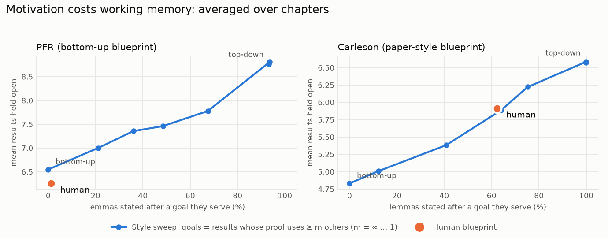

# Statements, proofs and motivation

*Prompted by the observation that Carleson states a result, proves intermediate
results, and only then proves the original result. Those "forward references"
are a clarity device, not a failure of ordering. Reports:
[`results/events/pfr`](../results/events/pfr/events.md) and
[`results/events/carleson`](../results/events/carleson/events.md). Figure:
[`results/cross_project/motivation_frontier.png`](../results/cross_project/motivation_frontier.png).
Code: `cairn events` (`python/cairn/events.py`).*

## The model

Phases 0–2 treated each blueprint node as one point in the text. That is wrong
for "state now, prove later". Each node is now **two events**:

- its statement `S:v`;
- its proof `P:v`, located via `\proves{}` or the next `proof` environment.

The reading constraints are:

- `S:v` comes before `P:v`;
- if `v`'s **statement** mentions `u`, then `S:u` comes before `S:v`;
- if only `v`'s **proof** uses `u`, then `S:u` comes before `P:v`. The proof of
  `u` may come later: a **deferred proof**.

Whether a use is in the statement or the proof comes from Lean: a dependency in
the declaration's type vs only in its value. The blueprint's own `\uses` can't
be trusted for this; Carleson puts proof dependencies in statement blocks. The
load metrics carry over unchanged. A deferred proof is charged as one open item
from `S:v` to `P:v`, and a "forward reference" now means only a genuine
use-before-statement.

## Carleson's forward references are mostly deferred proofs

On Lean edges, Carleson's 126 node-level forward references break down as:

- **93 (74%) are deferred proofs:** the goal is stated first and its proof
  comes after the lemmas it needs. They are valid under the event model.
- **33 are proofs citing a lemma stated later** ("by Lemma X below"). 18 of
  these are in one section, the proof of the classical Carleson theorem.
- **None** are statements that need a later statement.

The blueprint defers 37 proofs, all with `\proves{}`. PFR defers none and has 8
genuine forward references.

With this correction the Phase 0 conclusion flips for Carleson. Its human order
beats **every** uniform random valid order on load in 6 of 7 sections, where
before it looked worse than random in 4 of 7. The earlier claim that "the
working-memory story is PFR-specific" was an artefact of the single-point
model.

## A second quantity: motivation

The notes' principle "no node before the goal it serves" can be measured. The
**motivated share** is the fraction of supporting results that are stated
*after* the statement of a result that uses them.

| | human | random valid order |
|---|---:|---:|
| PFR (chapter average) | 1% | ~55% |
| Carleson (chapter average) | 62% | ~57% |

Carleson's 62% is not uniform:

- **87%** of the lemmas serving a deferred-proof goal come after that goal
  (89 of 102);
- only **15%** of the other supporting results do (9 of 61);
- deferred goals sit early in their section (median 21% of the way through).

So Carleson is **goal-first for its key results and bottom-up underneath**.
PFR is bottom-up throughout.

## One setting spans both styles

`hybrid_order(g, goals)` states each *goal* first, then builds what its proof
needs, then proves it. Every other result is built bottom-up, with its proof
straight after its statement. With the label-free rule "a goal is a result
whose proof uses at least *m* others":

- *m* = ∞ gives pure bottom-up;
- *m* = 1 gives fully top-down.

Averaged over chapters:

| | motivated | mean open | τ with human |
|---|---:|---:|---:|
| PFR human | 1% | 6.3 | 1 |
| PFR bottom-up (*m* = ∞) | 0% | 6.6 | **0.54** |
| PFR top-down (*m* = 1) | 94% | 8.8 | 0.17 |
| Carleson human | 62% | 5.9 | 1 |
| Carleson hybrid *m* = 3 | 64% | 5.9 | 0.20 |
| Carleson bottom-up | 0% | 4.8 | 0.11 |
| Carleson top-down | 100% | 6.6 | 0.24 |

1. **Motivation has a price in working memory.** Going from 0% to ~100%
   motivated raises load by about 35% in both projects. This is the first
   quantitative handle on the trade-off between Sanderson's "motivated
   explanation" and a proof that is easy to follow.
2. **Both human blueprints sit on the frontier traced by the one-setting
   rule.** PFR is at the bottom-up end, slightly *better* on load than the
   heuristic. Carleson is at *m* ≈ 3, matching the hybrid almost exactly on
   both axes. So the style choice is one interpretable setting: how many
   results get the "state it first, prove it later" treatment.
3. **The setting fixes the trade-off, not the sequence.** On Carleson the
   hybrid matches the human *profile* but only τ 0.20 on the order. Which
   lemma comes next inside a goal's proof still follows the paper's
   argument, as the LLM baseline also suggested.

## What this means for Cairn

- **Make the style an explicit, user-facing setting.** A bottom-up
  (textbook/blueprint) mode minimises load; a goal-first mode buys motivation
  at a measurable cost. The *m* threshold is a first rule for choosing goals.
  The key-declaration score from Phase 2 is a natural alternative to try
  next: state first the results the model says deserve a name.
- **Score candidate expositions on both axes, load and motivation**, not load
  alone. A single-objective optimiser will always produce PFR-style text.
- **Always model statements and proofs separately.** The LLM ordering prompts
  should let the model place a proof after other results. For Carleson the
  current prompts force "statement and proof together", which may explain
  part of its low τ.
