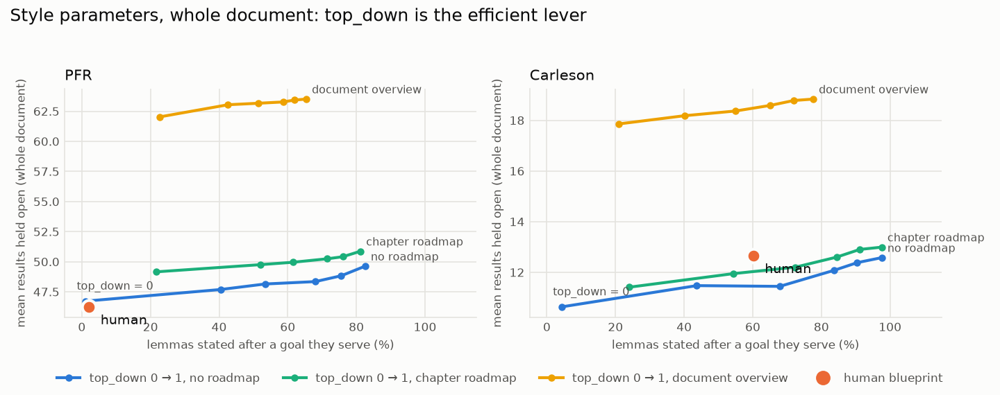

# Parameterised exposition style

*Code: `python/cairn/style.py`, run with `cairn style`. Reports:
[`results/style/pfr/style.md`](../results/style/pfr/style.md) and
[`results/style/carleson/style.md`](../results/style/carleson/style.md).
Figure:
[`results/cross_project/style_frontier.png`](../results/cross_project/style_frontier.png).*

## The parameters

A `Style` says how to organise the statement/proof events of a verified
development (see [`statement-proof-events.md`](statement-proof-events.md)).
`arrange(graph, style)` always returns a valid order: nothing is used before
it is stated, and nothing is proved before it is stated.

| Parameter | Values | What it controls |
|---|---|---|
| `top_down` | 0 … 1 | Position on the bottom-up ↔ top-down curve: the share of eligible results (those whose proof uses other results here) that become *goals*. A goal is stated before the material its proof needs and proved after it; everything else is built bottom-up with its proof straight after its statement. |
| `roadmap` | none / chapter / document | Announce main results early and prove them later: at the start of each chapter, or in an overview at the start of the document. |
| `definitions` | just-in-time / upfront | Introduce each definition just before its first use ("definitions in the middle"), or collect them at the start of the chapter. |
| `goal_rule` | fan-in / support / key | Which results get goal treatment first as `top_down` rises: those whose proof uses most results, those that depend on most of the chapter, or those with the highest Phase 2 key-declaration score. |

Chapter structure is kept fixed: results stay in their home chapter (where
they are proved), and chapters appear in the authors' order.

## What each parameter does (both projects)

Whole document, chapters intact:

| | PFR motivated | PFR load | Carleson motivated | Carleson load |
|---|---:|---:|---:|---:|
| **Human** | 2% | 46.2 | 60% | 12.7 |
| `top_down` 0 | 1% | 46.7 | 4% | 10.6 |
| `top_down` 0.2 | 40% | 47.7 | 44% | 11.5 |
| `top_down` 0.4 | 53% | 48.1 | 68% | 11.4 |
| `top_down` 1 | 83% | 49.6 | 98% | 12.6 |
| `top_down` 0, chapter roadmap | 22% | 49.2 | 24% | 11.4 |
| `top_down` 0, document overview | 23% | 62.0 | 21% | 17.9 |

*Motivated = lemmas stated after a goal they serve. Load = mean results held
open; lower is better.*

- **`top_down` is the efficient lever.** It moves motivation from about 0% to
  83–98% for only +6–19% load. In the chapter-level analysis the same move
  cost 35–40%. At document scale, most of the load comes from long-range
  dependencies, which the local style barely touches.
- **A chapter roadmap buys less motivation per unit of load than `top_down`.**
  It adds about 20 points of motivation for +0.8 to +2.5 load.
- **A document overview is dominated.** It gives the same motivation as a
  chapter roadmap at about 1.35× the load, because every announced result
  stays open until its own chapter.
- **`definitions = upfront` is slightly worse on PFR:** τ 0.55 → 0.49 and
  load 6.4 → 6.7 at chapter level, which supports "definitions in the
  middle". Carleson has no definition nodes, so there is no effect there.
- **`goal_rule` hardly matters.** Fan-in and support behave almost
  identically. Choosing goals by key-declaration score is slightly *less*
  efficient and matches the authors slightly worse.

## Fitting each blueprint's style

`cairn style` also fits the style that best reproduces the human order, both
by τ and by the closest (motivation, load) profile:

| | Chapter-level fit | Whole-document fit (τ and profile agree) |
|---|---|---|
| PFR | `top_down = 0` (τ 0.55) | `top_down = 0` (τ 0.92) |
| Carleson | `top_down` 0.4–0.6, chapter roadmap (τ 0.20) | `top_down = 0.2`, chapter roadmap (τ 0.86) |

The parameters separate the two authors as intended: PFR is pure bottom-up;
Carleson is partly goal-first and opens chapters with their main results.
Whole-document τ is high for every style because chapter order is fixed. The
parameters differ by what they do *inside* chapters, where Carleson's τ stays
low (≤ 0.20) for every setting. That matches earlier findings: its lemma
order follows the paper's argument, not the graph.

## Correction to the previous write-up

[`statement-proof-events.md`](statement-proof-events.md) said Carleson's
human order *beats* the trade-off curve (67% motivated at bottom-up load).
That was an artefact of scoring chapter by chapter, which never charges a
goal announced in one section and proved in another. On the whole document,
with chapters kept intact, `top_down = 0.4` reaches 68% motivation at load
11.4, against the human's 60% at 12.7. The human order is **close to but
not better than** what the style arrangement achieves.

Two readings are possible:

1. Carleson's authors pay a little extra load for other goods: the
   paper's argument order and announcing section goals.
2. The load metric overcharges announced goals. A result the reader has been
   told is coming, and why, is arguably lighter to carry than an
   unexplained lemma, but it currently costs the same as any open item.

Distinguishing these needs a finer reader model. One option is to weight
open *promises* (announced goals) less than open *lemmas*, and fit that
weight to both blueprints.

## Next

- **A `detail` parameter** for how many Lean declarations to surface as named
  results. The Phase 2 key-declaration score ranks them; the rest are folded
  into the proofs that use them. Together with `top_down` this would let
  `cairn` produce an outline straight from a Lean development, with no
  blueprint needed. That is the actual end-to-end tool.
- **Style-conditioned LLM prompts,** e.g. "write this bottom-up" or "announce
  the goal first", to see whether an LLM can hit a requested point on the
  curve.
- **The promise-weight question above.**
