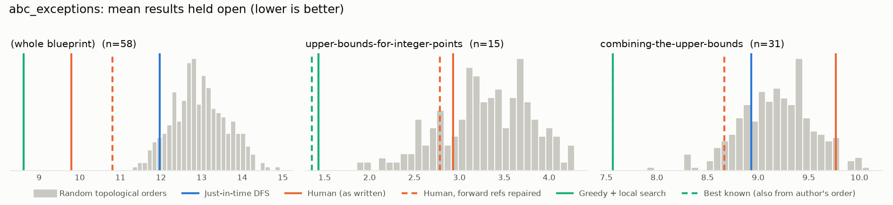
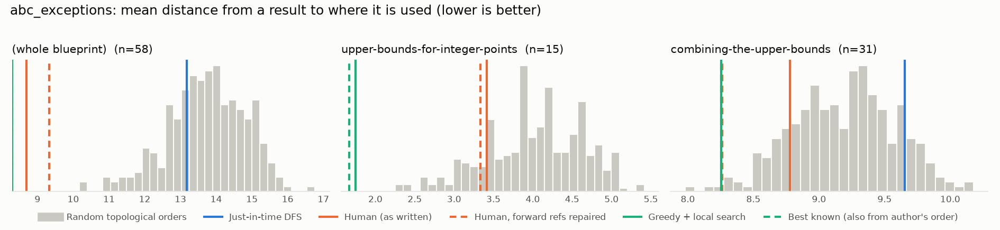

# Phase 0: abc_exceptions

*b-mehta/ABC-Exceptions @ d8ace7bbaa23 (2025-08-18)*

58 nodes, 131 dependency edges. Null models per scope: 300 randomised-Kahn topological orders (biased towards opening many results early) and 200 approximately uniform ones (Karzanov–Khachiyan MCMC). All metrics: lower is better.

**Share of random orders better than the order** (0% = the order beats every random one; 50% = typical):

| Scope | n | forward edges | Human: mean open (Kahn null) | Human: mean open (uniform null) | Human: mean edge length (Kahn) | Mean open: human / best known / uniform median | τ(human, optimised) | τ(human, random) |
|---|---:|---:|---:|---:|---:|---:|---:|---:|
| (whole blueprint) | 58 | 9% | 0% | 0% | 0% | 9.8 / 8.6 / 13.4 | +0.56 | +0.55 |
| upper-bounds-for-integer-points | 15 | 25% | 24% | 11% | 18% | 2.9 / 1.4 / 3.6 | +0.60 | +0.42 |
| combining-the-upper-bounds | 31 | 4% | 95% | 94% | 16% | 9.8 / 7.6 / 9.2 | +0.76 | +0.72 |

## Whole blueprint: raw metrics

| Order | fwd refs | mean open | max open | mean cut | cutwidth | mean edge length | τ vs human | chapter runs |
|---|---:|---:|---:|---:|---:|---:|---:|---:|
| Human (as written) | 12 | 9.8 | 20 | 20.0 | 50 | 8.7 | +1.00 | 4 |
| Human, forward refs repaired | 0 | 10.8 | 18 | 21.4 | 53 | 9.3 | +0.86 | 6 |
| Just-in-time DFS (median run) | 0 | 12.0 | 21 | 30.3 | 56 | 13.2 | +0.27 | 17 |
| Greedy min-open (best run) | 0 | 9.9 | 17 | 20.1 | 45 | 8.8 | +0.64 | 10 |
| Greedy + local search on mean open (best run) | 0 | 8.6 | 16 | 19.1 | 45 | 8.3 | +0.56 | 9 |
| Best known (local search also from the author's order) | 0 | 8.6 | 16 | 19.1 | 45 | 8.3 | +0.56 | 9 |
| Random topological (median) | 0 | 12.9 | 19 | 31.6 | 54 | 13.8 | +0.55 | |
| Uniform topological (median) | 0 | 13.4 | 20 | 32.1 | 56 | 14.0 | | |

## Forward references in the human order (12)

- `thm:ABCExceptionalBound` uses `lem:NlambdatoSstar`, which is stated later
- `thm:ABCExceptionalBound` uses `thm:BdExceptionalBound`, which is stated later
- `thm:BdExceptionalBound` uses `def:BdDiophantineCount`, which is stated later
- `thm:BdExceptionalBound` uses `prop:DiophantineReduction`, which is stated later
- `thm:BdExceptionalBound` uses `thm:ABCExponentNu`, which is stated later
- `prop:GeometryofNumbers` uses `thm:HeathBrownGeometry`, which is stated later
- `thm:QuadraticFormsEstimate` uses `lem:DivisorBoundQuadField`, which is stated later
- `thm:BombierSchmidtforThueEqs` uses `def:omega`, which is stated later
- `lem:Case2` uses `lem:Subcase2.3`, which is stated later
- `lem:Case2` uses `lem:Subcase2.4`, which is stated later
- `lem:Case2` uses `lem:Subcase2.5`, which is stated later
- `lem:Case2` uses `lem:Subcase2.6`, which is stated later

