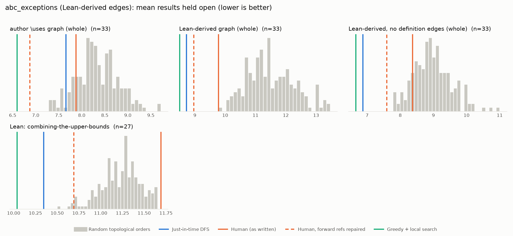

# Phase 1: abc_exceptions

*b-mehta/ABC-Exceptions @ d8ace7bbaa23 (2025-08-18), Lean leanprover/lean4:v4.21.0-rc3*

## Formal graph

- Project declarations (after folding compiler auxiliaries): 248 (def: 39, inductive: 3, theorem: 206); 978 dependency edges.
- Blueprint `\lean{}` names resolved to project declarations: 49 (100%); 33 of 58 blueprint nodes have at least one.
- Project theorems the blueprint never names: 171.

## Author `\uses` edges vs Lean

Over the 33 formalised nodes. Lean edges are projected onto blueprint nodes through unlabelled helper declarations.

| | count |
|---|---:|
| Author edges | 80 |
| … also a direct Lean dependency | 67 |
| … implied by a chain of Lean dependencies | 0 |
| … not a Lean dependency at all | 13 |
| Lean edges | 147 |
| … not written by the author | 80 |
| … … of which from a definition node | 14 |

Most frequent sources of unreported edges: `lem:Trivialaibici` (14), `lem:aibiciconstraints` (14), `prop:GeometryBound` (11), `prop:Eqn4Point5` (10), `def:delta` (7), `def:s` (7), `prop:DeterminantBound` (7), `prop:FourierBound` (4), `prop:SpecialThue` (3), `lem:ThreeLowerBounds` (2).

## Ordering (Phase 0 metrics) on both graphs

Share of random orders better than the human order (0% = human beats all):

| Scope | n | edges | Kahn null | uniform null | mean open: human / optimised / uniform median | τ(human, optimised) |
|---|---:|---:|---:|---:|---:|---:|
| author \uses graph (whole) | 33 | 80 | 15% | 1% | 7.9 / 6.6 / 9.0 | +0.82 |
| Lean-derived graph (whole) | 33 | 147 | 0% | 0% | 9.8 / 8.5 / 13.0 | +0.70 |
| Lean-derived, no definition edges (whole) | 33 | 117 | 14% | 0% | 8.4 / 6.7 / 10.3 | +0.71 |
| Lean: combining-the-upper-bounds | 27 | 142 | 100% | 100% | 11.7 / 10.0 / 11.3 | +0.66 |

Forward references in the human order under Lean edges: 5

- `lem:Subcase1.2` depends on `lem:Case2Basic1`, stated later
- `lem:Case2` depends on `lem:Subcase2.3`, stated later
- `lem:Case2` depends on `lem:Subcase2.4`, stated later
- `lem:Case2` depends on `lem:Subcase2.5`, stated later
- `lem:Case2` depends on `lem:Subcase2.6`, stated later

