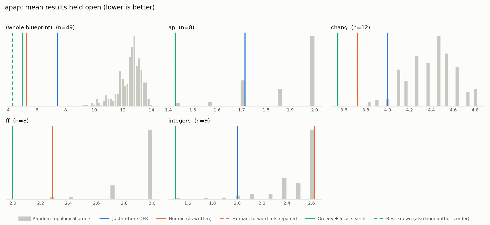
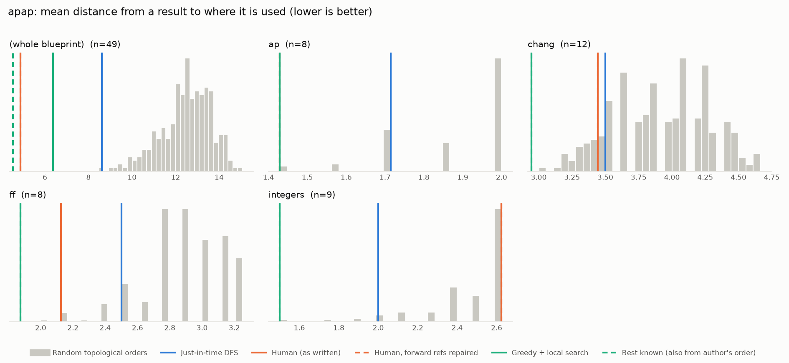

# Phase 0: apap

*YaelDillies/LeanAPAP @ 3b79412fbe52 (2026-09-20)*

49 nodes, 74 dependency edges. Null models per scope: 300 randomised-Kahn topological orders (biased towards opening many results early) and 200 approximately uniform ones (Karzanov–Khachiyan MCMC). All metrics: lower is better.

**Share of random orders better than the order** (0% = the order beats every random one; 50% = typical):

| Scope | n | forward edges | Human: mean open (Kahn null) | Human: mean open (uniform null) | Human: mean edge length (Kahn) | Mean open: human / best known / uniform median | τ(human, optimised) | τ(human, random) |
|---|---:|---:|---:|---:|---:|---:|---:|---:|
| (whole blueprint) | 49 | 0% | 0% | 0% | 0% | 5.3 / 4.3 / 11.8 | +0.75 | +0.33 |
| ap | 8 | 0% | 1% | 6% | 1% | 1.4 / 1.4 / 1.9 | +0.93 | +0.67 |
| chang | 12 | 0% | 0% | 0% | 13% | 3.7 / 3.5 / 4.5 | +0.67 | +0.50 |
| ff | 8 | 0% | 3% | 6% | 1% | 2.3 / 2.0 / 3.0 | +0.64 | +0.50 |
| integers | 9 | 0% | 73% | 89% | 73% | 2.6 / 1.5 / 2.4 | +0.56 | +0.77 |

## Whole blueprint: raw metrics

| Order | fwd refs | mean open | max open | mean cut | cutwidth | mean edge length | τ vs human | chapter runs |
|---|---:|---:|---:|---:|---:|---:|---:|---:|
| Human (as written) | 0 | 5.3 | 9 | 7.5 | 18 | 4.9 | +1.00 | 7 |
| Human, forward refs repaired | 0 | 5.3 | 9 | 7.5 | 18 | 4.9 | +1.00 | 7 |
| Just-in-time DFS (median run) | 0 | 7.5 | 15 | 13.3 | 25 | 8.6 | +0.19 | 16 |
| Greedy min-open (best run) | 0 | 7.8 | 13 | 11.5 | 24 | 7.5 | +0.66 | 23 |
| Greedy + local search on mean open (best run) | 0 | 5.0 | 9 | 9.8 | 21 | 6.4 | +0.75 | 15 |
| Best known (local search also from the author's order) | 0 | 4.3 | 8 | 7.0 | 18 | 4.5 | +0.93 | 14 |
| Random topological (median) | 0 | 12.6 | 21 | 19.4 | 33 | 12.6 | +0.33 | |
| Uniform topological (median) | 0 | 11.8 | 19 | 20.5 | 33 | 13.3 | | |

## Forward references in the human order (0)

None.

