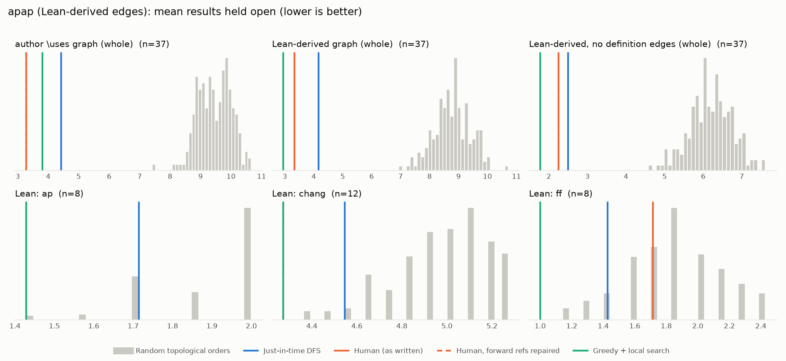

# Phase 1: apap

*YaelDillies/LeanAPAP @ 3b79412fbe52 (2026-09-20), Lean leanprover/lean4:v4.35.0-rc2*

## Formal graph

- Project declarations (after folding compiler auxiliaries): 769 (def: 61, inductive: 2, theorem: 706); 1965 dependency edges, including 4 blueprint-named declarations outside the project (e.g. upstreamed to Mathlib).
- Blueprint `\lean{}` names resolved to project declarations: 38 (100%); 37 of 49 blueprint nodes have at least one.
- Project theorems the blueprint never names: 677.

## Author `\uses` edges vs Lean

Over the 37 formalised nodes. Lean edges are projected onto blueprint nodes through unlabelled helper declarations.

| | count |
|---|---:|
| Author edges | 43 |
| … also a direct Lean dependency | 39 |
| … implied by a chain of Lean dependencies | 0 |
| … not a Lean dependency at all | 4 |
| Lean edges | 46 |
| … not written by the author | 7 |
| … … of which from a definition node | 7 |

Most frequent sources of unreported edges: `large_spec` (2), `weight_energy` (2), `bohr-set` (1), `dissociated` (1), `energy` (1).

## Ordering (Phase 0 metrics) on both graphs

Share of random orders better than the human order (0% = human beats all):

| Scope | n | edges | Kahn null | uniform null | mean open: human / optimised / uniform median | τ(human, optimised) |
|---|---:|---:|---:|---:|---:|---:|
| author \uses graph (whole) | 37 | 43 | 0% | 0% | 3.3 / 3.8 / 9.2 | +0.45 |
| Lean-derived graph (whole) | 37 | 46 | 0% | 0% | 3.3 / 2.9 / 8.9 | +0.41 |
| Lean-derived, no definition edges (whole) | 37 | 26 | 0% | 0% | 2.2 / 1.8 / 6.1 | +0.14 |
| Lean: ap | 8 | 7 | 1% | 5% | 1.4 / 1.4 / 1.7 | +0.93 |
| Lean: chang | 12 | 23 | 0% | 0% | 4.3 / 4.3 / 5.0 | +0.55 |
| Lean: ff | 8 | 5 | 32% | 41% | 1.7 / 1.0 / 1.7 | +0.57 |

Forward references in the human order under Lean edges: 0

