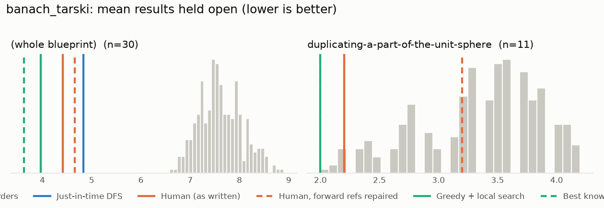
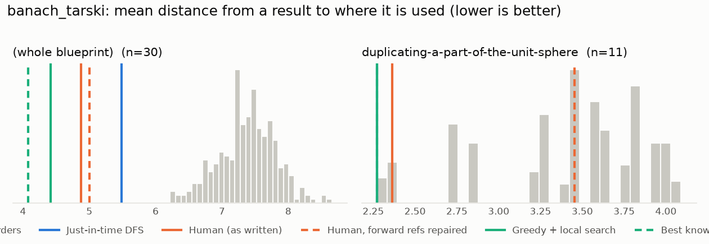

# Phase 0: banach_tarski

*bergschaf/lean-banach-tarski @ 1c6bf6edb1df (2025-10-27)*

30 nodes, 41 dependency edges. Null models per scope: 300 randomised-Kahn topological orders (biased towards opening many results early) and 200 approximately uniform ones (Karzanov–Khachiyan MCMC). All metrics: lower is better.

**Share of random orders better than the order** (0% = the order beats every random one; 50% = typical):

| Scope | n | forward edges | Human: mean open (Kahn null) | Human: mean open (uniform null) | Human: mean edge length (Kahn) | Mean open: human / best known / uniform median | τ(human, optimised) | τ(human, random) |
|---|---:|---:|---:|---:|---:|---:|---:|---:|
| (whole blueprint) | 30 | 2% | 0% | 0% | 0% | 4.4 / 3.6 / 8.0 | +0.79 | +0.27 |
| duplicating-a-part-of-the-unit-sphere | 11 | 9% | 2% | 0% | 5% | 2.2 / 2.0 / 3.4 | +0.78 | +0.34 |

## Whole blueprint: raw metrics

| Order | fwd refs | mean open | max open | mean cut | cutwidth | mean edge length | τ vs human | chapter runs |
|---|---:|---:|---:|---:|---:|---:|---:|---:|
| Human (as written) | 1 | 4.4 | 7 | 6.9 | 12 | 4.9 | +1.00 | 5 |
| Human, forward refs repaired | 0 | 4.7 | 8 | 7.1 | 12 | 5.0 | +0.97 | 5 |
| Just-in-time DFS (median run) | 0 | 4.8 | 8 | 7.8 | 11 | 5.5 | +0.73 | 9 |
| Greedy min-open (best run) | 0 | 4.9 | 8 | 7.0 | 13 | 4.9 | +0.66 | 10 |
| Greedy + local search on mean open (best run) | 0 | 4.0 | 7 | 6.2 | 11 | 4.4 | +0.79 | 8 |
| Best known (local search also from the author's order) | 0 | 3.6 | 7 | 5.8 | 10 | 4.1 | +0.87 | 8 |
| Random topological (median) | 0 | 7.6 | 11 | 10.4 | 16 | 7.4 | +0.27 | |
| Uniform topological (median) | 0 | 8.0 | 12 | 11.0 | 17 | 7.8 | | |

## Forward references in the human order (1)

- `lemma:count_rot_axes` uses `lemma:count_set_rep_points`, which is stated later

