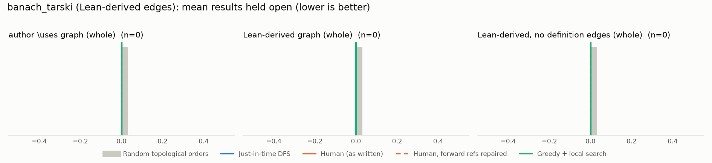

# Phase 1: banach_tarski

*bergschaf/lean-banach-tarski @ 1c6bf6edb1df (2025-10-27), Lean leanprover/lean4:v4.25.0-rc2*

## Formal graph

- Project declarations (after folding compiler auxiliaries): 52 (def: 38, inductive: 2, theorem: 12); 80 project-internal dependency edges.
- Blueprint `\lean{}` names resolved to project declarations: 0 (0%); 0 of 30 blueprint nodes have at least one.
- Project theorems the blueprint never names: 12.

## Author `\uses` edges vs Lean

Over the 0 formalised nodes. Lean edges are projected onto blueprint nodes through unlabelled helper declarations.

| | count |
|---|---:|
| Author edges | 0 |
| … also a direct Lean dependency | 0 |
| … implied by a chain of Lean dependencies | 0 |
| … not a Lean dependency at all | 0 |
| Lean edges | 0 |
| … not written by the author | 0 |
| … … of which from a definition node | 0 |

Most frequent sources of unreported edges: .

## Ordering (Phase 0 metrics) on both graphs

Share of random orders better than the human order (0% = human beats all):

| Scope | n | edges | Kahn null | uniform null | mean open: human / optimised / uniform median | τ(human, optimised) |
|---|---:|---:|---:|---:|---:|---:|
| author \uses graph (whole) | 0 | 0 | 50% | 50% | 0.0 / 0.0 / 0.0 | +1.00 |
| Lean-derived graph (whole) | 0 | 0 | 50% | 50% | 0.0 / 0.0 / 0.0 | +1.00 |
| Lean-derived, no definition edges (whole) | 0 | 0 | 50% | 50% | 0.0 / 0.0 / 0.0 | +1.00 |

Forward references in the human order under Lean edges: 0

