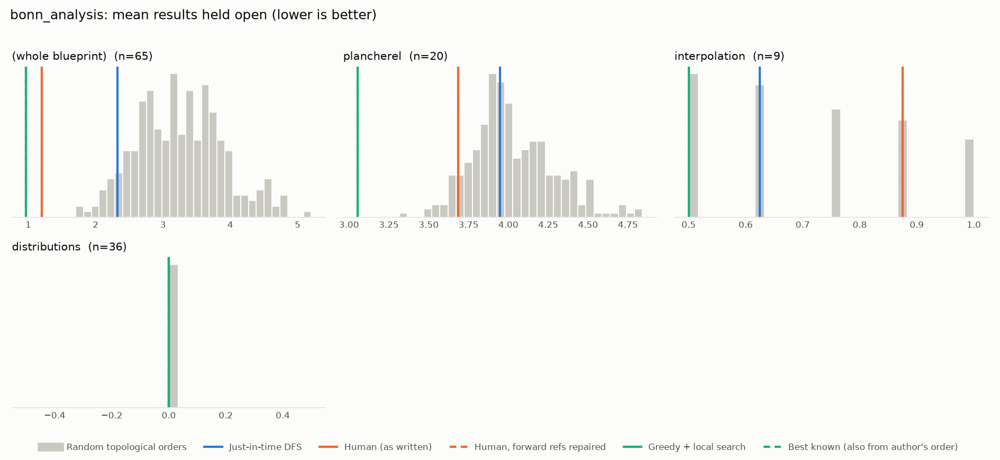
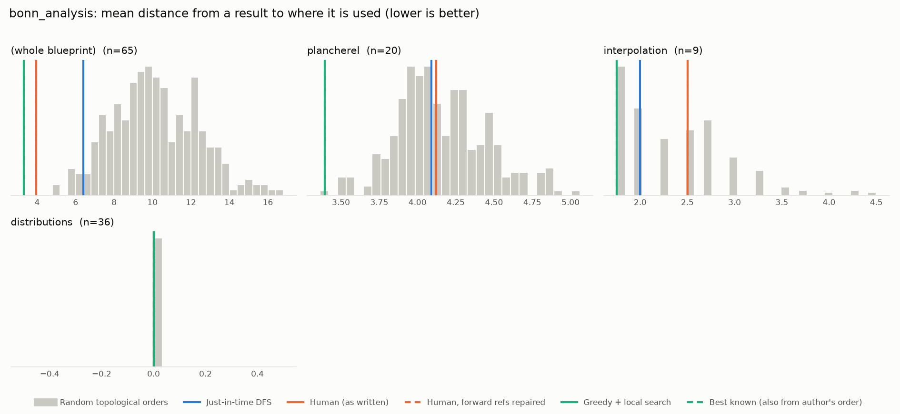

# Phase 0: bonn_analysis

*fpvandoorn/BonnAnalysis @ af8a23e0fae8 (2026-01-08)*

65 nodes, 37 dependency edges. Null models per scope: 300 randomised-Kahn topological orders (biased towards opening many results early) and 200 approximately uniform ones (Karzanov–Khachiyan MCMC). All metrics: lower is better.

**Share of random orders better than the order** (0% = the order beats every random one; 50% = typical):

| Scope | n | forward edges | Human: mean open (Kahn null) | Human: mean open (uniform null) | Human: mean edge length (Kahn) | Mean open: human / best known / uniform median | τ(human, optimised) | τ(human, random) |
|---|---:|---:|---:|---:|---:|---:|---:|---:|
| (whole blueprint) | 65 | 0% | 0% | 0% | 0% | 1.2 / 1.0 / 5.1 | -0.35 | -0.23 |
| plancherel | 20 | 0% | 8% | 0% | 50% | 3.7 / 3.1 / 4.7 | +0.63 | +0.59 |
| interpolation | 9 | 0% | 77% | 54% | 61% | 0.9 / 0.5 / 0.9 | +0.56 | +0.51 |
| distributions | 36 | 0% | 50% | 50% | 50% | 0.0 / 0.0 / 0.0 | -0.05 | +0.00 |

## Whole blueprint: raw metrics

| Order | fwd refs | mean open | max open | mean cut | cutwidth | mean edge length | τ vs human | chapter runs |
|---|---:|---:|---:|---:|---:|---:|---:|---:|
| Human (as written) | 0 | 1.2 | 6 | 2.3 | 10 | 3.9 | +1.00 | 3 |
| Human, forward refs repaired | 0 | 1.2 | 6 | 2.3 | 10 | 3.9 | +1.00 | 3 |
| Just-in-time DFS (median run) | 0 | 2.3 | 9 | 3.7 | 14 | 6.4 | +0.21 | 19 |
| Greedy min-open (best run) | 0 | 1.0 | 6 | 1.9 | 10 | 3.3 | -0.43 | 13 |
| Greedy + local search on mean open (best run) | 0 | 1.0 | 6 | 1.9 | 10 | 3.3 | -0.35 | 13 |
| Best known (local search also from the author's order) | 0 | 1.0 | 6 | 1.9 | 10 | 3.3 | -0.35 | 13 |
| Random topological (median) | 0 | 3.2 | 7 | 5.8 | 12 | 10.0 | -0.23 | |
| Uniform topological (median) | 0 | 5.1 | 8 | 8.9 | 14 | 15.4 | | |

## Forward references in the human order (0)

None.

