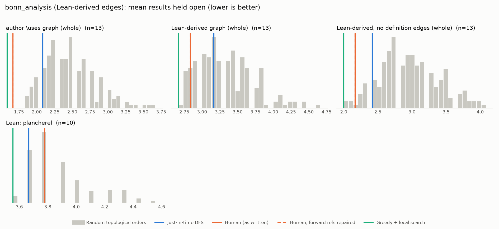

# Phase 1: bonn_analysis

*fpvandoorn/BonnAnalysis @ af8a23e0fae8 (2026-01-08), Lean leanprover/lean4:v4.10.0-rc1*

## Formal graph

- Project declarations (after folding compiler auxiliaries): 393 (def: 87, inductive: 10, theorem: 296); 1179 dependency edges, including 15 blueprint-named declarations outside the project (e.g. upstreamed to Mathlib).
- Blueprint `\lean{}` names resolved to project declarations: 23 (96%); 13 of 65 blueprint nodes have at least one.
- Project theorems the blueprint never names: 289.

## Author `\uses` edges vs Lean

Over the 13 formalised nodes. Lean edges are projected onto blueprint nodes through unlabelled helper declarations.

| | count |
|---|---:|
| Author edges | 12 |
| … also a direct Lean dependency | 10 |
| … implied by a chain of Lean dependencies | 0 |
| … not a Lean dependency at all | 2 |
| Lean edges | 19 |
| … not written by the author | 9 |
| … … of which from a definition node | 3 |

Most frequent sources of unreported edges: `lem:fourier-bounded` (4), `def:fourier-transform` (3), `lem:fourier-cont` (1), `lem:fourier-gaussian` (1).

## Ordering (Phase 0 metrics) on both graphs

Share of random orders better than the human order (0% = human beats all):

| Scope | n | edges | Kahn null | uniform null | mean open: human / optimised / uniform median | τ(human, optimised) |
|---|---:|---:|---:|---:|---:|---:|
| author \uses graph (whole) | 13 | 12 | 0% | 0% | 1.7 / 1.6 / 2.8 | -0.03 |
| Lean-derived graph (whole) | 13 | 19 | 9% | 1% | 2.8 / 2.7 / 3.8 | -0.28 |
| Lean-derived, no definition edges (whole) | 13 | 12 | 2% | 0% | 2.2 / 2.0 / 3.2 | -0.23 |
| Lean: plancherel | 10 | 19 | 40% | 16% | 3.8 / 3.6 / 4.1 | +0.02 |

Forward references in the human order under Lean edges: 0

## `\lean{}` names not found in the project

- `thm:maximum_modulus`: `Analysis.Complex.norm_eqOn_closure_of_isPreconnected_of_isMaxOn`

