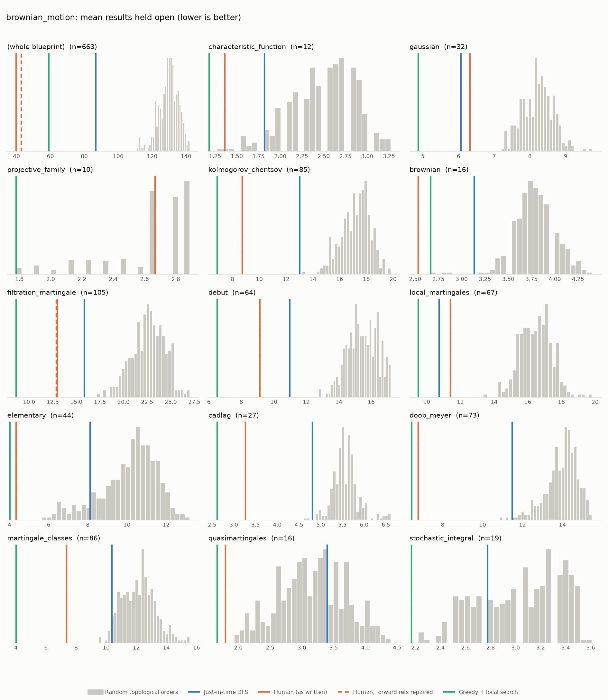
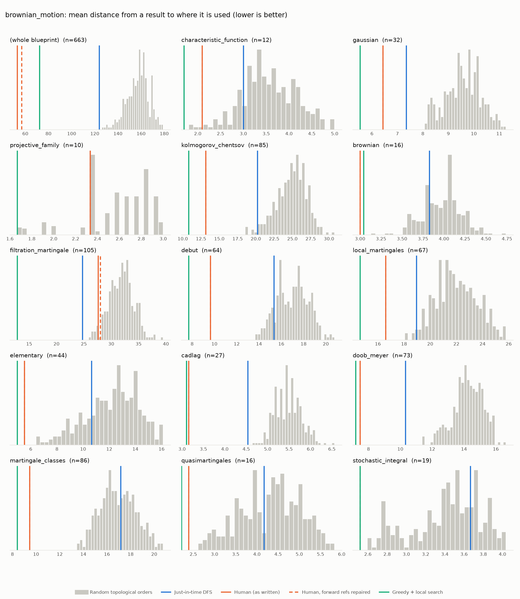

# Phase 0: brownian_motion

*RemyDegenne/brownian-motion @ 0d5b6eb928e6 (2026-09-22)*

663 nodes, 1566 dependency edges. Null models per scope: 300 randomised-Kahn topological orders (biased towards opening many results early) and 200 approximately uniform ones (Karzanov–Khachiyan MCMC). All metrics: lower is better.

**Share of random orders better than the order** (0% = the order beats every random one; 50% = typical):

| Scope | n | forward edges | Human: mean open (Kahn null) | Human: mean open (uniform null) | Human: mean edge length (Kahn) | Mean open: human / optimised / uniform median | τ(human, optimised) | τ(human, random) |
|---|---:|---:|---:|---:|---:|---:|---:|---:|
| (whole blueprint) | 663 | 1% | 0% | 0% | 0% | 39.7 / 59.1 / 145.1 | +0.37 | +0.26 |
| characteristic_function | 12 | 0% | 0% | 0% | 1% | 1.4 / 1.2 / 2.8 | +0.82 | +0.32 |
| gaussian | 32 | 0% | 0% | 0% | 0% | 6.3 / 4.9 / 8.1 | +0.75 | +0.40 |
| projective_family | 10 | 0% | 38% | 49% | 22% | 2.7 / 1.8 / 2.7 | +0.24 | +0.69 |
| kolmogorov_chentsov | 85 | 0% | 0% | 0% | 0% | 8.7 / 6.8 / 18.2 | +0.67 | +0.36 |
| brownian | 16 | 0% | 0% | 0% | 0% | 2.5 / 2.7 / 3.9 | +0.67 | +0.36 |
| filtration_martingale | 105 | 1% | 0% | 0% | 4% | 13.0 / 8.6 / 26.8 | -0.00 | +0.25 |
| debut | 64 | 0% | 0% | 0% | 0% | 9.1 / 6.5 / 15.5 | +0.55 | +0.32 |
| local_martingales | 67 | 0% | 0% | 0% | 0% | 11.4 / 9.5 / 17.8 | +0.39 | +0.22 |
| elementary | 44 | 0% | 0% | 0% | 0% | 4.3 / 4.0 / 12.1 | +0.84 | +0.42 |
| cadlag | 27 | 0% | 0% | 0% | 0% | 3.3 / 2.6 / 5.8 | +0.66 | +0.49 |
| doob_meyer | 73 | 0% | 0% | 0% | 0% | 6.8 / 6.5 / 14.3 | +0.90 | +0.51 |
| martingale_classes | 86 | 0% | 0% | 0% | 0% | 7.4 / 4.0 / 16.7 | +0.18 | +0.38 |
| quasimartingales | 16 | 0% | 0% | 0% | 0% | 1.8 / 1.7 / 3.8 | -0.32 | +0.07 |
| stochastic_integral | 19 | 0% | 0% | 0% | 0% | 2.2 / 2.2 / 3.3 | +1.00 | +0.77 |

## Whole blueprint: raw metrics

| Order | fwd refs | mean open | max open | mean cut | cutwidth | mean edge length | τ vs human | chapter runs |
|---|---:|---:|---:|---:|---:|---:|---:|---:|
| Human (as written) | 15 | 39.7 | 72 | 125.3 | 268 | 53.0 | +1.00 | 15 |
| Human, forward refs repaired | 0 | 42.7 | 88 | 134.3 | 280 | 56.8 | +0.98 | 20 |
| Just-in-time DFS (median run) | 0 | 86.9 | 147 | 293.4 | 464 | 124.0 | +0.22 | 207 |
| Greedy min-open (best run) | 0 | 84.3 | 131 | 278.0 | 465 | 117.5 | +0.33 | 301 |
| Greedy + local search (best run) | 0 | 59.1 | 108 | 171.3 | 332 | 72.4 | +0.37 | 215 |
| Random topological (median) | 0 | 130.1 | 213 | 374.3 | 620 | 158.2 | +0.26 | |
| Uniform topological (median) | 0 | 145.1 | 219 | 461.1 | 709 | 194.9 | | |

## Forward references in the human order (15)

- `def:covMatrix` uses `def:IsGaussian`, which is stated later
- `lem:Submartingale.integrable_stoppedValue` uses `def:stoppedProcess`, which is stated later
- `lem:uniformIntegrable_stoppedValue_martingale` uses `lem:optionalSampling_discrete`, which is stated later
- `lem:uniformIntegrable_stoppedValue_martingale_of_countable_range` uses `lem:optionalSampling_discrete`, which is stated later
- `lem:uniformIntegrable_stoppedValue_submartingale` uses `def:predictablePart`, which is stated later
- `lem:uniformIntegrable_stoppedValue_submartingale` uses `def:martingalePart`, which is stated later
- `lem:uniformIntegrable_stoppedValue_submartingale` uses `lem:predictablePart_zero`, which is stated later
- `lem:uniformIntegrable_stoppedValue_submartingale` uses `lem:predictable_predictablePart`, which is stated later
- `lem:uniformIntegrable_stoppedValue_submartingale` uses `lem:martingale_martingalePart`, which is stated later
- `lem:uniformIntegrable_stoppedValue_submartingale` uses `lem:Submartingale.monotone_predictablePart`, which is stated later
- `lem:uniformIntegrable_stoppedValue_submartingale` uses `lem:centering_basic`, which is stated later
- `lem:optionalSampling_discrete_submartingale` uses `lem:predictable_predictablePart`, which is stated later
- `lem:optionalSampling_discrete_submartingale` uses `lem:martingale_martingalePart`, which is stated later
- `lem:optionalSampling_discrete_submartingale` uses `lem:Submartingale.monotone_predictablePart`, which is stated later
- `lem:optionalSampling_discrete_submartingale` uses `lem:centering_basic`, which is stated later

