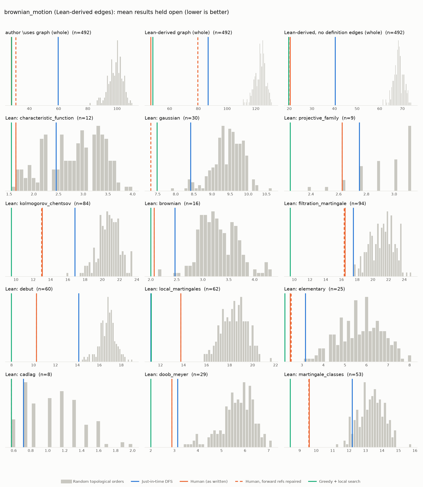

# Phase 1: brownian_motion

*RemyDegenne/brownian-motion @ 0d5b6eb928e6 (2026-09-22), Lean leanprover/lean4:v4.33.0-rc1*

## Formal graph

- Project declarations (after folding compiler auxiliaries): 2222 (constructor: 1, def: 266, inductive: 24, theorem: 1931); 10371 dependency edges, including 190 blueprint-named declarations outside the project (e.g. upstreamed to Mathlib).
- Blueprint `\lean{}` names resolved to project declarations: 521 (100%); 492 of 663 blueprint nodes have at least one.
- Project theorems the blueprint never names: 1674.

## Author `\uses` edges vs Lean

Over the 492 formalised nodes. Lean edges are projected onto blueprint nodes through unlabelled helper declarations.

| | count |
|---|---:|
| Author edges | 1058 |
| … also a direct Lean dependency | 918 |
| … implied by a chain of Lean dependencies | 19 |
| … not a Lean dependency at all | 121 |
| Lean edges | 2428 |
| … not written by the author | 1510 |
| … … of which from a definition node | 1193 |

Most frequent sources of unreported edges: `def:filtration` (213), `def:isOrderedAddMonoid` (125), `def:orderClosedTopology` (60), `def:RightContinuous` (49), `def:IsStoppingTime` (43), `def:IsCadlag` (37), `def:stoppedProcess` (37), `def:Martingale` (28), `def:IsCover` (27), `def:isOrderedModule` (27).

## Ordering (Phase 0 metrics) on both graphs

Share of random orders better than the human order (0% = human beats all):

| Scope | n | edges | Kahn null | uniform null | mean open: human / optimised / uniform median | τ(human, optimised) |
|---|---:|---:|---:|---:|---:|---:|
| author \uses graph (whole) | 492 | 1058 | 0% | 0% | 27.7 / 27.9 / 114.2 | +0.40 |
| Lean-derived graph (whole) | 492 | 2428 | 0% | 0% | 46.9 / 48.3 / 138.7 | +0.34 |
| Lean-derived, no definition edges (whole) | 492 | 621 | 0% | 0% | 20.4 / 19.8 / 80.8 | -0.11 |
| Lean: characteristic_function | 12 | 15 | 2% | 0% | 1.6 / 1.5 / 3.4 | +0.76 |
| Lean: gaussian | 30 | 95 | 0% | 0% | 7.5 / 7.5 / 10.0 | +0.42 |
| Lean: projective_family | 9 | 10 | 8% | 16% | 2.6 / 2.2 / 2.9 | +0.22 |
| Lean: kolmogorov_chentsov | 84 | 289 | 0% | 0% | 13.1 / 9.5 / 21.5 | +0.51 |
| Lean: brownian | 16 | 23 | 0% | 0% | 2.1 / 2.0 / 3.7 | +0.48 |
| Lean: filtration_martingale | 94 | 307 | 0% | 0% | 16.5 / 9.5 / 25.2 | +0.03 |
| Lean: debut | 60 | 172 | 0% | 0% | 10.3 / 8.0 / 17.6 | +0.52 |
| Lean: local_martingales | 62 | 193 | 0% | 0% | 13.8 / 11.2 / 19.3 | +0.32 |
| Lean: elementary | 25 | 42 | 0% | 0% | 2.5 / 2.2 / 6.9 | +0.45 |
| Lean: cadlag | 8 | 4 | 4% | 1% | 0.6 / 0.6 / 1.4 | +0.43 |
| Lean: doob_meyer | 29 | 42 | 0% | 0% | 2.9 / 2.0 / 6.4 | +0.49 |
| Lean: martingale_classes | 53 | 199 | 0% | 0% | 9.6 / 8.4 / 15.8 | +0.31 |

Forward references in the human order under Lean edges: 139

- `thm:ext_of_charFunDual` depends on `def:isOrderedAddMonoid`, stated later
- `def:covarianceBilin` depends on `def:isOrderedAddMonoid`, stated later
- `lem:covarianceBilin_same_eq_variance` depends on `def:isOrderedAddMonoid`, stated later
- `lem:covInnerBilin_map` depends on `def:isOrderedAddMonoid`, stated later
- `lem:covMatrix_map` depends on `def:isOrderedAddMonoid`, stated later
- `lem:map_eq_of_modification` depends on `lem:map_eq_iff`, stated later
- `lem:map_eq_iff` depends on `def:IsProjectiveLimit`, stated later
- `lem:map_eq_iff` depends on `thm:kolmogorovExtension`, stated later
- `lem:charFun_gaussianReal` depends on `def:isOrderedAddMonoid`, stated later
- `lem:centralMoment_two_mul_gaussianReal` depends on `def:isOrderedAddMonoid`, stated later
- `lem:centralMoment_two_mul_gaussianReal` depends on `def:orderClosedTopology`, stated later
- `def:IsGaussian` depends on `lem:IsGaussian.ext_iff`, stated later
- `def:IsGaussian` depends on `def:isOrderedAddMonoid`, stated later
- `thm:isGaussian_iff_charFunDual_eq` depends on `def:isOrderedAddMonoid`, stated later
- `lem:isGaussian_conv` depends on `def:isOrderedAddMonoid`, stated later
- `thm:exists_integrable_exp_sq_of_map_rotation_eq_self` depends on `def:isOrderedAddMonoid`, stated later
- `thm:exists_integrable_exp_sq_of_map_rotation_eq_self` depends on `def:orderClosedTopology`, stated later
- `lem:IsGaussian.map_rotation_eq_self` depends on `def:isOrderedAddMonoid`, stated later
- `thm:IsGaussian.exists_integrable_exp_sq` depends on `def:isOrderedAddMonoid`, stated later
- `lem:IsGaussian.memLp_id` depends on `def:isOrderedAddMonoid`, stated later
- `lem:IsGaussian.memLp_id` depends on `def:orderClosedTopology`, stated later
- `lem:isGaussian_iff_gaussian_charFun` depends on `def:isOrderedAddMonoid`, stated later
- `lem:IsGaussian.ext_iff` depends on `def:isOrderedAddMonoid`, stated later
- `lem:isCentered_stdGaussian` depends on `lem:isGaussian_stdGaussian`, stated later
- `lem:isCentered_stdGaussian` depends on `lem:integral_id_stdGaussian`, stated later
- `lem:isProbabilityMeasure_stdGaussian` depends on `def:isOrderedAddMonoid`, stated later
- `lem:charFun_stdGaussian` depends on `def:isOrderedAddMonoid`, stated later
- `lem:isGaussian_stdGaussian` depends on `def:isOrderedAddMonoid`, stated later
- `lem:integral_id_stdGaussian` depends on `def:isOrderedAddMonoid`, stated later
- `lem:covMatrix_stdGaussian` depends on `def:isOrderedAddMonoid`, stated later
- `def:multivariateGaussian` depends on `def:isOrderedAddMonoid`, stated later
- `lem:integral_id_multivariateGaussian` depends on `def:isOrderedAddMonoid`, stated later
- `lem:covMatrix_multivariateGaussian` depends on `def:isOrderedAddMonoid`, stated later
- `lem:isGaussian_multivariateGaussian` depends on `def:isOrderedAddMonoid`, stated later
- `thm:charFun_multivariateGaussian` depends on `def:isOrderedAddMonoid`, stated later
- `thm:kolmogorovExtension` depends on `def:semiRingOfSets`, stated later
- `thm:kolmogorovExtension` depends on `def:ringOfSets`, stated later
- `thm:kolmogorovExtension` depends on `def:addContent`, stated later
- `lem:posSemidef_brownianCov` depends on `def:isOrderedAddMonoid`, stated later
- `lem:posSemidef_brownianCov` depends on `def:orderClosedTopology`, stated later

## `\lean{}` names not found in the project

- `lem:IsGaussian.ext_iff`: `ProbabilityTheory.IsGaussian.ext_iff`

