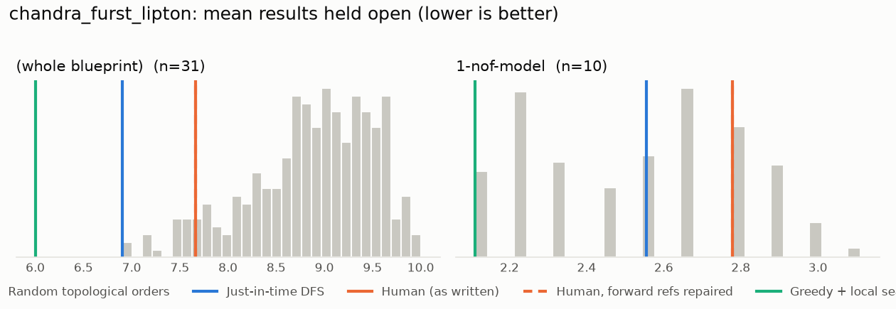
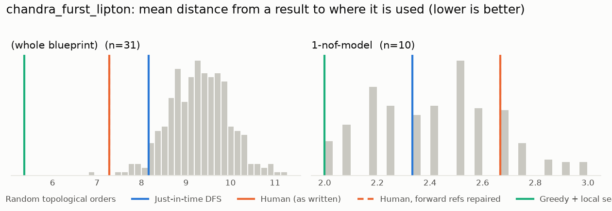

# Phase 0: chandra_furst_lipton

*YaelDillies/ChandraFurstLipton @ 5818428f492b (2026-09-20)*

31 nodes, 61 dependency edges. Null models per scope: 300 randomised-Kahn topological orders (biased towards opening many results early) and 200 approximately uniform ones (Karzanov–Khachiyan MCMC). All metrics: lower is better.

**Share of random orders better than the order** (0% = the order beats every random one; 50% = typical):

| Scope | n | forward edges | Human: mean open (Kahn null) | Human: mean open (uniform null) | Human: mean edge length (Kahn) | Mean open: human / optimised / uniform median | τ(human, optimised) | τ(human, random) |
|---|---:|---:|---:|---:|---:|---:|---:|---:|
| (whole blueprint) | 31 | 0% | 6% | 0% | 0% | 7.7 / 6.0 / 8.9 | -0.01 | +0.38 |
| 1-nof-model | 10 | 0% | 79% | 55% | 84% | 2.8 / 2.1 / 2.8 | +0.69 | +0.71 |

## Whole blueprint: raw metrics

| Order | fwd refs | mean open | max open | mean cut | cutwidth | mean edge length | τ vs human | chapter runs |
|---|---:|---:|---:|---:|---:|---:|---:|---:|
| Human (as written) | 0 | 7.7 | 13 | 14.8 | 29 | 7.3 | +1.00 | 5 |
| Human, forward refs repaired | 0 | 7.7 | 13 | 14.8 | 29 | 7.3 | +1.00 | 5 |
| Just-in-time DFS (median run) | 0 | 6.9 | 11 | 16.6 | 28 | 8.2 | +0.20 | 13 |
| Greedy min-open (best run) | 0 | 6.2 | 9 | 13.5 | 21 | 6.6 | +0.03 | 25 |
| Greedy + local search (best run) | 0 | 6.0 | 9 | 10.9 | 20 | 5.4 | -0.01 | 26 |
| Random topological (median) | 0 | 9.0 | 14 | 18.9 | 29 | 9.3 | +0.38 | |
| Uniform topological (median) | 0 | 8.9 | 14 | 19.4 | 31 | 9.5 | | |

## Forward references in the human order (0)

None.

