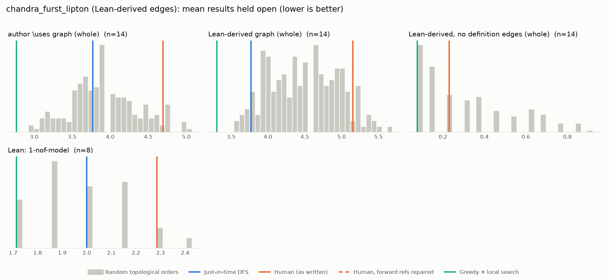

# Phase 1: chandra_furst_lipton

*YaelDillies/ChandraFurstLipton @ 5818428f492b (2026-09-20), Lean leanprover/lean4:v4.35.0-rc2*

## Formal graph

- Project declarations (after folding compiler auxiliaries): 29 (def: 12, inductive: 2, theorem: 15); 67 project-internal dependency edges.
- Blueprint `\lean{}` names resolved to project declarations: 15 (100%); 14 of 31 blueprint nodes have at least one.
- Project theorems the blueprint never names: 11.

## Author `\uses` edges vs Lean

Over the 14 formalised nodes. Lean edges are projected onto blueprint nodes through unlabelled helper declarations.

| | count |
|---|---:|
| Author edges | 20 |
| … also a direct Lean dependency | 16 |
| … implied by a chain of Lean dependencies | 0 |
| … not a Lean dependency at all | 4 |
| Lean edges | 27 |
| … not written by the author | 11 |
| … … of which from a definition node | 11 |

Most frequent sources of unreported edges: `def:protocol` (6), `def:forget` (3), `def:broadcast` (2).

## Ordering (Phase 0 metrics) on both graphs

Share of random orders better than the human order (0% = human beats all):

| Scope | n | edges | Kahn null | uniform null | mean open: human / optimised / uniform median | τ(human, optimised) |
|---|---:|---:|---:|---:|---:|---:|
| author \uses graph (whole) | 14 | 20 | 94% | 56% | 4.7 / 2.8 / 4.6 | +0.41 |
| Lean-derived graph (whole) | 14 | 27 | 92% | 64% | 5.2 / 3.3 / 5.0 | +0.27 |
| Lean-derived, no definition edges (whole) | 14 | 1 | 48% | 36% | 0.2 / 0.1 / 0.3 | +0.36 |
| Lean: 1-nof-model | 8 | 12 | 93% | 72% | 2.3 / 1.7 / 2.1 | +0.50 |

Forward references in the human order under Lean edges: 0

