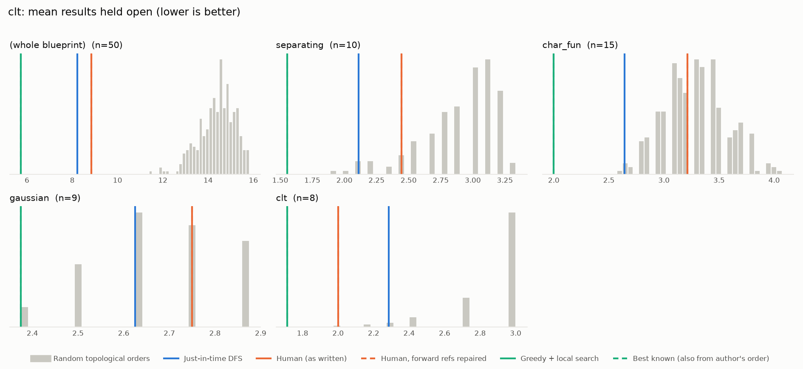
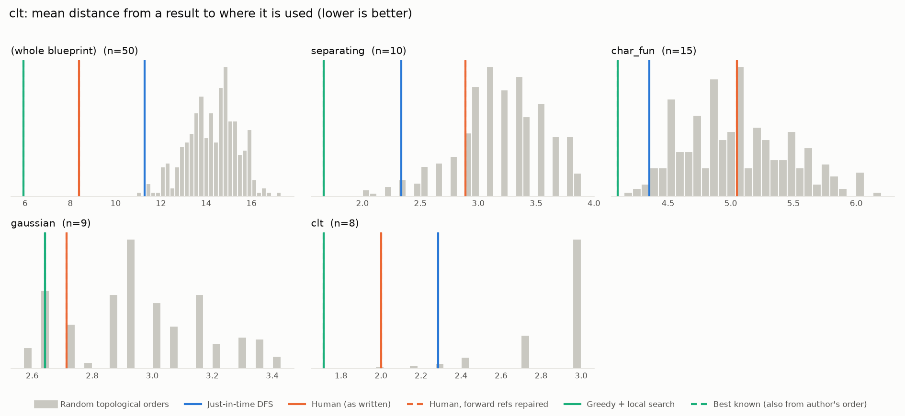

# Phase 0: clt

*RemyDegenne/CLT @ 760df08d054d (2026-05-06)*

50 nodes, 80 dependency edges. Null models per scope: 300 randomised-Kahn topological orders (biased towards opening many results early) and 200 approximately uniform ones (Karzanov–Khachiyan MCMC). All metrics: lower is better.

**Share of random orders better than the order** (0% = the order beats every random one; 50% = typical):

| Scope | n | forward edges | Human: mean open (Kahn null) | Human: mean open (uniform null) | Human: mean edge length (Kahn) | Mean open: human / best known / uniform median | τ(human, optimised) | τ(human, random) |
|---|---:|---:|---:|---:|---:|---:|---:|---:|
| (whole blueprint) | 50 | 0% | 0% | 0% | 0% | 8.8 / 5.7 / 14.2 | +0.69 | +0.30 |
| separating | 10 | 0% | 9% | 6% | 18% | 2.4 / 1.6 / 3.0 | +0.64 | +0.48 |
| char_fun | 15 | 0% | 42% | 29% | 54% | 3.2 / 2.0 / 3.4 | +0.31 | +0.38 |
| gaussian | 9 | 0% | 64% | 38% | 19% | 2.8 / 2.4 / 2.8 | +0.72 | +0.73 |
| clt | 8 | 0% | 1% | 4% | 1% | 2.0 / 1.7 / 2.7 | +0.86 | +0.44 |

## Whole blueprint: raw metrics

| Order | fwd refs | mean open | max open | mean cut | cutwidth | mean edge length | τ vs human | chapter runs |
|---|---:|---:|---:|---:|---:|---:|---:|---:|
| Human (as written) | 0 | 8.8 | 15 | 13.7 | 25 | 8.4 | +1.00 | 6 |
| Human, forward refs repaired | 0 | 8.8 | 15 | 13.7 | 25 | 8.4 | +1.00 | 6 |
| Just-in-time DFS (median run) | 0 | 8.2 | 15 | 18.4 | 26 | 11.3 | +0.26 | 18 |
| Greedy min-open (best run) | 0 | 9.7 | 17 | 18.2 | 26 | 11.2 | +0.47 | 24 |
| Greedy + local search on mean open (best run) | 0 | 5.7 | 10 | 9.7 | 21 | 5.9 | +0.69 | 18 |
| Best known (local search also from the author's order) | 0 | 5.7 | 10 | 9.7 | 21 | 5.9 | +0.69 | 18 |
| Random topological (median) | 0 | 14.5 | 23 | 23.4 | 35 | 14.3 | +0.30 | |
| Uniform topological (median) | 0 | 14.2 | 22 | 24.7 | 35 | 15.1 | | |

## Forward references in the human order (0)

None.

