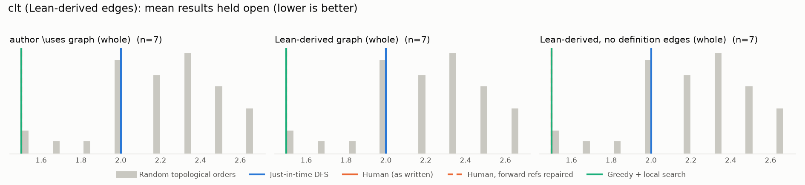

# Phase 1: clt

*RemyDegenne/CLT @ 760df08d054d (2026-05-06), Lean leanprover/lean4:v4.29.0-rc3*

## Formal graph

- Project declarations (after folding compiler auxiliaries): 26 (def: 4, theorem: 22); 27 project-internal dependency edges.
- Blueprint `\lean{}` names resolved to project declarations: 7 (16%); 7 of 50 blueprint nodes have at least one.
- Project theorems the blueprint never names: 15.

## Author `\uses` edges vs Lean

Over the 7 formalised nodes. Lean edges are projected onto blueprint nodes through unlabelled helper declarations.

| | count |
|---|---:|
| Author edges | 5 |
| … also a direct Lean dependency | 5 |
| … implied by a chain of Lean dependencies | 0 |
| … not a Lean dependency at all | 0 |
| Lean edges | 5 |
| … not written by the author | 0 |
| … … of which from a definition node | 0 |

Most frequent sources of unreported edges: .

## Ordering (Phase 0 metrics) on both graphs

Share of random orders better than the human order (0% = human beats all):

| Scope | n | edges | Kahn null | uniform null | mean open: human / optimised / uniform median | τ(human, optimised) |
|---|---:|---:|---:|---:|---:|---:|
| author \uses graph (whole) | 7 | 5 | 3% | 3% | 1.5 / 1.5 / 2.2 | +0.90 |
| Lean-derived graph (whole) | 7 | 5 | 3% | 3% | 1.5 / 1.5 / 2.2 | +0.90 |
| Lean-derived, no definition edges (whole) | 7 | 5 | 3% | 3% | 1.5 / 1.5 / 2.2 | +0.90 |

Forward references in the human order under Lean edges: 0

## `\lean{}` names not found in the project

- `def:weak_cvg_measure`: `MeasureTheory.ProbabilityMeasure.tendsto_iff_forall_integral_tendsto`
- `def:cvg_distribution`: `MeasureTheory.ProbabilityMeasure.tendsto_iff_forall_integral_tendsto`
- `def:tight`: `MeasureTheory.IsTightMeasureSet`
- `lem:isTightMeasureSet_iff_norm`: `MeasureTheory.isTightMeasureSet_iff_tendsto_measure_norm_gt`
- `lem:isTightMeasureSet_iff_sup_inner`: `MeasureTheory.isTightMeasureSet_iff_inner_tendsto`
- `lem:isTightMeasureSet_iff_basis`: `isTightMeasureSet_iff_tendsto_limsup_inner`
- `lem:relatively_compact_of_tight`: `isCompact_closure_of_isTightMeasureSet`
- `def:separates_points`: `Set.SeparatesPoints`
- `lem:bounded_continuous_separating`: `MeasureTheory.ext_of_forall_integral_eq_of_IsFiniteMeasure`
- `lem:exp_character`: `BoundedContinuousFunction.charMonoidHom`
- `lem:starSubalgebra_expPoly`: `BoundedContinuousFunction.charPoly`
- `lem:separates_points_expPoly`: `BoundedContinuousFunction.separatesPoints_charPoly`
- `lem:integral_restrict_compact`: `abs_integral_sub_setIntegral_mulExpNegMulSq_comp_lt`
- `lem:introduce_exponential`: `tendsto_integral_mulExpNegMulSq_comp`
- `lem:dist_integral_mulExpNegMulSq_comp_le`: `dist_integral_mulExpNegMulSq_comp_le`
- `thm:separating_starSubalgebra`: `MeasureTheory.ext_of_forall_mem_subalgebra_integral_eq_of_polish`
- `def:charFun`: `MeasureTheory.charFun`
- `lem:charFun_bounded`: `MeasureTheory.norm_charFun_le_one`
- `lem:charFun_contDiff`: `contDiff_charFun`
- `lem:charFun_continuous`: `continuous_charFun`
- `lem:charFun_neg`: `MeasureTheory.charFun_neg`
- `lem:charFun_smul`: `MeasureTheory.charFun_map_smul`
- `lem:charFun_add_of_indep`: `MeasureTheory.charFun_conv`
- `lem:integral_exp_I`: `integral_exp_mul_I_eq_sin`
- `lem:integral_charFun`: `integral_exp_mul_I_eq_sinc`
- `lem:charFun_bound_large`: `MeasureTheory.measureReal_abs_gt_le_integral_charFun`
- `lem:charFun_bound_inner`: `MeasureTheory.measureReal_abs_inner_gt_le_integral_charFun`
- `lem:ext_charFun`: `MeasureTheory.Measure.ext_of_charFun`
- `def:gaussianReal`: `ProbabilityTheory.gaussianReal`
- `lem:gaussian_charFun`: `ProbabilityTheory.charFun_gaussianReal`
- `lem:add_gaussianReal`: `ProbabilityTheory.gaussianReal_conv_gaussianReal`
- `def:isGaussian`: `ProbabilityTheory.IsGaussian`
- `lem:isGaussian_gaussianReal`: `ProbabilityTheory.isGaussian_gaussianReal`
- `lem:isGaussian_add`: `ProbabilityTheory.isGaussian_conv`
- `lem:deriv_charFun`: `iteratedDeriv_charFun`
- `lem:taylor_peano`: `taylor_isLittleO`
- `lem:iIndepFun_iff_pi_map_eq_map`: `ProbabilityTheory.iIndepFun_iff_map_fun_eq_pi_map`
- `lem:charFun_taylor`: `taylor_charFun`

