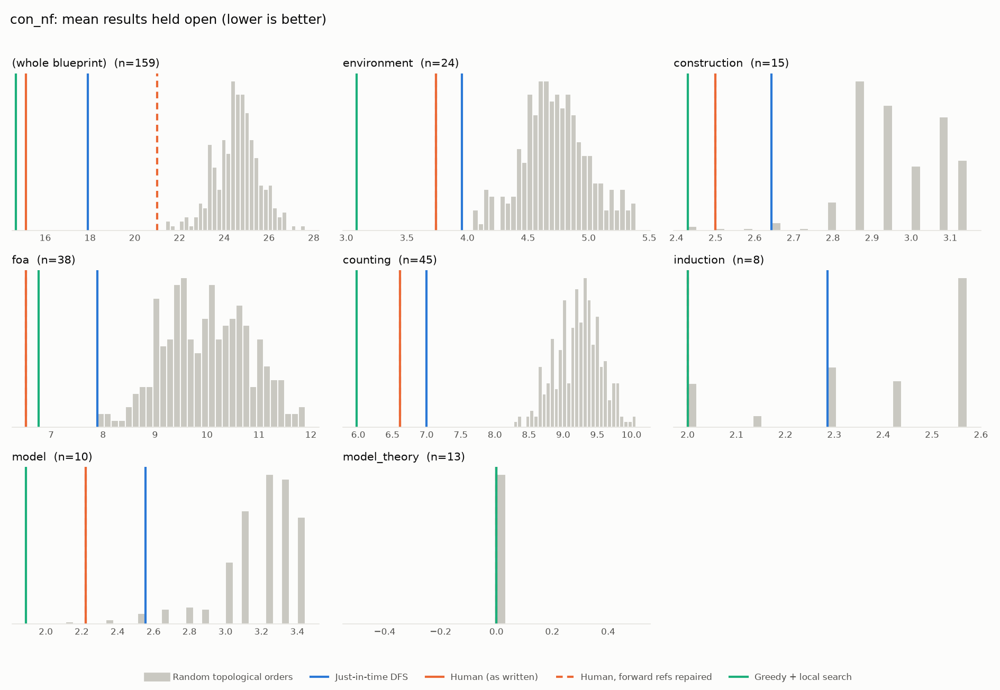
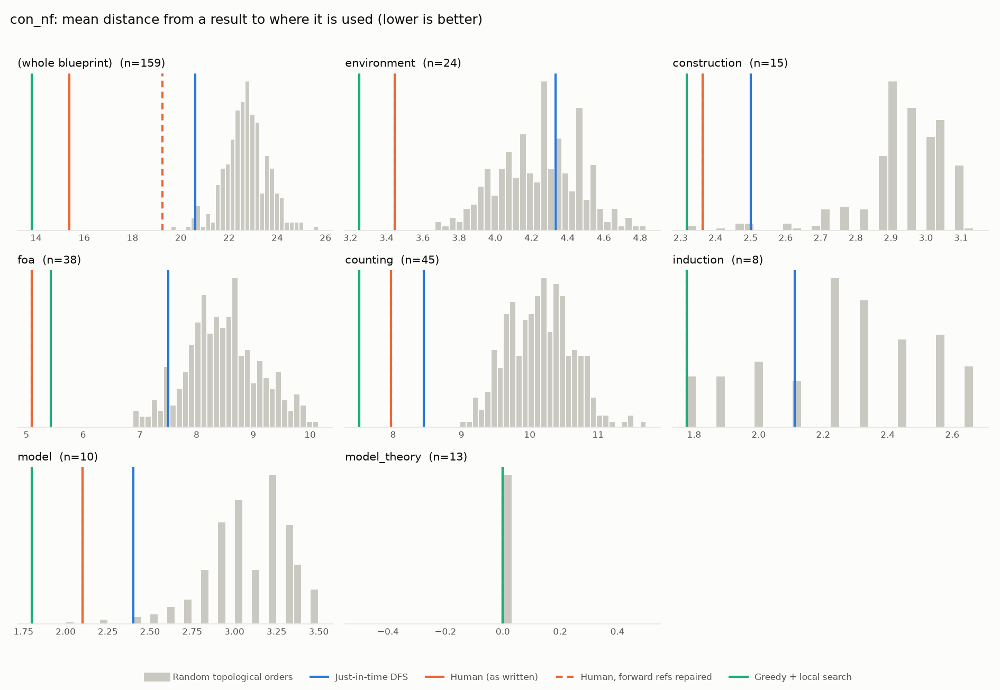

# Phase 0: con_nf

*leanprover-community/con-nf @ 55b939a3acf9 (2025-06-18)*

159 nodes, 293 dependency edges. Null models per scope: 300 randomised-Kahn topological orders (biased towards opening many results early) and 200 approximately uniform ones (Karzanov–Khachiyan MCMC). All metrics: lower is better.

**Share of random orders better than the order** (0% = the order beats every random one; 50% = typical):

| Scope | n | forward edges | Human: mean open (Kahn null) | Human: mean open (uniform null) | Human: mean edge length (Kahn) | Mean open: human / optimised / uniform median | τ(human, optimised) | τ(human, random) |
|---|---:|---:|---:|---:|---:|---:|---:|---:|
| (whole blueprint) | 159 | 1% | 0% | 0% | 0% | 15.1 / 14.7 / 29.4 | +0.29 | +0.16 |
| environment | 24 | 0% | 0% | 2% | 0% | 3.7 / 3.1 / 4.7 | +0.84 | +0.66 |
| construction | 15 | 0% | 1% | 8% | 1% | 2.5 / 2.4 / 2.9 | +0.90 | +0.78 |
| foa | 38 | 0% | 0% | 0% | 0% | 6.5 / 6.8 / 10.2 | +0.80 | +0.37 |
| counting | 45 | 0% | 0% | 0% | 0% | 6.6 / 6.0 / 9.3 | +0.81 | +0.54 |
| induction | 8 | 0% | 7% | 2% | 4% | 2.0 / 2.0 / 2.6 | +1.00 | +0.58 |
| model | 10 | 0% | 0% | 3% | 0% | 2.2 / 1.9 / 3.1 | +0.78 | +0.43 |
| model_theory | 13 | 0% | 50% | 50% | 50% | 0.0 / 0.0 / 0.0 | -0.08 | +0.01 |

## Whole blueprint: raw metrics

| Order | fwd refs | mean open | max open | mean cut | cutwidth | mean edge length | τ vs human | chapter runs |
|---|---:|---:|---:|---:|---:|---:|---:|---:|
| Human (as written) | 2 | 15.1 | 27 | 28.5 | 56 | 15.4 | +1.00 | 8 |
| Human, forward refs repaired | 0 | 21.0 | 36 | 35.7 | 59 | 19.2 | +0.90 | 13 |
| Just-in-time DFS (median run) | 0 | 17.9 | 36 | 38.2 | 74 | 20.6 | +0.53 | 31 |
| Greedy min-open (best run) | 0 | 18.8 | 34 | 35.3 | 64 | 19.0 | +0.21 | 48 |
| Greedy + local search (best run) | 0 | 14.7 | 25 | 25.6 | 50 | 13.8 | +0.29 | 31 |
| Random topological (median) | 0 | 24.6 | 49 | 42.1 | 83 | 22.7 | +0.16 | |
| Uniform topological (median) | 0 | 29.4 | 51 | 54.5 | 92 | 29.4 | | |

## Forward references in the human order (2)

- `prop:exists_flexApprox` uses `prop:completing_restricted_orbits`, which is stated later
- `prop:exists_flexApprox` uses `prop:completing_orbits`, which is stated later

