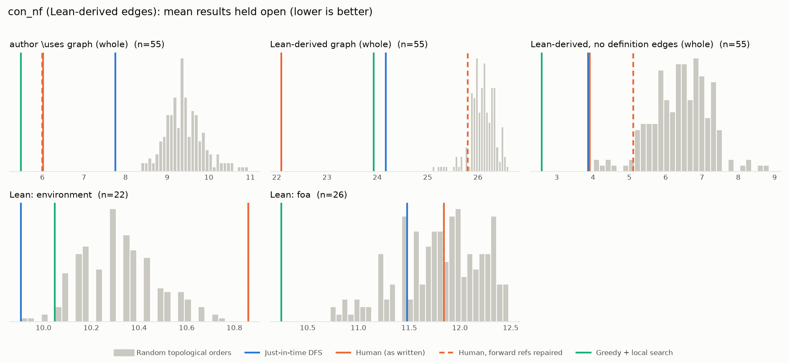

# Phase 1: con_nf

*leanprover-community/con-nf @ 55b939a3acf9 (2025-06-18), Lean leanprover/lean4:v4.21.0-rc3*

## Formal graph

- Project declarations (after folding compiler auxiliaries): 1998 (constructor: 2, def: 509, inductive: 87, theorem: 1400); 29622 dependency edges.
- Blueprint `\lean{}` names resolved to project declarations: 57 (90%); 55 of 159 blueprint nodes have at least one.
- Project theorems the blueprint never names: 1388.

## Author `\uses` edges vs Lean

Over the 55 formalised nodes. Lean edges are projected onto blueprint nodes through unlabelled helper declarations.

| | count |
|---|---:|
| Author edges | 87 |
| … also a direct Lean dependency | 63 |
| … implied by a chain of Lean dependencies | 0 |
| … not a Lean dependency at all | 24 |
| Lean edges | 519 |
| … not written by the author | 456 |
| … … of which from a definition node | 417 |

Most frequent sources of unreported edges: `def:Params` (46), `def:Atom` (34), `def:Litter` (33), `def:Small` (30), `def:TypeIndex` (29), `def:NearLitter` (28), `def:Path` (21), `def:BaseApprox` (17), `def:StrPerm` (15), `def:StrSet` (14).

## Ordering (Phase 0 metrics) on both graphs

Share of random orders better than the human order (0% = human beats all):

| Scope | n | edges | Kahn null | uniform null | mean open: human / optimised / uniform median | τ(human, optimised) |
|---|---:|---:|---:|---:|---:|---:|
| author \uses graph (whole) | 55 | 87 | 0% | 0% | 6.0 / 5.5 / 9.7 | +0.72 |
| Lean-derived graph (whole) | 55 | 519 | 0% | 0% | 22.1 / 23.9 / 26.1 | +0.31 |
| Lean-derived, no definition edges (whole) | 55 | 53 | 0% | 0% | 3.9 / 2.6 / 8.4 | +0.33 |
| Lean: environment | 22 | 110 | 100% | 98% | 10.9 / 10.0 / 10.5 | +0.71 |
| Lean: foa | 26 | 101 | 50% | 41% | 11.8 / 10.2 / 11.9 | +0.09 |

Forward references in the human order under Lean edges: 9

- `prop:exists_flexApprox` depends on `def:OrbitRestriction`, stated later
- `prop:exists_flexApprox` depends on `prop:completing_restricted_orbits`, stated later
- `prop:exists_flexApprox` depends on `prop:completing_orbits`, stated later
- `prop:approximates_of_flexApprox` depends on `def:OrbitRestriction`, stated later
- `prop:approximates_of_flexApprox` depends on `prop:completing_restricted_orbits`, stated later
- `prop:approximates_of_flexApprox` depends on `prop:completing_orbits`, stated later
- `thm:StrAction.foa` depends on `def:OrbitRestriction`, stated later
- `thm:StrAction.foa` depends on `prop:completing_restricted_orbits`, stated later
- `thm:StrAction.foa` depends on `prop:completing_orbits`, stated later

## `\lean{}` names not found in the project

- `prop:Params.minimal`: `ConNF.minimalParams`, `ConNF.inaccessibleParams`
- `def:StrApprox.Coherent`: `ConNF.StrApprox.CoherentAt`
- `prop:StrApprox.chain`: `ConNF.StrApprox.exists_isMax`
- `thm:StrApprox.foa`: `ConNF.StrApprox.exists_exactlyApproximates`
- `def:Interference`: `ConNF.Interference`

