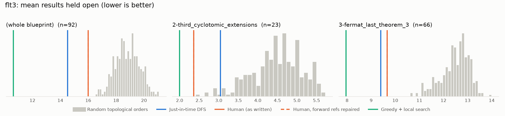
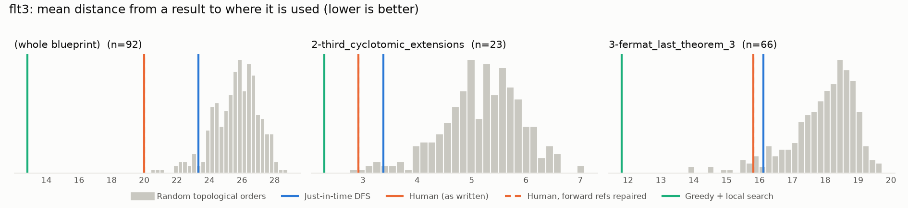

# Phase 0: flt3

*pitmonticone/FLT3 @ a199fa0467f8 (2024-08-21)*

92 nodes, 227 dependency edges. Null models per scope: 300 randomised-Kahn topological orders (biased towards opening many results early) and 200 approximately uniform ones (Karzanov–Khachiyan MCMC). All metrics: lower is better.

**Share of random orders better than the order** (0% = the order beats every random one; 50% = typical):

| Scope | n | forward edges | Human: mean open (Kahn null) | Human: mean open (uniform null) | Human: mean edge length (Kahn) | Mean open: human / optimised / uniform median | τ(human, optimised) | τ(human, random) |
|---|---:|---:|---:|---:|---:|---:|---:|---:|
| (whole blueprint) | 92 | 0% | 0% | 0% | 0% | 16.0 / 10.6 / 20.4 | +0.66 | +0.63 |
| 2-third_cyclotomic_extensions | 23 | 0% | 0% | 0% | 0% | 2.4 / 2.0 / 5.4 | +0.02 | +0.45 |
| 3-fermat_last_theorem_3 | 66 | 0% | 0% | 0% | 5% | 9.7 / 8.0 / 12.8 | +0.63 | +0.67 |

## Whole blueprint: raw metrics

| Order | fwd refs | mean open | max open | mean cut | cutwidth | mean edge length | τ vs human | chapter runs |
|---|---:|---:|---:|---:|---:|---:|---:|---:|
| Human (as written) | 0 | 16.0 | 26 | 49.9 | 95 | 20.0 | +1.00 | 3 |
| Human, forward refs repaired | 0 | 16.0 | 26 | 49.9 | 95 | 20.0 | +1.00 | 3 |
| Just-in-time DFS (median run) | 0 | 14.5 | 25 | 58.2 | 88 | 23.3 | +0.38 | 20 |
| Greedy min-open (best run) | 0 | 13.1 | 22 | 44.1 | 86 | 17.7 | +0.76 | 18 |
| Greedy + local search (best run) | 0 | 10.6 | 21 | 32.0 | 75 | 12.8 | +0.66 | 17 |
| Random topological (median) | 0 | 18.8 | 30 | 64.2 | 98 | 25.7 | +0.63 | |
| Uniform topological (median) | 0 | 20.4 | 32 | 69.6 | 100 | 27.9 | | |

## Forward references in the human order (0)

None.

