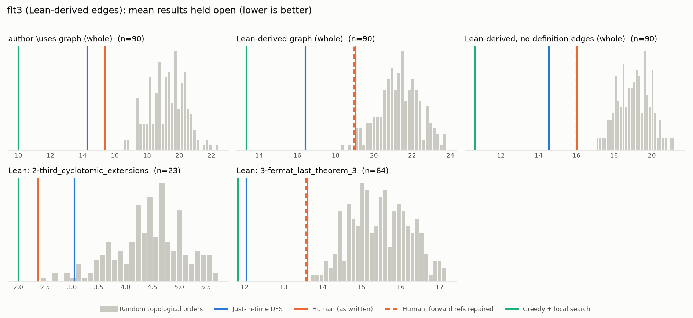

# Phase 1: flt3

*pitmonticone/FLT3 @ a199fa0467f8 (2024-08-21), Lean leanprover/lean4:v4.7.0-rc2*

## Formal graph

- Project declarations (after folding compiler auxiliaries): 235 (def: 71, inductive: 2, theorem: 162); 1000 dependency edges.
- Blueprint `\lean{}` names resolved to project declarations: 90 (100%); 90 of 92 blueprint nodes have at least one.
- Project theorems the blueprint never names: 78.

## Author `\uses` edges vs Lean

Over the 90 formalised nodes. Lean edges are projected onto blueprint nodes through unlabelled helper declarations.

| | count |
|---|---:|
| Author edges | 204 |
| … also a direct Lean dependency | 196 |
| … implied by a chain of Lean dependencies | 5 |
| … not a Lean dependency at all | 3 |
| Lean edges | 368 |
| … not written by the author | 172 |
| … … of which from a definition node | 75 |

Most frequent sources of unreported edges: `def:Solution1` (37), `def:Solution_Multiplicity` (27), `lmm:lambda_dvd_a_add_eta_mul_b` (18), `lmm:lambda_pow_dvd_a_add_b` (17), `lmm:lambda_dvd_a_add_eta_sq_mul_b` (16), `lmm:x_eq_unit_mul_cube` (10), `lmm:y_eq_unit_mul_cube` (10), `lmm:multiplicity_lambda_c_finite` (8), `lmm:z_eq_unit_mul_cube` (8), `def:Solution1_Multiplicity` (7).

## Ordering (Phase 0 metrics) on both graphs

Share of random orders better than the human order (0% = human beats all):

| Scope | n | edges | Kahn null | uniform null | mean open: human / optimised / uniform median | τ(human, optimised) |
|---|---:|---:|---:|---:|---:|---:|
| author \uses graph (whole) | 90 | 204 | 0% | 0% | 15.4 / 10.0 / 20.3 | +0.64 |
| Lean-derived graph (whole) | 90 | 368 | 1% | 0% | 19.0 / 13.3 / 23.2 | +0.67 |
| Lean-derived, no definition edges (whole) | 90 | 238 | 0% | 0% | 16.0 / 10.6 / 20.9 | +0.62 |
| Lean: 2-third_cyclotomic_extensions | 23 | 24 | 0% | 0% | 2.4 / 2.0 / 5.2 | +0.02 |
| Lean: 3-fermat_last_theorem_3 | 64 | 307 | 0% | 0% | 13.6 / 11.8 / 16.3 | +0.60 |

Forward references in the human order under Lean edges: 1

- `def:Solution1_Multiplicity` depends on `lmm:multiplicity_lambda_c_finite`, stated later

