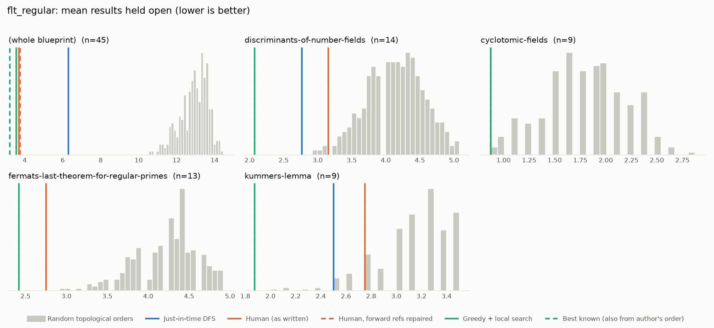
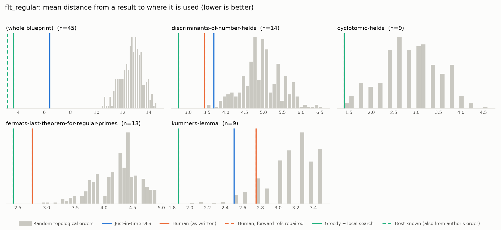

# Phase 0: flt_regular

*leanprover-community/flt-regular @ 8c3c5a908a63 (2026-08-24)*

45 nodes, 51 dependency edges. Null models per scope: 300 randomised-Kahn topological orders (biased towards opening many results early) and 200 approximately uniform ones (Karzanov–Khachiyan MCMC). All metrics: lower is better.

**Share of random orders better than the order** (0% = the order beats every random one; 50% = typical):

| Scope | n | forward edges | Human: mean open (Kahn null) | Human: mean open (uniform null) | Human: mean edge length (Kahn) | Mean open: human / best known / uniform median | τ(human, optimised) | τ(human, random) |
|---|---:|---:|---:|---:|---:|---:|---:|---:|
| (whole blueprint) | 45 | 2% | 0% | 0% | 0% | 3.7 / 3.2 / 12.0 | +0.44 | +0.09 |
| discriminants-of-number-fields | 14 | 0% | 1% | 2% | 0% | 3.2 / 2.1 / 4.4 | -0.27 | +0.28 |
| cyclotomic-fields | 9 | 0% | 0% | 1% | 0% | 0.9 / 0.9 / 1.9 | -0.61 | +0.03 |
| fermats-last-theorem-for-regular-primes | 13 | 0% | 0% | 0% | 0% | 2.8 / 2.4 / 4.2 | +0.69 | +0.38 |
| kummers-lemma | 9 | 0% | 12% | 16% | 12% | 2.8 / 1.9 / 3.1 | +0.17 | +0.40 |

## Whole blueprint: raw metrics

| Order | fwd refs | mean open | max open | mean cut | cutwidth | mean edge length | τ vs human | chapter runs |
|---|---:|---:|---:|---:|---:|---:|---:|---:|
| Human (as written) | 1 | 3.7 | 7 | 4.2 | 8 | 3.6 | +1.00 | 4 |
| Human, forward refs repaired | 0 | 3.8 | 7 | 4.2 | 8 | 3.7 | +0.94 | 5 |
| Just-in-time DFS (median run) | 0 | 6.3 | 13 | 7.4 | 14 | 6.4 | +0.54 | 15 |
| Greedy min-open (best run) | 0 | 7.0 | 11 | 8.2 | 15 | 7.1 | +0.29 | 15 |
| Greedy + local search on mean open (best run) | 0 | 3.5 | 6 | 4.2 | 7 | 3.6 | +0.44 | 9 |
| Best known (local search also from the author's order) | 0 | 3.2 | 6 | 3.7 | 7 | 3.2 | +0.89 | 7 |
| Random topological (median) | 0 | 13.0 | 21 | 14.8 | 24 | 12.8 | +0.09 | |
| Uniform topological (median) | 0 | 12.0 | 20 | 14.2 | 22 | 12.3 | | |

## Forward references in the human order (1)

- `thm:Kummers_lemma` uses `Kummer_alt`, which is stated later

