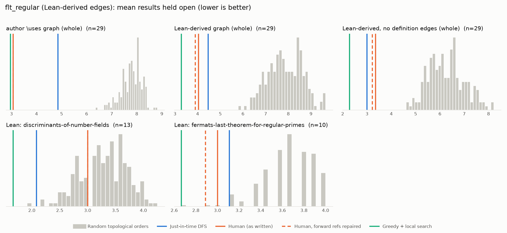

# Phase 1: flt_regular

*leanprover-community/flt-regular @ 8c3c5a908a63 (2026-08-24), Lean leanprover/lean4:v4.34.0-rc2*

## Formal graph

- Project declarations (after folding compiler auxiliaries): 295 (def: 62, inductive: 1, theorem: 232); 751 dependency edges, including 17 blueprint-named declarations outside the project (e.g. upstreamed to Mathlib).
- Blueprint `\lean{}` names resolved to project declarations: 29 (81%); 29 of 45 blueprint nodes have at least one.
- Project theorems the blueprint never names: 221.

## Author `\uses` edges vs Lean

Over the 29 formalised nodes. Lean edges are projected onto blueprint nodes through unlabelled helper declarations.

| | count |
|---|---:|
| Author edges | 31 |
| … also a direct Lean dependency | 24 |
| … implied by a chain of Lean dependencies | 1 |
| … not a Lean dependency at all | 6 |
| Lean edges | 40 |
| … not written by the author | 16 |
| … … of which from a definition node | 7 |

Most frequent sources of unreported edges: `defn_of_disc` (4), `defn:is_regular_number` (3), `lemma:cyclo_poly_deg` (3), `lemma:cyclo_poly_irr` (2), `lem:Hilbert92` (1), `lem:lin_indep_iff_disc_ne_zero` (1), `lem:roots_of_unity_in_cyclo` (1), `lemma:trace_of_alg_int_is_int` (1).

## Ordering (Phase 0 metrics) on both graphs

Share of random orders better than the human order (0% = human beats all):

| Scope | n | edges | Kahn null | uniform null | mean open: human / optimised / uniform median | τ(human, optimised) |
|---|---:|---:|---:|---:|---:|---:|
| author \uses graph (whole) | 29 | 31 | 0% | 0% | 3.1 / 3.0 / 7.3 | +0.52 |
| Lean-derived graph (whole) | 29 | 40 | 0% | 0% | 4.0 / 3.3 / 8.5 | +0.77 |
| Lean-derived, no definition edges (whole) | 29 | 27 | 0% | 0% | 3.4 / 2.3 / 7.2 | +0.73 |
| Lean: discriminants-of-number-fields | 13 | 15 | 25% | 17% | 3.0 / 1.7 / 3.5 | -0.26 |
| Lean: fermats-last-theorem-for-regular-primes | 10 | 12 | 1% | 3% | 3.0 / 2.7 / 3.7 | +0.82 |

Forward references in the human order under Lean edges: 2

- `lemma:may_assume_coprime` depends on `defn:is_regular_number`, stated later
- `thm:Kummers_lemma` depends on `lem:Hilbert92`, stated later

## `\lean{}` names not found in the project

- `lemma:diff_of_irr_pol`: `Polynomial.aeval_root_derivative_of_splits`
- `lemma:alg_int_abs_val_one`: `mem_roots_of_unity_of_abs_eq_one`
- `lemma:unit_lemma`: `unit_lemma_gal_conj`
- `lemma:zeta_pow_sub_eq_unit_zeta_sub_one`: `is_primitive_root.zeta_pow_sub_eq_unit_zeta_sub_one`
- `lemma:ideals_mult_to_power`: `ideal.exists_eq_pow_of_mul_eq_pow`
- `lem:exists_alg_int`: `exists_alg_int`
- `Hilbert90`: `Hilbert90`

