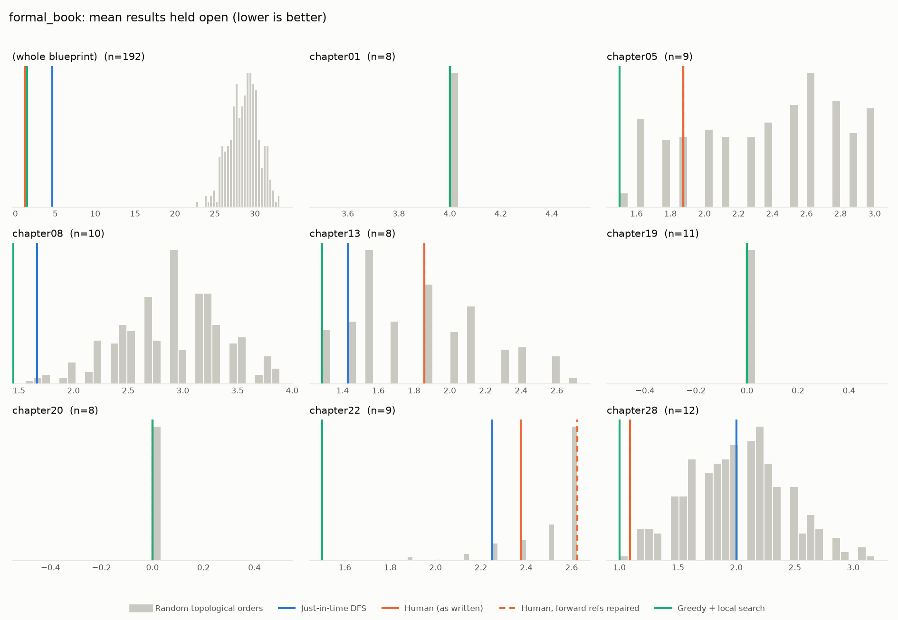
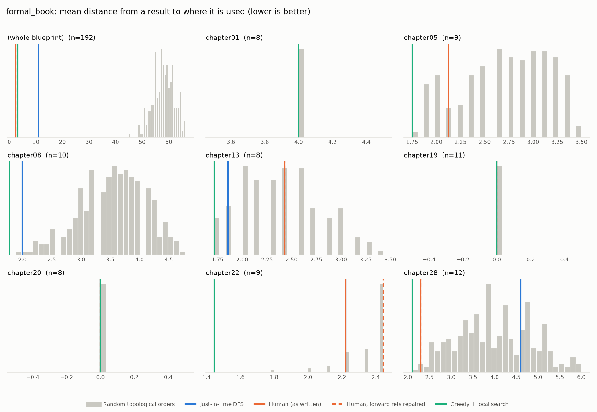

# Phase 0: formal_book

*mo271/FormalBook @ 239c3f099c3b (2026-09-22)*

192 nodes, 103 dependency edges. Null models per scope: 300 randomised-Kahn topological orders (biased towards opening many results early) and 200 approximately uniform ones (Karzanov–Khachiyan MCMC). All metrics: lower is better.

**Share of random orders better than the order** (0% = the order beats every random one; 50% = typical):

| Scope | n | forward edges | Human: mean open (Kahn null) | Human: mean open (uniform null) | Human: mean edge length (Kahn) | Mean open: human / optimised / uniform median | τ(human, optimised) | τ(human, random) |
|---|---:|---:|---:|---:|---:|---:|---:|---:|
| (whole blueprint) | 192 | 11% | 0% | 0% | 0% | 1.2 / 1.5 / 32.8 | -0.03 | -0.01 |
| chapter01 | 8 | 0% | 50% | 50% | 50% | 4.0 / 4.0 / 4.0 | +0.14 | +0.25 |
| chapter05 | 9 | 0% | 19% | 9% | 15% | 1.9 / 1.5 / 2.5 | +0.00 | +0.28 |
| chapter08 | 10 | 0% | 0% | 0% | 0% | 1.4 / 1.4 / 3.1 | +1.00 | +0.34 |
| chapter13 | 8 | 0% | 56% | 20% | 56% | 1.9 / 1.3 / 2.1 | -0.14 | +0.25 |
| chapter19 | 11 | 0% | 50% | 50% | 50% | 0.0 / 0.0 / 0.0 | +0.31 | -0.01 |
| chapter20 | 8 | 0% | 50% | 50% | 50% | 0.0 / 0.0 / 0.0 | +0.21 | +0.02 |
| chapter22 | 9 | 11% | 19% | 75% | 17% | 2.4 / 1.5 / 2.2 | +0.22 | -0.04 |
| chapter28 | 12 | 0% | 0% | 0% | 1% | 1.1 / 1.0 / 2.4 | +0.82 | +0.21 |

## Whole blueprint: raw metrics

| Order | fwd refs | mean open | max open | mean cut | cutwidth | mean edge length | τ vs human | chapter runs |
|---|---:|---:|---:|---:|---:|---:|---:|---:|
| Human (as written) | 11 | 1.2 | 7 | 1.3 | 7 | 2.5 | +1.00 | 45 |
| Human, forward refs repaired | 0 | 1.2 | 7 | 1.3 | 7 | 2.5 | +1.00 | 45 |
| Just-in-time DFS (median run) | 0 | 4.6 | 10 | 5.9 | 12 | 11.0 | -0.04 | 99 |
| Greedy min-open (best run) | 0 | 10.4 | 27 | 11.5 | 29 | 21.2 | -0.05 | 127 |
| Greedy + local search (best run) | 0 | 1.5 | 9 | 1.7 | 9 | 3.1 | -0.03 | 93 |
| Random topological (median) | 0 | 28.8 | 49 | 31.3 | 53 | 58.0 | -0.01 | |
| Uniform topological (median) | 0 | 32.8 | 53 | 36.8 | 57 | 68.2 | | |

## Forward references in the human order (11)

- `valuation` uses `valuation_on_reals`, which is stated later
- `ch23theorem1` uses `ch23theorem2`, which is stated later
- `ch23theorem2` uses `ch23corollary`, which is stated later
- `ch23theorem2` uses `chebyshev`, which is stated later
- `chebyshev` uses `ch23fact1`, which is stated later
- `chebyshev` uses `ch23fact2`, which is stated later
- `vanderwaerden` uses `gurvit`, which is stated later
- `ch37theorem1` uses `ch37fact_a`, which is stated later
- `ch37theorem1` uses `ch37fact_b`, which is stated later
- `ch37theorem1` uses `ch37fact_c`, which is stated later
- `lyusternik_shnirelman` uses `borsuk_ulam`, which is stated later

