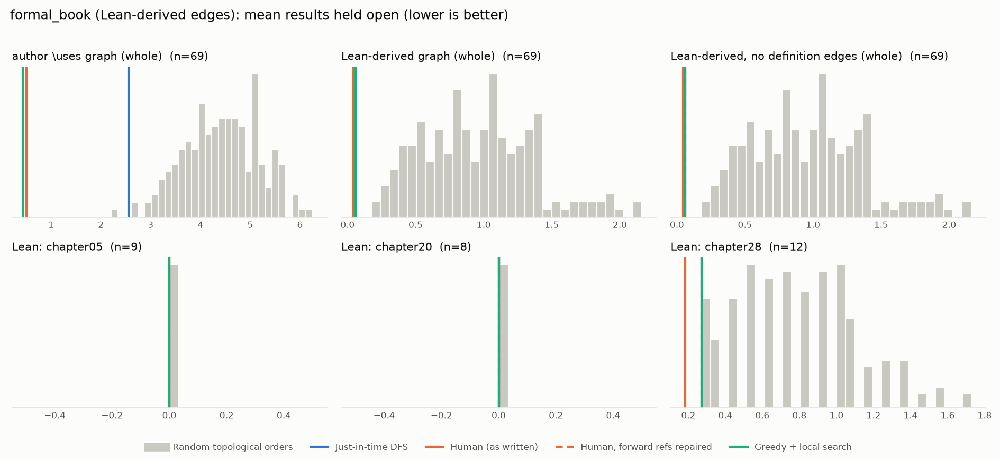

# Phase 1: formal_book

*mo271/FormalBook @ 239c3f099c3b (2026-09-22), Lean leanprover/lean4:v4.34.0-rc2*

## Formal graph

- Project declarations (after folding compiler auxiliaries): 507 (constructor: 1, def: 157, inductive: 7, recursor: 1, theorem: 341); 1047 dependency edges.
- Blueprint `\lean{}` names resolved to project declarations: 69 (100%); 69 of 192 blueprint nodes have at least one.
- Project theorems the blueprint never names: 273.

## Author `\uses` edges vs Lean

Over the 69 formalised nodes. Lean edges are projected onto blueprint nodes through unlabelled helper declarations.

| | count |
|---|---:|
| Author edges | 23 |
| … also a direct Lean dependency | 2 |
| … implied by a chain of Lean dependencies | 0 |
| … not a Lean dependency at all | 21 |
| Lean edges | 3 |
| … not written by the author | 1 |
| … … of which from a definition node | 0 |

Most frequent sources of unreported edges: `ch28_sum_choose` (1).

## Ordering (Phase 0 metrics) on both graphs

Share of random orders better than the human order (0% = human beats all):

| Scope | n | edges | Kahn null | uniform null | mean open: human / optimised / uniform median | τ(human, optimised) |
|---|---:|---:|---:|---:|---:|---:|
| author \uses graph (whole) | 69 | 23 | 0% | 0% | 0.5 / 0.4 / 5.8 | -0.05 |
| Lean-derived graph (whole) | 69 | 3 | 0% | 0% | 0.0 / 0.1 / 1.1 | +0.11 |
| Lean-derived, no definition edges (whole) | 69 | 3 | 0% | 0% | 0.0 / 0.1 / 1.1 | +0.11 |
| Lean: chapter05 | 9 | 0 | 50% | 50% | 0.0 / 0.0 / 0.0 | -0.17 |
| Lean: chapter20 | 8 | 0 | 50% | 50% | 0.0 / 0.0 / 0.0 | +0.21 |
| Lean: chapter28 | 12 | 2 | 0% | 0% | 0.2 / 0.3 / 0.8 | +0.12 |

Forward references in the human order under Lean edges: 1

- `ch28theorem` depends on `ch28_sum_choose`, stated later

