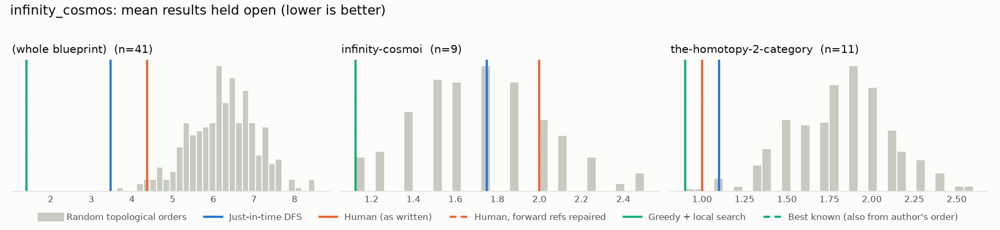
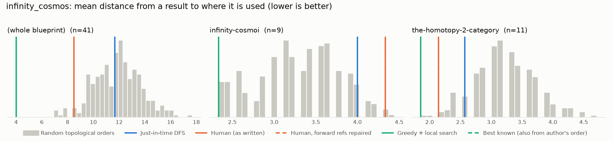

# Phase 0: infinity_cosmos

*emilyriehl/infinity-cosmos @ 4e1d20ffded8 (2026-08-20)*

41 nodes, 37 dependency edges. Null models per scope: 300 randomised-Kahn topological orders (biased towards opening many results early) and 200 approximately uniform ones (Karzanov–Khachiyan MCMC). All metrics: lower is better.

**Share of random orders better than the order** (0% = the order beats every random one; 50% = typical):

| Scope | n | forward edges | Human: mean open (Kahn null) | Human: mean open (uniform null) | Human: mean edge length (Kahn) | Mean open: human / best known / uniform median | τ(human, optimised) | τ(human, random) |
|---|---:|---:|---:|---:|---:|---:|---:|---:|
| (whole blueprint) | 41 | 0% | 2% | 0% | 3% | 4.4 / 1.4 / 7.3 | +0.01 | +0.18 |
| infinity-cosmoi | 9 | 0% | 81% | 53% | 99% | 2.0 / 1.1 / 2.0 | +0.11 | +0.41 |
| the-homotopy-2-category | 11 | 0% | 0% | 0% | 1% | 1.0 / 0.9 / 1.8 | +0.09 | +0.11 |

## Whole blueprint: raw metrics

| Order | fwd refs | mean open | max open | mean cut | cutwidth | mean edge length | τ vs human | chapter runs |
|---|---:|---:|---:|---:|---:|---:|---:|---:|
| Human (as written) | 0 | 4.4 | 8 | 7.8 | 16 | 8.5 | +1.00 | 7 |
| Human, forward refs repaired | 0 | 4.4 | 8 | 7.8 | 16 | 8.5 | +1.00 | 7 |
| Just-in-time DFS (median run) | 0 | 3.5 | 6 | 10.8 | 19 | 11.7 | +0.10 | 23 |
| Greedy min-open (best run) | 0 | 1.5 | 4 | 4.1 | 12 | 4.5 | +0.02 | 24 |
| Greedy + local search on mean open (best run) | 0 | 1.4 | 3 | 3.7 | 12 | 4.0 | +0.01 | 25 |
| Best known (local search also from the author's order) | 0 | 1.4 | 3 | 3.7 | 12 | 4.0 | +0.01 | 25 |
| Random topological (median) | 0 | 6.2 | 10 | 11.1 | 21 | 12.0 | +0.18 | |
| Uniform topological (median) | 0 | 7.3 | 12 | 14.4 | 23 | 15.6 | | |

## Forward references in the human order (0)

None.

