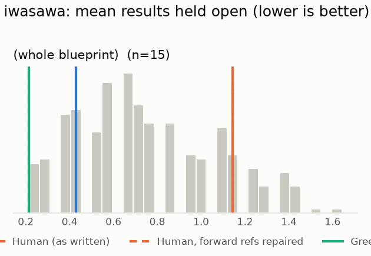
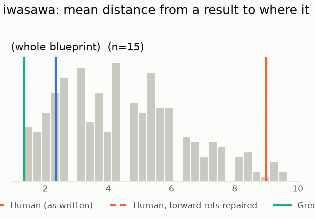

# Phase 0: iwasawa

*acmepjz/lean-iwasawa @ 7fffeb8c80fb (2026-07-29)*

15 nodes, 3 dependency edges. Null models per scope: 300 randomised-Kahn topological orders (biased towards opening many results early) and 200 approximately uniform ones (Karzanov–Khachiyan MCMC). All metrics: lower is better.

**Share of random orders better than the order** (0% = the order beats every random one; 50% = typical):

| Scope | n | forward edges | Human: mean open (Kahn null) | Human: mean open (uniform null) | Human: mean edge length (Kahn) | Mean open: human / best known / uniform median | τ(human, optimised) | τ(human, random) |
|---|---:|---:|---:|---:|---:|---:|---:|---:|
| (whole blueprint) | 15 | 0% | 87% | 64% | 98% | 1.1 / 0.2 / 1.0 | +0.33 | +0.17 |

## Whole blueprint: raw metrics

| Order | fwd refs | mean open | max open | mean cut | cutwidth | mean edge length | τ vs human | chapter runs |
|---|---:|---:|---:|---:|---:|---:|---:|---:|
| Human (as written) | 0 | 1.1 | 2 | 1.9 | 3 | 9.0 | +1.00 | 5 |
| Human, forward refs repaired | 0 | 1.1 | 2 | 1.9 | 3 | 9.0 | +1.00 | 5 |
| Just-in-time DFS (median run) | 0 | 0.4 | 1 | 0.5 | 2 | 2.3 | +0.05 | 12 |
| Greedy min-open (best run) | 0 | 0.2 | 1 | 0.3 | 2 | 1.3 | +0.33 | 11 |
| Greedy + local search on mean open (best run) | 0 | 0.2 | 1 | 0.3 | 2 | 1.3 | +0.33 | 11 |
| Best known (local search also from the author's order) | 0 | 0.2 | 1 | 0.3 | 2 | 1.3 | +0.33 | 11 |
| Random topological (median) | 0 | 0.7 | 2 | 0.9 | 2 | 4.3 | +0.17 | |
| Uniform topological (median) | 0 | 1.0 | 2 | 1.2 | 3 | 5.7 | | |

## Forward references in the human order (0)

None.

