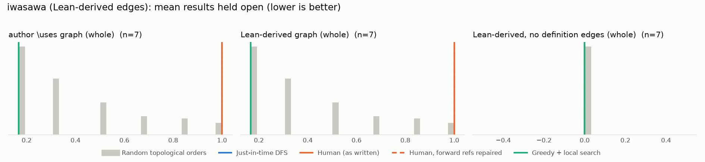

# Phase 1: iwasawa

*acmepjz/lean-iwasawa @ 7fffeb8c80fb (2026-07-29), Lean leanprover/lean4:v4.33.0-rc1*

## Formal graph

- Project declarations (after folding compiler auxiliaries): 950 (def: 121, inductive: 11, theorem: 818); 2718 dependency edges, including 1 blueprint-named declarations outside the project (e.g. upstreamed to Mathlib).
- Blueprint `\lean{}` names resolved to project declarations: 11 (100%); 7 of 15 blueprint nodes have at least one.
- Project theorems the blueprint never names: 818.

## Author `\uses` edges vs Lean

Over the 7 formalised nodes. Lean edges are projected onto blueprint nodes through unlabelled helper declarations.

| | count |
|---|---:|
| Author edges | 1 |
| … also a direct Lean dependency | 1 |
| … implied by a chain of Lean dependencies | 0 |
| … not a Lean dependency at all | 0 |
| Lean edges | 1 |
| … not written by the author | 0 |
| … … of which from a definition node | 0 |

Most frequent sources of unreported edges: .

## Ordering (Phase 0 metrics) on both graphs

Share of random orders better than the human order (0% = human beats all):

| Scope | n | edges | Kahn null | uniform null | mean open: human / optimised / uniform median | τ(human, optimised) |
|---|---:|---:|---:|---:|---:|---:|
| author \uses graph (whole) | 7 | 1 | 97% | 98% | 1.0 / 0.2 / 0.3 | +0.14 |
| Lean-derived graph (whole) | 7 | 1 | 97% | 98% | 1.0 / 0.2 / 0.3 | +0.14 |
| Lean-derived, no definition edges (whole) | 7 | 0 | 50% | 50% | 0.0 / 0.0 / 0.0 | -0.43 |

Forward references in the human order under Lean edges: 0

