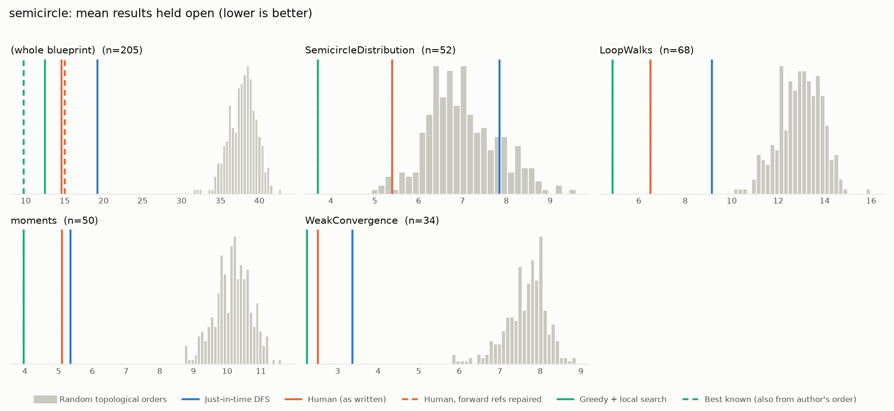
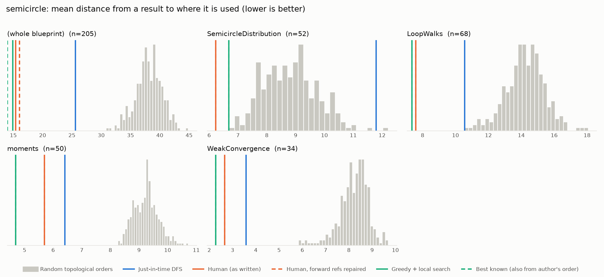

# Phase 0: semicircle

*fredraj3/SemicircleLaw @ 9f72b2d56258 (2026-09-10)*

205 nodes, 346 dependency edges. Null models per scope: 300 randomised-Kahn topological orders (biased towards opening many results early) and 200 approximately uniform ones (Karzanov–Khachiyan MCMC). All metrics: lower is better.

**Share of random orders better than the order** (0% = the order beats every random one; 50% = typical):

| Scope | n | forward edges | Human: mean open (Kahn null) | Human: mean open (uniform null) | Human: mean edge length (Kahn) | Mean open: human / best known / uniform median | τ(human, optimised) | τ(human, random) |
|---|---:|---:|---:|---:|---:|---:|---:|---:|
| (whole blueprint) | 205 | 1% | 0% | 0% | 0% | 14.6 / 9.7 / 41.6 | +0.19 | +0.19 |
| SemicircleDistribution | 52 | 0% | 2% | 0% | 0% | 5.4 / 3.7 / 10.8 | +0.73 | +0.71 |
| LoopWalks | 68 | 0% | 0% | 0% | 0% | 6.5 / 4.9 / 15.2 | +0.35 | +0.31 |
| moments | 50 | 0% | 0% | 0% | 0% | 5.1 / 4.0 / 10.0 | +0.13 | +0.21 |
| WeakConvergence | 34 | 0% | 0% | 0% | 0% | 2.5 / 2.2 / 7.2 | +0.65 | +0.28 |

## Whole blueprint: raw metrics

| Order | fwd refs | mean open | max open | mean cut | cutwidth | mean edge length | τ vs human | chapter runs |
|---|---:|---:|---:|---:|---:|---:|---:|---:|
| Human (as written) | 5 | 14.6 | 37 | 26.2 | 63 | 15.4 | +1.00 | 5 |
| Human, forward refs repaired | 0 | 15.0 | 32 | 27.2 | 60 | 16.0 | +0.98 | 11 |
| Just-in-time DFS (median run) | 0 | 19.2 | 32 | 43.4 | 85 | 25.6 | +0.23 | 51 |
| Greedy min-open (best run) | 0 | 27.0 | 50 | 46.0 | 83 | 27.1 | -0.05 | 60 |
| Greedy + local search on mean open (best run) | 0 | 12.5 | 27 | 25.3 | 66 | 14.9 | +0.19 | 37 |
| Best known (local search also from the author's order) | 0 | 9.7 | 22 | 23.7 | 64 | 14.0 | +0.85 | 31 |
| Random topological (median) | 0 | 38.1 | 61 | 64.7 | 106 | 38.1 | +0.19 | |
| Uniform topological (median) | 0 | 41.6 | 68 | 79.1 | 123 | 46.6 | | |

## Forward references in the human order (5)

- `lem:centralMoment_two_mul_semicircleReal` uses `def:Catalan_number`, which is stated later
- `lem:common_val_prod_eq_of_graph_walk_triple_rel` uses `lem:eq_equiv_eq_expect`, which is stated later
- `lem:common_val_prod_eq_of_graph_walk_triple_rel` uses `def:common_val_prod_of`, which is stated later
- `lem:common_val_prod_eq_of_graph_walk_triple_rel` uses `lem:common_val_eq_of_index_pair_rel`, which is stated later
- `lem:G_leq_k` uses `def:common_val_prod`, which is stated later

