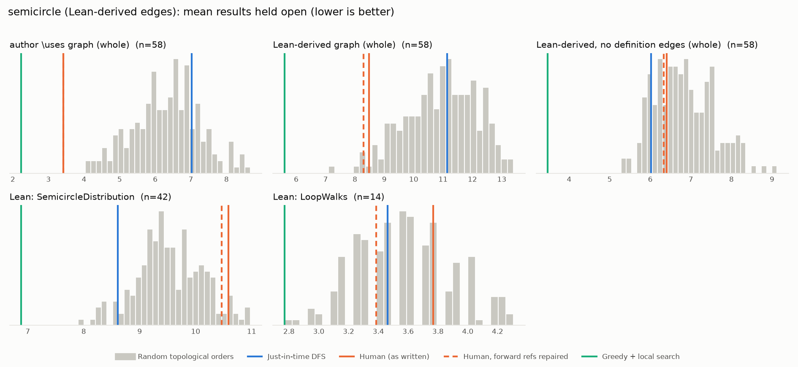

# Phase 1: semicircle

*fredraj3/SemicircleLaw @ 9f72b2d56258 (2026-09-10), Lean leanprover/lean4:v4.24.0*

## Formal graph

- Project declarations (after folding compiler auxiliaries): 229 (def: 94, inductive: 3, theorem: 132); 560 project-internal dependency edges.
- Blueprint `\lean{}` names resolved to project declarations: 59 (100%); 58 of 205 blueprint nodes have at least one.
- Project theorems the blueprint never names: 85.

## Author `\uses` edges vs Lean

Over the 58 formalised nodes. Lean edges are projected onto blueprint nodes through unlabelled helper declarations.

| | count |
|---|---:|
| Author edges | 75 |
| … also a direct Lean dependency | 48 |
| … implied by a chain of Lean dependencies | 1 |
| … not a Lean dependency at all | 26 |
| Lean edges | 139 |
| … not written by the author | 91 |
| … … of which from a definition node | 52 |

Most frequent sources of unreported edges: `def:semicirclePDF` (21), `def:semicirclePDFReal` (14), `def:loop_walk` (9), `lem:measurable_semicirclePDF` (6), `lem:semicirclePDFReal_def` (6), `def:length_of_w_i` (5), `lem:lintegral_semicirclePDF_eq_one` (4), `lem:integral_id_semicircleReal` (3), `lem:semicirclePDF_finite` (3), `lem:toReal_semicirclePDF` (3).

## Ordering (Phase 0 metrics) on both graphs

Share of random orders better than the human order (0% = human beats all):

| Scope | n | edges | Kahn null | uniform null | mean open: human / optimised / uniform median | τ(human, optimised) |
|---|---:|---:|---:|---:|---:|---:|
| author \uses graph (whole) | 58 | 75 | 0% | 0% | 3.4 / 2.2 / 10.5 | +0.66 |
| Lean-derived graph (whole) | 58 | 139 | 3% | 0% | 8.5 / 5.6 / 13.8 | +0.57 |
| Lean-derived, no definition edges (whole) | 58 | 56 | 32% | 0% | 6.4 / 3.5 / 8.6 | -0.14 |
| Lean: SemicircleDistribution | 42 | 111 | 95% | 64% | 10.6 / 6.9 / 10.3 | +0.49 |
| Lean: LoopWalks | 14 | 28 | 74% | 36% | 3.8 / 2.8 / 3.9 | +0.60 |

Forward references in the human order under Lean edges: 5

- `lem:lintegral_semicirclePDFReal_eq_one` depends on `lem:integral_semicirclePDFReal_eq_one`, stated later
- `lem:centralMoment_two_mul_semicircleReal` depends on `lem:centralMoment_fun_two_mul_semicircleReal`, stated later
- `lem:centralMoment_odd_semicircleReal` depends on `lem:centralMoment_fun_odd_semicircleReal`, stated later
- `def:graph_walk_vertices` depends on `def:length_of_w_i`, stated later
- `prop:vertex_edge_inequality` depends on `def:length_of_w_i`, stated later

