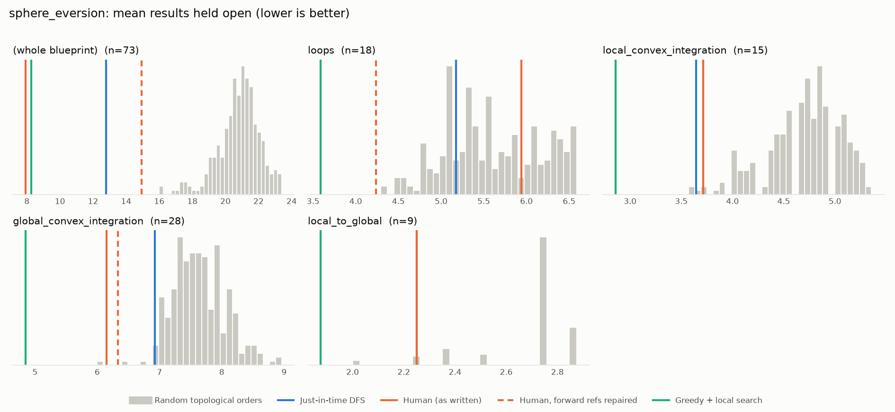
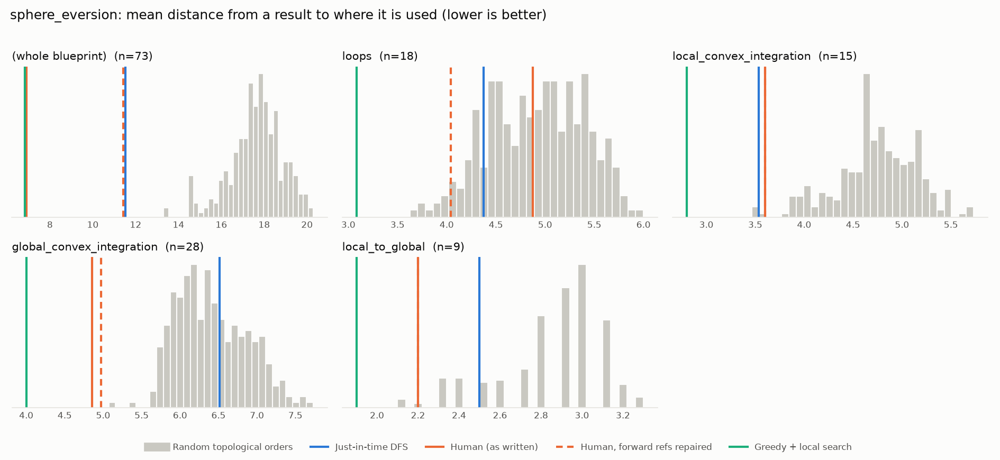

# Phase 0: sphere_eversion

*leanprover-community/sphere-eversion @ e03dfec32deb (2026-09-10)*

73 nodes, 104 dependency edges. Null models per scope: 300 randomised-Kahn topological orders (biased towards opening many results early) and 200 approximately uniform ones (Karzanov–Khachiyan MCMC). All metrics: lower is better.

**Share of random orders better than the order** (0% = the order beats every random one; 50% = typical):

| Scope | n | forward edges | Human: mean open (Kahn null) | Human: mean open (uniform null) | Human: mean edge length (Kahn) | Mean open: human / optimised / uniform median | τ(human, optimised) | τ(human, random) |
|---|---:|---:|---:|---:|---:|---:|---:|---:|
| (whole blueprint) | 73 | 11% | 0% | 0% | 0% | 7.9 / 8.3 / 20.4 | +0.25 | +0.17 |
| loops | 18 | 25% | 69% | 78% | 46% | 5.9 / 3.6 / 5.6 | +0.40 | +0.22 |
| local_convex_integration | 15 | 0% | 1% | 1% | 1% | 3.7 / 2.9 / 4.7 | +0.70 | +0.41 |
| global_convex_integration | 28 | 2% | 0% | 0% | 0% | 6.1 / 4.9 / 8.0 | +0.19 | +0.60 |
| local_to_global | 9 | 0% | 4% | 12% | 2% | 2.2 / 1.9 / 2.8 | +0.83 | +0.57 |

## Whole blueprint: raw metrics

| Order | fwd refs | mean open | max open | mean cut | cutwidth | mean edge length | τ vs human | chapter runs |
|---|---:|---:|---:|---:|---:|---:|---:|---:|
| Human (as written) | 11 | 7.9 | 15 | 10.0 | 21 | 6.9 | +1.00 | 5 |
| Human, forward refs repaired | 0 | 14.9 | 27 | 16.5 | 28 | 11.4 | +0.76 | 11 |
| Just-in-time DFS (median run) | 0 | 12.8 | 25 | 16.6 | 30 | 11.5 | +0.14 | 15 |
| Greedy min-open (best run) | 0 | 14.0 | 20 | 18.2 | 27 | 12.6 | +0.16 | 28 |
| Greedy + local search (best run) | 0 | 8.3 | 16 | 9.9 | 18 | 6.8 | +0.25 | 15 |
| Random topological (median) | 0 | 21.0 | 31 | 25.6 | 38 | 17.7 | +0.17 | |
| Uniform topological (median) | 0 | 20.4 | 32 | 27.4 | 40 | 19.0 | | |

## Forward references in the human order (11)

- `prop:∃_loops` uses `lem:∃_surrounding_loops`, which is stated later
- `prop:∃_loops` uses `lem:exists_cont_diff_of_convex`, which is stated later
- `prop:∃_loops` uses `lem:reparametrization`, which is stated later
- `prop:surrounded_by_open` uses `lem:caratheodory`, which is stated later
- `prop:surrounded_by_open` uses `lem:interior_chab`, which is stated later
- `prop:surrounded_by_open` uses `lem:int_homothety_cvx`, which is stated later
- `lem:∃_surrounding_loops` uses `lem:relative_inductive_construction_of_loc`, which is stated later
- `lem:nice_atlas` uses `def:index_type`, which is stated later
- `def:localisation_data` uses `def:index_type`, which is stated later
- `thm:open_ample` uses `lem:ample_parameter`, which is stated later
- `thm:open_ample` uses `lem:inductive_htpy_construction`, which is stated later

