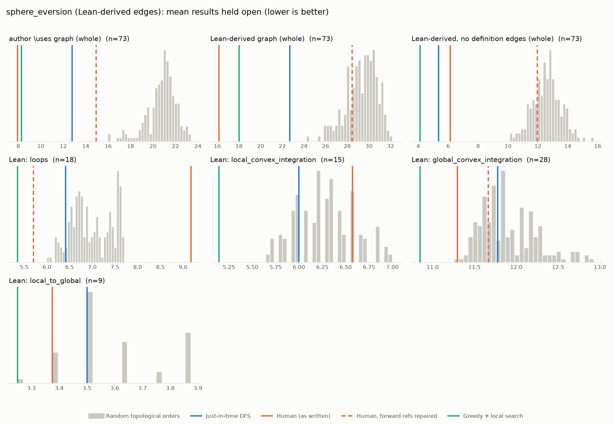

# Phase 1: sphere_eversion

*leanprover-community/sphere-eversion @ e03dfec32deb (2026-09-10), Lean leanprover/lean4:v4.34.0-rc2*

## Formal graph

- Project declarations (after folding compiler auxiliaries): 1378 (def: 324, inductive: 31, theorem: 1023); 7219 dependency edges, including 10 blueprint-named declarations outside the project (e.g. upstreamed to Mathlib).
- Blueprint `\lean{}` names resolved to project declarations: 91 (100%); 73 of 73 blueprint nodes have at least one.
- Project theorems the blueprint never names: 974.

## Author `\uses` edges vs Lean

Over the 73 formalised nodes. Lean edges are projected onto blueprint nodes through unlabelled helper declarations.

| | count |
|---|---:|
| Author edges | 104 |
| … also a direct Lean dependency | 92 |
| … implied by a chain of Lean dependencies | 0 |
| … not a Lean dependency at all | 12 |
| Lean edges | 265 |
| … not written by the author | 173 |
| … … of which from a definition node | 156 |

Most frequent sources of unreported edges: `def:pull_back_bundle` (18), `def:dual_pair` (14), `def:rel` (14), `def:one_jet_space` (13), `def:loop` (10), `def:germ` (8), `def:rel_loc` (8), `def:ample_subset` (7), `def:rel_slice` (6), `def:surrounds_points` (6).

## Ordering (Phase 0 metrics) on both graphs

Share of random orders better than the human order (0% = human beats all):

| Scope | n | edges | Kahn null | uniform null | mean open: human / optimised / uniform median | τ(human, optimised) |
|---|---:|---:|---:|---:|---:|---:|
| author \uses graph (whole) | 73 | 104 | 0% | 0% | 7.9 / 8.3 / 20.6 | +0.25 |
| Lean-derived graph (whole) | 73 | 265 | 0% | 0% | 16.1 / 18.0 / 29.5 | +0.39 |
| Lean-derived, no definition edges (whole) | 73 | 59 | 0% | 0% | 6.1 / 4.1 / 13.0 | +0.12 |
| Lean: loops | 18 | 46 | 100% | 100% | 9.2 / 5.4 / 6.8 | +0.53 |
| Lean: local_convex_integration | 15 | 31 | 82% | 71% | 6.6 / 5.1 / 6.4 | +0.09 |
| Lean: global_convex_integration | 28 | 101 | 0% | 0% | 11.3 / 10.9 / 12.5 | +0.88 |
| Lean: local_to_global | 9 | 18 | 9% | 11% | 3.4 / 3.2 / 3.5 | +0.83 |

Forward references in the human order under Lean edges: 32

- `prop:∃_loops` depends on `def:surrounds_points`, stated later
- `prop:∃_loops` depends on `lem:smooth_barycentric_coord`, stated later
- `prop:∃_loops` depends on `def:surrounds`, stated later
- `prop:∃_loops` depends on `lem:loop_of_hull`, stated later
- `prop:∃_loops` depends on `def:family_surrounds`, stated later
- `prop:∃_loops` depends on `lem:∃_surrounding_loops`, stated later
- `prop:∃_loops` depends on `lem:exists_cont_diff_of_convex`, stated later
- `prop:∃_loops` depends on `lem:exists_cont_diff_of_convex₂`, stated later
- `prop:∃_loops` depends on `lem:reparametrization`, stated later
- `prop:surrounded_by_open` depends on `lem:caratheodory`, stated later
- `prop:surrounded_by_open` depends on `lem:interior_chab`, stated later
- `prop:surrounded_by_open` depends on `lem:int_homothety_cvx`, stated later
- `lem:∃_surrounding_loops` depends on `def:germ`, stated later
- `lem:∃_surrounding_loops` depends on `lem:relative_inductive_construction_of_loc`, stated later
- `lem:exists_cont_diff_of_convex` depends on `def:germ`, stated later
- `lem:exists_cont_diff_of_convex₂` depends on `def:germ`, stated later
- `def:rel_slice` depends on `def:pull_back_bundle`, stated later
- `def:rel_slice` depends on `def:one_jet_space`, stated later
- `def:rel_slice` depends on `def:rel`, stated later
- `lem:update_lin_map` depends on `def:pull_back_bundle`, stated later
- `lem:update_lin_map` depends on `def:one_jet_space`, stated later
- `lem:update_lin_map` depends on `def:rel`, stated later
- `lem:nice_atlas` depends on `def:index_type`, stated later
- `def:localisation_data` depends on `def:index_type`, stated later
- `lem:ex_localisation` depends on `def:index_type`, stated later
- `lem:localisation_stability` depends on `def:index_type`, stated later
- `thm:open_ample` depends on `lem:ample_parameter`, stated later
- `thm:open_ample` depends on `def:index_type`, stated later
- `thm:open_ample` depends on `def:germ`, stated later
- `thm:open_ample` depends on `def:restrict_germ_predicate`, stated later
- `thm:open_ample` depends on `lem:inductive_htpy_construction`, stated later
- `lem:inductive_htpy_construction` depends on `lem:exists_locally_finite_subcover_of_locally`, stated later

