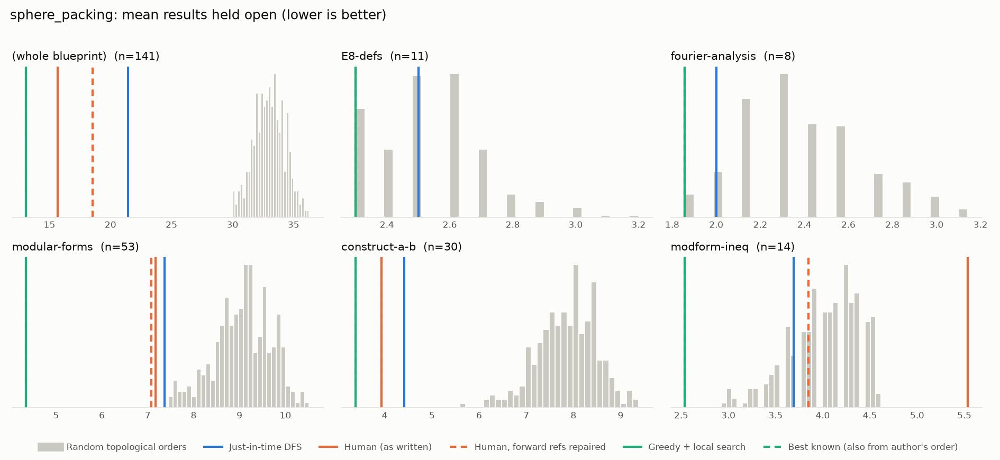
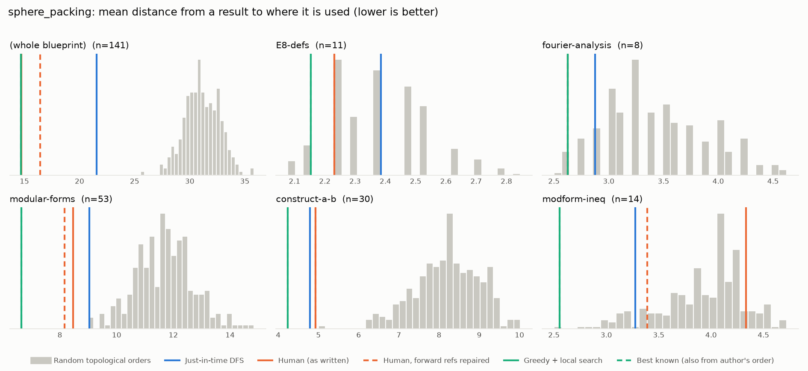

# Phase 0: sphere_packing

*thefundamentaltheor3m/Sphere-Packing-Lean @ 9b2ddfc66330 (2026-09-01)*

141 nodes, 246 dependency edges. Null models per scope: 300 randomised-Kahn topological orders (biased towards opening many results early) and 200 approximately uniform ones (Karzanov–Khachiyan MCMC). All metrics: lower is better.

**Share of random orders better than the order** (0% = the order beats every random one; 50% = typical):

| Scope | n | forward edges | Human: mean open (Kahn null) | Human: mean open (uniform null) | Human: mean edge length (Kahn) | Mean open: human / best known / uniform median | τ(human, optimised) | τ(human, random) |
|---|---:|---:|---:|---:|---:|---:|---:|---:|
| (whole blueprint) | 141 | 5% | 0% | 0% | 0% | 15.7 / 13.1 / 33.2 | -0.10 | +0.23 |
| E8-defs | 11 | 0% | 9% | 4% | 19% | 2.3 / 2.3 / 2.6 | +0.85 | +0.83 |
| fourier-analysis | 8 | 0% | 2% | 2% | 2% | 1.9 / 1.9 / 2.4 | +0.50 | +0.19 |
| modular-forms | 53 | 1% | 0% | 0% | 0% | 7.2 / 4.3 / 10.2 | +0.31 | +0.36 |
| construct-a-b | 30 | 0% | 0% | 0% | 0% | 3.9 / 3.4 / 8.3 | +0.77 | +0.25 |
| modform-ineq | 14 | 39% | 100% | 100% | 88% | 5.5 / 2.5 / 3.9 | -0.23 | +0.09 |

## Whole blueprint: raw metrics

| Order | fwd refs | mean open | max open | mean cut | cutwidth | mean edge length | τ vs human | chapter runs |
|---|---:|---:|---:|---:|---:|---:|---:|---:|
| Human (as written) | 13 | 15.7 | 30 | 25.9 | 49 | 14.7 | +1.00 | 11 |
| Human, forward refs repaired | 0 | 18.5 | 33 | 28.9 | 54 | 16.4 | +0.90 | 12 |
| Just-in-time DFS (median run) | 0 | 21.5 | 38 | 37.9 | 68 | 21.5 | -0.16 | 44 |
| Greedy min-open (best run) | 0 | 24.0 | 39 | 39.7 | 70 | 22.6 | -0.07 | 62 |
| Greedy + local search on mean open (best run) | 0 | 13.1 | 23 | 25.8 | 52 | 14.7 | -0.10 | 48 |
| Best known (local search also from the author's order) | 0 | 13.1 | 23 | 25.8 | 52 | 14.7 | -0.10 | 48 |
| Random topological (median) | 0 | 33.0 | 50 | 54.5 | 87 | 31.0 | +0.23 | |
| Uniform topological (median) | 0 | 33.2 | 52 | 60.2 | 92 | 34.3 | | |

## Forward references in the human order (13)

- `theorem:CE_Main` uses `E8-Lattice`, which is stated later
- `theorem:CE_Main` uses `E8Packing-density`, which is stated later
- `theorem:CE_Main` uses `thm:Cohn-Elkies-general`, which is stated later
- `theorem:CE_Main` uses `thm:g`, which is stated later
- `thm:g` uses `thm:g1`, which is stated later
- `def:disc-definition` uses `def:dedekind_eta`, which is stated later
- `prop:ineqA` uses `lemma:F-G-phi-psi-identities`, which is stated later
- `prop:ineqA` uses `lemma:ineqABnew-equiv`, which is stated later
- `prop:ineqA` uses `lemma:F-G-pos`, which is stated later
- `prop:ineqA` uses `cor:ineqAnew`, which is stated later
- `prop:ineqB` uses `lemma:F-G-phi-psi-identities`, which is stated later
- `prop:ineqB` uses `lemma:ineqABnew-equiv`, which is stated later
- `prop:ineqB` uses `cor:ineqBnew`, which is stated later

