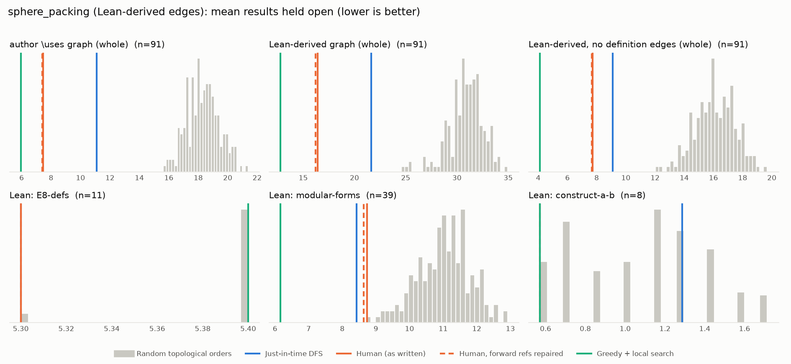

# Phase 1: sphere_packing

*thefundamentaltheor3m/Sphere-Packing-Lean @ 9b2ddfc66330 (2026-09-01), Lean leanprover/lean4:v4.32.0*

## Formal graph

- Project declarations (after folding compiler auxiliaries): 1466 (axiom: 2, def: 294, inductive: 3, opaque: 4, theorem: 1163); 5315 dependency edges, including 22 blueprint-named declarations outside the project (e.g. upstreamed to Mathlib).
- Blueprint `\lean{}` names resolved to project declarations: 122 (100%); 91 of 141 blueprint nodes have at least one.
- Project theorems the blueprint never names: 1098.

## Author `\uses` edges vs Lean

Over the 91 formalised nodes. Lean edges are projected onto blueprint nodes through unlabelled helper declarations.

| | count |
|---|---:|
| Author edges | 123 |
| … also a direct Lean dependency | 97 |
| … implied by a chain of Lean dependencies | 2 |
| … not a Lean dependency at all | 24 |
| Lean edges | 315 |
| … not written by the author | 218 |
| … … of which from a definition node | 155 |

Most frequent sources of unreported edges: `def:Gamma-generators` (17), `def:Mk` (15), `SpherePacking` (13), `def:automorphy-factor` (12), `IsZLattice` (10), `PeriodicSpherePacking` (9), `def:H2-H3-H4` (9), `E8-Set` (8), `def:Ek` (8), `def:Schwartz-Space` (8).

## Ordering (Phase 0 metrics) on both graphs

Share of random orders better than the human order (0% = human beats all):

| Scope | n | edges | Kahn null | uniform null | mean open: human / optimised / uniform median | τ(human, optimised) |
|---|---:|---:|---:|---:|---:|---:|
| author \uses graph (whole) | 91 | 123 | 0% | 0% | 7.5 / 5.9 / 21.1 | -0.18 |
| Lean-derived graph (whole) | 91 | 315 | 0% | 0% | 16.4 / 12.8 / 32.8 | -0.22 |
| Lean-derived, no definition edges (whole) | 91 | 111 | 0% | 0% | 7.7 / 4.1 / 18.3 | +0.32 |
| Lean: E8-defs | 11 | 34 | 4% | 12% | 5.3 / 5.4 / 5.4 | +0.78 |
| Lean: modular-forms | 39 | 93 | 0% | 0% | 8.7 / 6.2 / 12.2 | +0.20 |
| Lean: construct-a-b | 8 | 4 | 5% | 1% | 0.6 / 0.6 / 1.3 | +0.21 |

Forward references in the human order under Lean edges: 7

- `SpherePacking.balls` depends on `SpherePacking`, stated later
- `SpherePacking.scale_finiteDensity` depends on `IsZLattice`, stated later
- `SpherePacking.scale_finiteDensity` depends on `PeriodicSpherePacking`, stated later
- `MainTheorem` depends on `E8Packing`, stated later
- `def:disc-definition` depends on `def:dedekind_eta`, stated later
- `lemma:disc-E4E6` depends on `cor:disc-nonvanishing`, stated later
- `lemma:disc-E4E6` depends on `thm:nonpos_wt`, stated later

