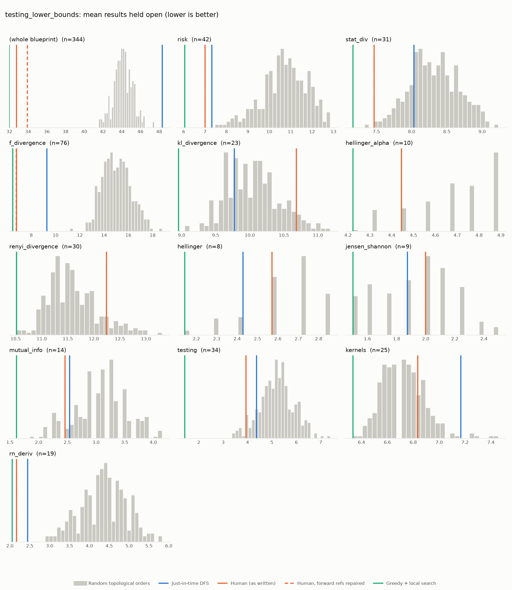
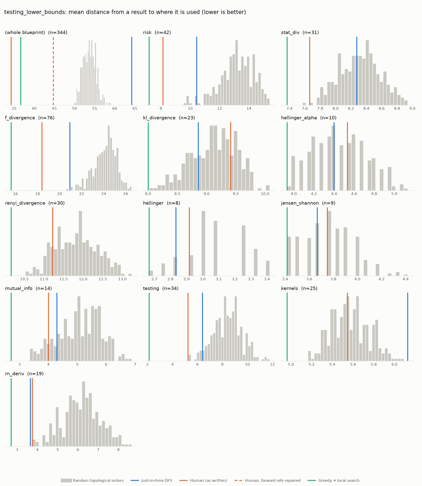

# Phase 0: testing_lower_bounds

*RemyDegenne/testing-lower-bounds @ da2cf0bfba77 (2026-09-24)*

344 nodes, 861 dependency edges. Null models per scope: 300 randomised-Kahn topological orders (biased towards opening many results early) and 200 approximately uniform ones (Karzanov–Khachiyan MCMC). All metrics: lower is better.

**Share of random orders better than the order** (0% = the order beats every random one; 50% = typical):

| Scope | n | forward edges | Human: mean open (Kahn null) | Human: mean open (uniform null) | Human: mean edge length (Kahn) | Mean open: human / optimised / uniform median | τ(human, optimised) | τ(human, random) |
|---|---:|---:|---:|---:|---:|---:|---:|---:|
| (whole blueprint) | 344 | 3% | 0% | 0% | 0% | 32.8 / 32.0 / 61.7 | +0.09 | +0.13 |
| risk | 42 | 0% | 0% | 0% | 0% | 7.0 / 6.0 / 11.6 | +0.58 | +0.43 |
| stat_div | 31 | 0% | 0% | 0% | 0% | 7.5 / 7.2 / 8.7 | +0.69 | +0.69 |
| f_divergence | 76 | 1% | 0% | 0% | 0% | 6.8 / 6.5 / 15.4 | -0.05 | +0.21 |
| kl_divergence | 23 | 0% | 93% | 80% | 74% | 10.7 / 9.0 / 10.2 | +0.32 | +0.52 |
| hellinger_alpha | 10 | 0% | 14% | 17% | 61% | 4.4 / 4.2 / 4.7 | +0.33 | +0.36 |
| renyi_divergence | 30 | 0% | 90% | 34% | 14% | 12.2 / 10.5 / 12.5 | +0.45 | +0.50 |
| hellinger | 8 | 0% | 31% | 26% | 18% | 2.6 / 2.1 / 2.7 | +0.29 | +0.63 |
| jensen_shannon | 9 | 0% | 56% | 24% | 50% | 2.0 / 1.5 / 2.1 | +0.56 | +0.56 |
| mutual_info | 14 | 0% | 11% | 0% | 11% | 2.5 / 1.6 / 3.5 | +0.71 | +0.29 |
| testing | 34 | 0% | 3% | 0% | 0% | 3.9 / 1.4 / 6.6 | +0.35 | +0.24 |
| kernels | 25 | 0% | 76% | 46% | 46% | 6.8 / 6.3 / 6.9 | +0.79 | +0.78 |
| rn_deriv | 19 | 0% | 0% | 0% | 0% | 2.2 / 2.1 / 4.9 | +0.08 | +0.23 |

## Whole blueprint: raw metrics

| Order | fwd refs | mean open | max open | mean cut | cutwidth | mean edge length | τ vs human | chapter runs |
|---|---:|---:|---:|---:|---:|---:|---:|---:|
| Human (as written) | 28 | 32.8 | 64 | 86.0 | 160 | 34.3 | +1.00 | 17 |
| Human, forward refs repaired | 0 | 33.9 | 57 | 112.4 | 192 | 44.8 | +0.45 | 31 |
| Just-in-time DFS (median run) | 0 | 48.3 | 83 | 161.1 | 240 | 64.2 | +0.07 | 117 |
| Greedy min-open (best run) | 0 | 38.3 | 61 | 123.6 | 195 | 49.3 | +0.12 | 168 |
| Greedy + local search (best run) | 0 | 32.0 | 54 | 92.0 | 155 | 36.7 | +0.09 | 116 |
| Random topological (median) | 0 | 44.1 | 65 | 134.8 | 220 | 53.7 | +0.13 | |
| Uniform topological (median) | 0 | 61.7 | 92 | 187.4 | 260 | 74.7 | | |

## Forward references in the human order (28)

- `def:risk` uses `lem:kernel_properties`, which is stated later
- `lem:bayesianRisk_bayesInv` uses `def:bayesInv`, which is stated later
- `lem:bayesianRisk_bayesInv` uses `lem:bayesInv_properties`, which is stated later
- `lem:bayesianRisk_ge_inf_bayesInv` uses `def:bayesInv`, which is stated later
- `lem:bayesRisk_eq_rnDeriv` uses `lem:bayesInv_properties`, which is stated later
- `lem:bayesRisk_binary_eq_sub_bayesInv` uses `lem:bayesInv_properties`, which is stated later
- `lem:bayesInv_binary` uses `def:bayesInv`, which is stated later
- `lem:bayesInv_binary` uses `lem:bayesInv_properties`, which is stated later
- `def:fDiv` uses `def:derivAtTop`, which is stated later
- `lem:fDiv_compProd_ne_top_iff` uses `lem:fDiv_compProd_right`, which is stated later
- `lem:fDiv_compProd_right` uses `cor:rnDeriv_value`, which is stated later
- `lem:fDiv_compProd_right` uses `cor:rnDeriv_compProd_right`, which is stated later
- `thm:fDiv_compProd_left_1` uses `cor:rnDeriv_compProd_left`, which is stated later
- `thm:fDiv_map_le` uses `lem:rnDeriv_map_eq_condexp`, which is stated later
- `thm:fDiv_map_le` uses `thm:condexp_jensen`, which is stated later
- `thm:fDiv_le_compProd_1` uses `cor:rnDeriv_value`, which is stated later
- `thm:fDiv_le_compProd_1` uses `lem:rnDeriv_compProd`, which is stated later
- `lem:fDiv_map_eq_fDiv_trim_of_ac` uses `lem:rnDeriv_map_eq_rnDeriv_trim`, which is stated later
- `cor:bh_kl` uses `def:KL`, which is stated later
- `cor:cor:bh_hellingerAlpha` uses `def:hellingerAlpha`, which is stated later
- `thm:kl_compProd_aux` uses `lem:ac_compProd_iff`, which is stated later
- `thm:kl_compProd_aux` uses `thm:rnDeriv_chain_compProd`, which is stated later
- `thm:kl_compProd` uses `cor:rnDeriv_value`, which is stated later
- `thm:kl_compProd` uses `lem:rnDeriv_compProd`, which is stated later
- `thm:kl_compProd_bayesInv` uses `def:bayesInv`, which is stated later
- `thm:renyi_compProd_bayesInv` uses `def:bayesInv`, which is stated later
- `lem:llr_filtration_nat` uses `lem:rnDeriv_map_eq_rnDeriv_trim`, which is stated later
- `lem:llr_stopping_time` uses `lem:rnDeriv_trim_of_ac`, which is stated later

