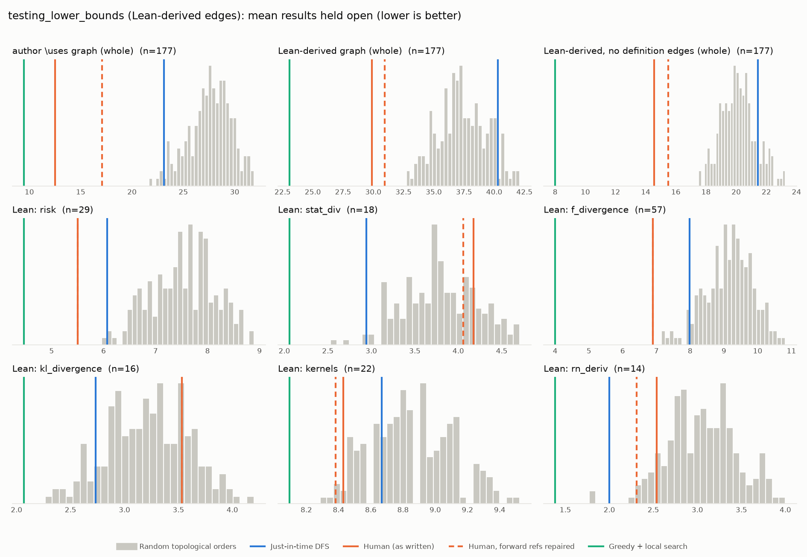

# Phase 1: testing_lower_bounds

*RemyDegenne/testing-lower-bounds @ da2cf0bfba77 (2026-09-24), Lean leanprover/lean4:v4.35.0-rc2*

## Formal graph

- Project declarations (after folding compiler auxiliaries): 1035 (def: 69, inductive: 2, theorem: 964); 5177 dependency edges, including 66 blueprint-named declarations outside the project (e.g. upstreamed to Mathlib).
- Blueprint `\lean{}` names resolved to project declarations: 195 (100%); 177 of 344 blueprint nodes have at least one.
- Project theorems the blueprint never names: 854.

## Author `\uses` edges vs Lean

Over the 177 formalised nodes. Lean edges are projected onto blueprint nodes through unlabelled helper declarations.

| | count |
|---|---:|
| Author edges | 316 |
| … also a direct Lean dependency | 255 |
| … implied by a chain of Lean dependencies | 10 |
| … not a Lean dependency at all | 51 |
| Lean edges | 883 |
| … not written by the author | 628 |
| … … of which from a definition node | 516 |

Most frequent sources of unreported edges: `def:kernel` (89), `def:finite_kernel` (55), `def:measure_compProd` (48), `def:markov_kernel` (43), `def:sFinite_kernel` (41), `def:kernel_compProd` (38), `def:measure_measurableSpace` (36), `def:kernel_comp` (31), `def:deterministic_kernel` (24), `def:kernel_parallel_prod` (15).

## Ordering (Phase 0 metrics) on both graphs

Share of random orders better than the human order (0% = human beats all):

| Scope | n | edges | Kahn null | uniform null | mean open: human / optimised / uniform median | τ(human, optimised) |
|---|---:|---:|---:|---:|---:|---:|
| author \uses graph (whole) | 177 | 316 | 0% | 0% | 12.5 / 9.5 / 34.7 | -0.25 |
| Lean-derived graph (whole) | 177 | 883 | 0% | 0% | 29.9 / 23.1 / 47.5 | -0.17 |
| Lean-derived, no definition edges (whole) | 177 | 194 | 0% | 0% | 14.6 / 8.0 / 27.9 | +0.06 |
| Lean: risk | 29 | 66 | 0% | 0% | 5.5 / 4.5 / 8.1 | +0.62 |
| Lean: stat_div | 18 | 30 | 79% | 70% | 4.2 / 2.1 / 4.0 | +0.18 |
| Lean: f_divergence | 57 | 112 | 0% | 0% | 6.9 / 4.0 / 11.2 | +0.25 |
| Lean: kl_divergence | 16 | 27 | 76% | 34% | 3.5 / 2.1 / 3.7 | +0.25 |
| Lean: kernels | 22 | 96 | 3% | 2% | 8.4 / 8.1 / 9.0 | +0.56 |
| Lean: rn_deriv | 14 | 13 | 10% | 6% | 2.5 / 1.4 / 3.4 | -0.16 |

Forward references in the human order under Lean edges: 377

- `def:bayesianRisk` depends on `def:kernel`, stated later
- `def:bayesianRisk` depends on `def:kernel_comp`, stated later
- `def:bayesRisk` depends on `def:kernel`, stated later
- `def:bayesRisk` depends on `def:markov_kernel`, stated later
- `def:bayesEstimator` depends on `def:kernel`, stated later
- `def:minimaxRisk` depends on `def:kernel`, stated later
- `def:minimaxRisk` depends on `def:markov_kernel`, stated later
- `def:minimaxRisk` depends on `def:kernel_comp`, stated later
- `lem:bayesRisk_le_minimaxRisk` depends on `def:kernel`, stated later
- `lem:bayesRisk_le_minimaxRisk` depends on `def:markov_kernel`, stated later
- `lem:bayesRisk_le_minimaxRisk` depends on `def:kernel_comp`, stated later
- `lem:bayesRisk_le_const` depends on `def:kernel`, stated later
- `lem:bayesRisk_le_const` depends on `def:markov_kernel`, stated later
- `lem:bayesRisk_le_const` depends on `def:kernel_comp`, stated later
- `lem:bayesRisk_const` depends on `def:kernel`, stated later
- `lem:bayesRisk_const` depends on `def:markov_kernel`, stated later
- `thm:data_proc_bayesRisk` depends on `def:measure_measurableSpace`, stated later
- `thm:data_proc_bayesRisk` depends on `def:kernel`, stated later
- `thm:data_proc_bayesRisk` depends on `def:markov_kernel`, stated later
- `thm:data_proc_bayesRisk` depends on `def:kernel_comp`, stated later
- `lem:bayesRisk_compProd_le_fst` depends on `def:kernel`, stated later
- `lem:bayesRisk_compProd_le_fst` depends on `def:deterministic_kernel`, stated later
- `lem:bayesRisk_compProd_le_fst` depends on `def:finite_kernel`, stated later
- `lem:bayesRisk_compProd_le_fst` depends on `def:markov_kernel`, stated later
- `lem:bayesRisk_compProd_le_fst` depends on `def:sFinite_kernel`, stated later
- `lem:bayesRisk_compProd_le_fst` depends on `def:kernel_compProd`, stated later
- `lem:bayesRisk_compProd_le_fst` depends on `def:kernel_comp`, stated later
- `lem:bayesianRisk_bayesInv` depends on `def:measure_measurableSpace`, stated later
- `lem:bayesianRisk_bayesInv` depends on `def:kernel`, stated later
- `lem:bayesianRisk_bayesInv` depends on `def:deterministic_kernel`, stated later
- `lem:bayesianRisk_bayesInv` depends on `def:finite_kernel`, stated later
- `lem:bayesianRisk_bayesInv` depends on `def:markov_kernel`, stated later
- `lem:bayesianRisk_bayesInv` depends on `def:sFinite_kernel`, stated later
- `lem:bayesianRisk_bayesInv` depends on `def:kernel_compProd`, stated later
- `lem:bayesianRisk_bayesInv` depends on `def:measure_compProd`, stated later
- `lem:bayesianRisk_bayesInv` depends on `def:kernel_comp`, stated later
- `lem:bayesianRisk_bayesInv` depends on `def:kernel_prod`, stated later
- `lem:bayesianRisk_bayesInv` depends on `def:kernel_parallel_prod`, stated later
- `lem:bayesianRisk_bayesInv` depends on `def:bayesInv`, stated later
- `lem:bayesianRisk_bayesInv` depends on `lem:exists_bayesInv`, stated later

