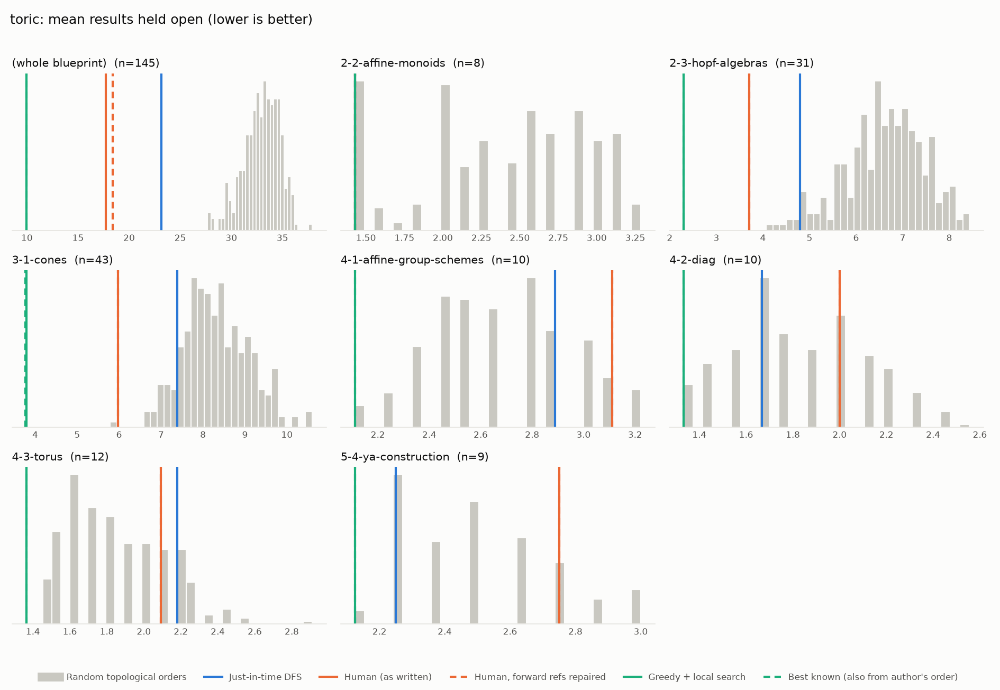
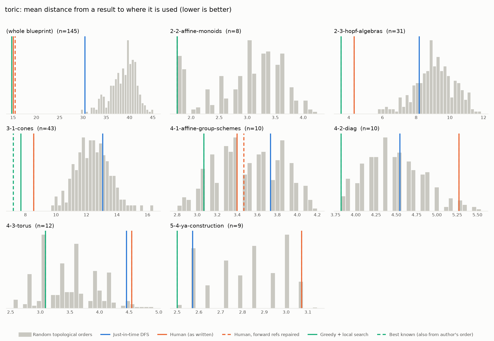

# Phase 0: toric

*YaelDillies/Toric @ 6eef2aacaa5e (2026-09-20)*

145 nodes, 244 dependency edges. Null models per scope: 300 randomised-Kahn topological orders (biased towards opening many results early) and 200 approximately uniform ones (Karzanov–Khachiyan MCMC). All metrics: lower is better.

**Share of random orders better than the order** (0% = the order beats every random one; 50% = typical):

| Scope | n | forward edges | Human: mean open (Kahn null) | Human: mean open (uniform null) | Human: mean edge length (Kahn) | Mean open: human / best known / uniform median | τ(human, optimised) | τ(human, random) |
|---|---:|---:|---:|---:|---:|---:|---:|---:|
| (whole blueprint) | 145 | 3% | 0% | 0% | 0% | 17.7 / 9.9 / 36.2 | +0.11 | +0.35 |
| 2-2-affine-monoids | 8 | 0% | 7% | 1% | 4% | 1.4 / 1.4 / 2.9 | -0.43 | +0.37 |
| 2-3-hopf-algebras | 31 | 0% | 0% | 0% | 0% | 3.7 / 2.3 / 7.8 | +0.42 | +0.09 |
| 3-1-cones | 43 | 0% | 0% | 0% | 0% | 6.0 / 3.8 / 9.7 | -0.02 | +0.35 |
| 4-1-affine-group-schemes | 10 | 7% | 93% | 88% | 40% | 3.1 / 2.1 / 2.9 | +0.42 | +0.44 |
| 4-2-diag | 10 | 0% | 70% | 51% | 97% | 2.0 / 1.3 / 2.0 | -0.11 | +0.28 |
| 4-3-torus | 12 | 0% | 79% | 27% | 98% | 2.1 / 1.4 / 2.3 | +0.21 | +0.37 |
| 5-4-ya-construction | 9 | 0% | 84% | 79% | 96% | 2.8 / 2.1 / 2.5 | +0.61 | +0.81 |

## Whole blueprint: raw metrics

| Order | fwd refs | mean open | max open | mean cut | cutwidth | mean edge length | τ vs human | chapter runs |
|---|---:|---:|---:|---:|---:|---:|---:|---:|
| Human (as written) | 7 | 17.7 | 28 | 25.5 | 48 | 15.0 | +1.00 | 13 |
| Human, forward refs repaired | 0 | 18.4 | 28 | 26.1 | 48 | 15.4 | +0.98 | 23 |
| Just-in-time DFS (median run) | 0 | 23.1 | 38 | 51.6 | 87 | 30.4 | -0.03 | 73 |
| Greedy min-open (best run) | 0 | 20.2 | 31 | 48.0 | 77 | 28.3 | +0.10 | 68 |
| Greedy + local search on mean open (best run) | 0 | 9.9 | 17 | 25.0 | 49 | 14.7 | +0.11 | 55 |
| Best known (local search also from the author's order) | 0 | 9.9 | 17 | 25.0 | 49 | 14.7 | +0.11 | 55 |
| Random topological (median) | 0 | 33.1 | 50 | 66.3 | 101 | 39.1 | +0.35 | |
| Uniform topological (median) | 0 | 36.2 | 56 | 79.1 | 121 | 46.7 | | |

## Forward references in the human order (7)

- `1-2-18-aff-tor-var-rat-polyhedral-cone` uses `5-1-tor-var`, which is stated later
- `1-2-18-dim-aff-tor-var-rat-polyhedral-cone` uses `1-1-14-spec-aff-mon-alg`, which is stated later
- `0-spec-cocomm-bialg` uses `0-spec-hopf`, which is stated later
- `0-diag-spec` uses `0-torus`, which is stated later
- `1-1-11-toric-ideal-gen-binomial` uses `1-1-9-ideal-ya`, which is stated later
- `5-3-van-tor-emb` uses `1-1-phiAprime`, which is stated later
- `5-3-van-tor-emb` uses `1-1-7-ya`, which is stated later

