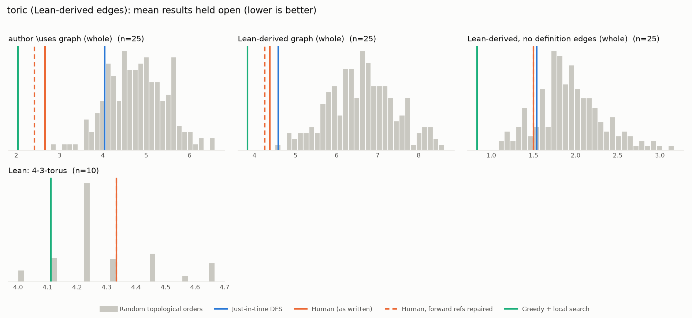

# Phase 1: toric

*YaelDillies/Toric @ 6eef2aacaa5e (2026-09-20), Lean leanprover/lean4:v4.35.0-rc2*

## Formal graph

- Project declarations (after folding compiler auxiliaries): 276 (def: 82, inductive: 7, theorem: 187); 1205 project-internal dependency edges.
- Blueprint `\lean{}` names resolved to project declarations: 30 (34%); 25 of 145 blueprint nodes have at least one.
- Project theorems the blueprint never names: 178.

## Author `\uses` edges vs Lean

Over the 25 formalised nodes. Lean edges are projected onto blueprint nodes through unlabelled helper declarations.

| | count |
|---|---:|
| Author edges | 32 |
| … also a direct Lean dependency | 23 |
| … implied by a chain of Lean dependencies | 5 |
| … not a Lean dependency at all | 4 |
| Lean edges | 60 |
| … not written by the author | 37 |
| … … of which from a definition node | 27 |

Most frequent sources of unreported edges: `0-diag` (12), `0-torus` (8), `0-char-diag` (3), `0-grp-alg` (3), `0-char-torus` (2), `0-cochar-diag` (2), `0-diag-hom` (2), `0-char` (1), `0-cochar` (1), `0-diag-spec` (1).

## Ordering (Phase 0 metrics) on both graphs

Share of random orders better than the human order (0% = human beats all):

| Scope | n | edges | Kahn null | uniform null | mean open: human / optimised / uniform median | τ(human, optimised) |
|---|---:|---:|---:|---:|---:|---:|
| author \uses graph (whole) | 25 | 32 | 0% | 0% | 2.7 / 2.0 / 5.9 | +0.35 |
| Lean-derived graph (whole) | 25 | 60 | 0% | 0% | 4.4 / 3.8 / 8.0 | +0.15 |
| Lean-derived, no definition edges (whole) | 25 | 13 | 13% | 0% | 1.5 / 0.8 / 2.5 | +0.02 |
| Lean: 4-3-torus | 10 | 27 | 69% | 55% | 4.3 / 4.1 / 4.3 | +0.73 |

Forward references in the human order under Lean edges: 2

- `0-is-diag` depends on `0-torus`, stated later
- `0-diag-spec` depends on `0-torus`, stated later

## `\lean{}` names not found in the project

- `0-slice-adj`: `CategoryTheory.Over.postAdjunctionRight`
- `0-over-lim`: `CategoryTheory.Limits.PreservesLimitsOfShape.overPost`, `CategoryTheory.Limits.PreservesLimitsOfSize.overPost`
- `0-ess-image-over`: `CategoryTheory.Functor.essImage_overPost`
- `0-full-faithful-grp`: `CategoryTheory.Functor.Faithful.mapGrp`, `CategoryTheory.Functor.Full.mapGrp`
- `0-grp-equiv`: `CategoryTheory.Equivalence.mapGrp`
- `0-ess-image-grp`: `CategoryTheory.Functor.essImage_mapGrp`
- `0-full-faithful-grp-hom`: `CategoryTheory.Functor.FullyFaithful.homMulEquiv`
- `0-tensor-lin-indep`: `LinearIndependent.tmul_of_isDomain`
- `0-mv-laurent-poly-domain`: `AddMonoidAlgebra.instIsDomainOfIsCancelAddOfUniqueSums`
- `0-aff-mon`: `AddCancelCommMonoid`, `AddMonoid.FG`, `IsAddTorsionFree`
- `0-embed-aff-mon`: `AffineAddMonoid.embedding`, `AffineAddMonoid.embedding_injective`
- `0-aff-mon-alg-domain`: `MonoidAlgebra.finiteType_of_fg`
- `0-irred`: `Irreducible`
- `0-irred-subset-gen`: `addIrreducible_subset_of_addSubmonoidClosure_eq_top`
- `0-irred-finite`: `finite_addIrreducible`
- `0-irred-gen`: `AddSubmonoid.closure_addIrreducible`
- `0-grp-like`: `IsGroupLikeElem`
- `0-grp-like-grp`: `GroupLike.instGroup`, `GroupLike.instCommGroup`
- `0-grp-like-map`: `IsGroupLikeElem.map`
- `0-grp-like-grp-alg-of`: `MonoidAlgebra.isGroupLikeElem_of`
- `0-grp-like-grp-alg-span`: `MonoidAlgebra.span_isGroupLikeElem`
- `0-grp-like-lin-indep`: `linearIndepOn_isGroupLikeElem`
- `0-grp-like-grp-alg`: `MonoidAlgebra.isGroupLikeElem_iff_mem_range_of`
- `0-antipode-mul`: `HopfAlgebra.antipode_mul_antidistrib`, `HopfAlgebra.antipode_mul_distrib`
- `0-bialg-equiv-comon-alg`: `commBialgCatEquivComonCommAlgCat`
- `0-hopf-alg-equiv-cogrp-alg`: `commHopfAlgCatEquivCogrpCommAlgCat`
- `0-full-faithful-grp-alg`: `MonoidAlgebra.mapDomainBialgHomMulEquiv`, `AddMonoidAlgebra.mapDomainBialgHomAddEquiv`
- `1-2-1-cone-hull`: `Submodule.span`
- `1-2-2-convex-hull`: `convexHull`
- `1-2-3-dual-cone`: `PointedCone.dual`
- `1-2-5-face`: `IsExposed`
- `1-2-rel-interior`: `intrinsicInterior`
- `1-2-12-salient-cone`: `ConvexCone.Salient`
- `0-spec-alg`: `AlgebraicGeometry.algSpec`
- `0-full-faithful-spec-alg`: `AlgebraicGeometry.preservesLimitsOfSize_algSpec`, `AlgebraicGeometry.algSpec.instFull`, `AlgebraicGeometry.algSpec.instFaithful`, `AlgebraicGeometry.algSpec.fullyFaithful`
- `0-spec-bialg`: `AlgebraicGeometry.bialgSpec`
- `0-full-faithful-spec-bialg`: `AlgebraicGeometry.bialgSpec.instFull`, `AlgebraicGeometry.bialgSpec.instFaithful`, `AlgebraicGeometry.bialgSpec.fullyFaithful`
- `0-spec-cocomm-bialg`: `AlgebraicGeometry.isCommMonObj_spec_asOver_spec`, `AlgebraicGeometry.instCommGrpObjSpecAsOverSpec`
- `0-spec-hopf`: `AlgebraicGeometry.hopfSpec`
- `0-full-faithful-spec-hopf`: `AlgebraicGeometry.hopfSpec.instFull`, `AlgebraicGeometry.hopfSpec.instFaithful`, `AlgebraicGeometry.hopfSpec.fullyFaithful`
- `0-ess-image-spec-alg`: `AlgebraicGeometry.essImage_algSpec`
- `0-ess-image-spec-bialg`: `AlgebraicGeometry.essImage_bialgSpec`
- `0-ess-image-spec-hopf`: `AlgebraicGeometry.essImage_hopfSpec`

