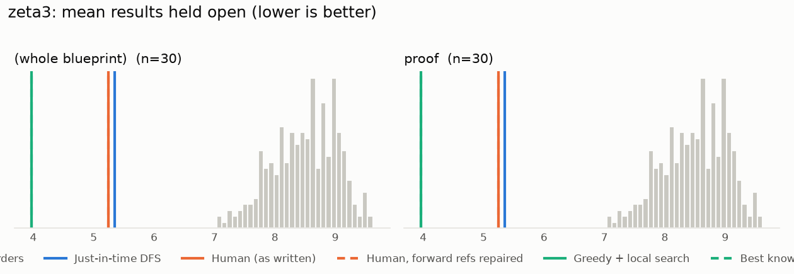
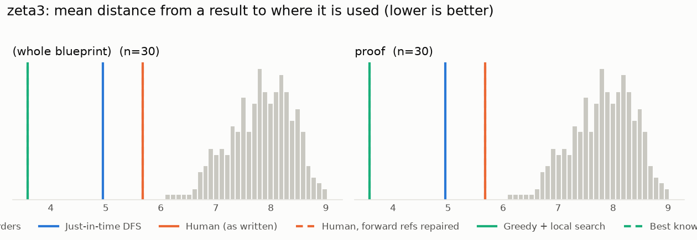

# Phase 0: zeta3

*ahhwuhu/zeta_3_irrational @ 3afdc9b57881 (2025-05-16)*

30 nodes, 40 dependency edges. Null models per scope: 300 randomised-Kahn topological orders (biased towards opening many results early) and 200 approximately uniform ones (Karzanov–Khachiyan MCMC). All metrics: lower is better.

**Share of random orders better than the order** (0% = the order beats every random one; 50% = typical):

| Scope | n | forward edges | Human: mean open (Kahn null) | Human: mean open (uniform null) | Human: mean edge length (Kahn) | Mean open: human / best known / uniform median | τ(human, optimised) | τ(human, random) |
|---|---:|---:|---:|---:|---:|---:|---:|---:|
| (whole blueprint) | 30 | 0% | 0% | 0% | 0% | 5.2 / 4.0 / 8.3 | +0.69 | +0.28 |
| proof | 30 | 0% | 0% | 0% | 0% | 5.2 / 4.0 / 8.3 | +0.69 | +0.28 |

## Whole blueprint: raw metrics

| Order | fwd refs | mean open | max open | mean cut | cutwidth | mean edge length | τ vs human | chapter runs |
|---|---:|---:|---:|---:|---:|---:|---:|---:|
| Human (as written) | 0 | 5.2 | 9 | 7.8 | 13 | 5.7 | +1.00 | 1 |
| Human, forward refs repaired | 0 | 5.2 | 9 | 7.8 | 13 | 5.7 | +1.00 | 1 |
| Just-in-time DFS (median run) | 0 | 5.3 | 9 | 6.8 | 9 | 5.0 | +0.35 | 1 |
| Greedy min-open (best run) | 0 | 5.3 | 9 | 7.2 | 12 | 5.2 | +0.60 | 1 |
| Greedy + local search on mean open (best run) | 0 | 4.0 | 8 | 4.9 | 9 | 3.6 | +0.69 | 1 |
| Best known (local search also from the author's order) | 0 | 4.0 | 8 | 4.9 | 9 | 3.6 | +0.69 | 1 |
| Random topological (median) | 0 | 8.5 | 14 | 10.8 | 17 | 7.8 | +0.28 | |
| Uniform topological (median) | 0 | 8.3 | 14 | 11.1 | 17 | 8.0 | | |

## Forward references in the human order (0)

None.

