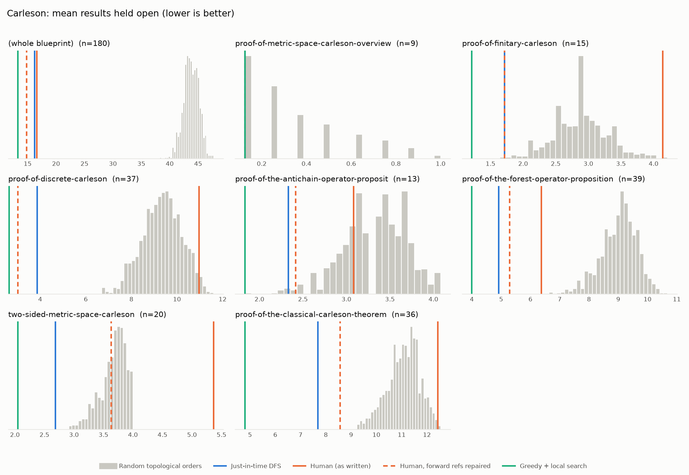
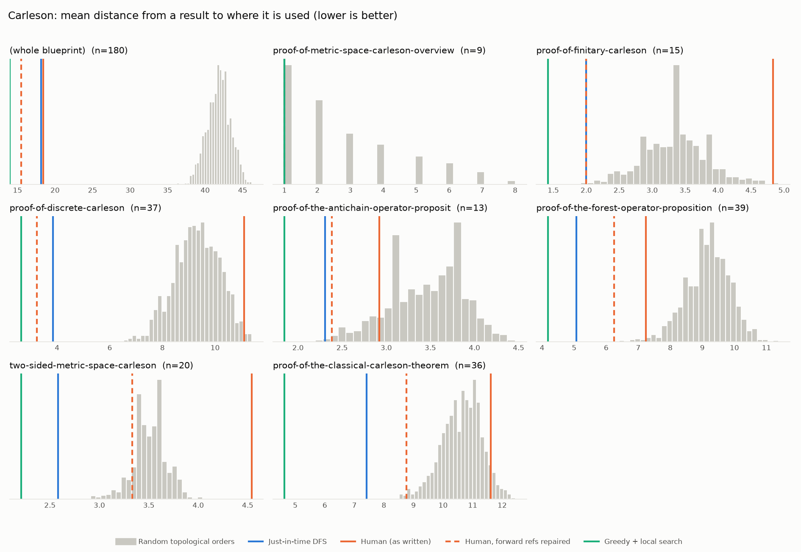

# Phase 0: Carleson

*fpvandoorn/carleson @ d966776f60fe (2026-09-23), chapters = \section*

180 nodes, 220 dependency edges. Null models per scope: 1000 randomised-Kahn topological orders (biased towards opening many results early) and 200 approximately uniform ones (Karzanov–Khachiyan MCMC). All metrics: lower is better.

**Share of random orders better than the order** (0% = the order beats every random one; 50% = typical):

| Scope | n | forward edges | Human: mean open (Kahn null) | Human: mean open (uniform null) | Human: mean edge length (Kahn) | Mean open: human / optimised / uniform median | τ(human, optimised) | τ(human, random) |
|---|---:|---:|---:|---:|---:|---:|---:|---:|
| (whole blueprint) | 180 | 41% | 0% | 0% | 0% | 16.6 / 13.3 / 39.2 | +0.06 | -0.09 |
| proof-of-metric-space-carleson-overview | 9 | 100% | 17% | 11% | 17% | 0.1 / 0.1 / 0.4 | -0.11 | -0.10 |
| proof-of-finitary-carleson | 15 | 42% | 100% | 99% | 100% | 4.1 / 1.2 / 3.0 | +0.37 | +0.03 |
| proof-of-discrete-carleson | 37 | 39% | 98% | 100% | 99% | 11.0 / 2.6 / 9.1 | -0.14 | -0.01 |
| proof-of-the-antichain-operator-proposit | 13 | 46% | 24% | 17% | 12% | 3.1 / 1.8 / 3.4 | +0.08 | -0.05 |
| proof-of-the-forest-operator-proposition | 39 | 42% | 0% | 0% | 1% | 6.4 / 4.0 / 8.9 | +0.30 | +0.11 |
| two-sided-metric-space-carleson | 20 | 25% | 100% | 100% | 100% | 5.4 / 2.1 / 3.4 | -0.32 | -0.12 |
| proof-of-the-classical-carleson-theorem | 36 | 41% | 100% | 100% | 95% | 12.4 / 4.8 / 10.9 | -0.10 | -0.15 |

## Whole blueprint: raw metrics

| Order | fwd refs | mean open | max open | mean cut | cutwidth | mean edge length | τ vs human | chapter runs |
|---|---:|---:|---:|---:|---:|---:|---:|---:|
| Human (as written) | 90 | 16.6 | 30 | 22.7 | 44 | 18.4 | +1.00 | 11 |
| Human, forward refs repaired | 0 | 14.8 | 36 | 19.0 | 41 | 15.5 | +0.72 | 27 |
| Just-in-time DFS (median run) | 0 | 16.2 | 25 | 22.3 | 40 | 18.2 | -0.20 | 30 |
| Greedy min-open (best run) | 0 | 31.3 | 50 | 39.8 | 63 | 32.4 | +0.07 | 83 |
| Greedy + local search (best run) | 0 | 13.3 | 22 | 17.2 | 31 | 14.0 | +0.06 | 47 |
| Random topological (median) | 0 | 43.8 | 68 | 51.5 | 80 | 41.9 | -0.09 | |
| Uniform topological (median) | 0 | 39.2 | 60 | 50.1 | 74 | 40.8 | | |

## Forward references in the human order (90)

- `classical-carleson` uses `exceptional-set-carleson`, which is stated later
- `metric-space-Carleson` uses `linearised-metric-Carleson`, which is stated later
- `metric-space-Carleson` uses `int-continuous`, which is stated later
- `linearised-metric-Carleson` uses `int-continuous`, which is stated later
- `linearised-metric-Carleson` uses `R-truncation`, which is stated later
- `finitary-Carleson` uses `discrete-Carleson`, which is stated later
- `finitary-Carleson` uses `grid-existence`, which is stated later
- `finitary-Carleson` uses `tile-structure`, which is stated later
- `finitary-Carleson` uses `tile-sum-operator`, which is stated later
- `discrete-Carleson` uses `exceptional-set`, which is stated later
- `discrete-Carleson` uses `forest-union`, which is stated later
- `discrete-Carleson` uses `forest-complement`, which is stated later
- `antichain-operator` uses `dens2-antichain`, which is stated later
- `antichain-operator` uses `dens1-antichain`, which is stated later
- `forest-operator` uses `forest-row-decomposition`, which is stated later
- `forest-operator` uses `row-bound`, which is stated later
- `forest-operator` uses `row-correlation`, which is stated later
- `forest-operator` uses `disjoint-row-support`, which is stated later
- `Holder-van-der-Corput` uses `Lipschitz-Holder-approximation`, which is stated later
- `Hardy-Littlewood` uses `layer-cake-representation`, which is stated later
- `R-truncation` uses `S-truncation`, which is stated later
- `S-truncation` uses `linearized-truncation`, which is stated later
- `grid-existence` uses `counting-balls`, which is stated later
- `grid-existence` uses `boundary-measure`, which is stated later
- `tile-structure` uses `frequency-ball-cover`, which is stated later
- `tile-structure` uses `disjoint-frequency-cubes`, which is stated later
- `tile-structure` uses `frequency-cube-cover`, which is stated later
- `exceptional-set` uses `first-exception`, which is stated later
- `exceptional-set` uses `second-exception`, which is stated later
- `exceptional-set` uses `third-exception`, which is stated later
- `forest-union` uses `C-dens1`, which is stated later
- `forest-union` uses `C6-forest`, which is stated later
- `forest-union` uses `forest-geometry`, which is stated later
- `forest-union` uses `forest-convex`, which is stated later
- `forest-union` uses `forest-separation`, which is stated later
- `forest-union` uses `forest-inner`, which is stated later
- `forest-union` uses `forest-stacking`, which is stated later
- `forest-complement` uses `C-dens1`, which is stated later
- `forest-complement` uses `antichain-decomposition`, which is stated later
- `forest-complement` uses `L0-antichain`, which is stated later
- `forest-complement` uses `L2-antichain`, which is stated later
- `forest-complement` uses `L1-L3-antichain`, which is stated later
- `dens1-antichain` uses `tile-correlation`, which is stated later
- `dens1-antichain` uses `antichain-tile-count`, which is stated later
- `tile-correlation` uses `correlation-kernel-bound`, which is stated later
- `tile-correlation` uses `tile-range-support`, which is stated later
- `tile-correlation` uses `tile-uncertainty`, which is stated later
- `antichain-tile-count` uses `global-antichain-density`, which is stated later
- `pointwise-tree-estimate` uses `first-tree-pointwise`, which is stated later
- `pointwise-tree-estimate` uses `second-tree-pointwise`, which is stated later
- `pointwise-tree-estimate` uses `third-tree-pointwise`, which is stated later
- `tree-projection-estimate` uses `nontangential-operator-bound`, which is stated later
- `tree-projection-estimate` uses `boundary-operator-bound`, which is stated later
- `boundary-operator-bound` uses `boundary-overlap`, which is stated later
- `densities-tree-bound` uses `local-dens1-tree-bound`, which is stated later
- `densities-tree-bound` uses `local-dens2-tree-bound`, which is stated later
- `correlation-separated-trees` uses `correlation-distant-tree-parts`, which is stated later
- `correlation-separated-trees` uses `correlation-near-tree-parts`, which is stated later
- `correlation-distant-tree-parts` uses `Lipschitz-partition-unity`, which is stated later
- `correlation-distant-tree-parts` uses `Holder-correlation-tree`, which is stated later
- `correlation-distant-tree-parts` uses `lower-oscillation-bound`, which is stated later
- `correlation-near-tree-parts` uses `dyadic-partition-2`, which is stated later
- `correlation-near-tree-parts` uses `bound-for-tree-projection`, which is stated later
- `Lipschitz-partition-unity` uses `moderate-scale-change`, which is stated later
- `Holder-correlation-tree` uses `global-tree-control-2`, which is stated later
- `bound-for-tree-projection` uses `thin-scale-impact`, which is stated later
- `bound-for-tree-projection` uses `square-function-count`, which is stated later
- `two-sided-metric-space-Carleson` uses `nontangential-from-simple`, which is stated later
- `nontangential-from-simple` uses `simple-nontangential-operator`, which is stated later
- `nontangential-from-simple` uses `nontangential-operator-boundary`, which is stated later
- `calderon-zygmund-weak-1-1` uses `Calderon-Zygmund-decomposition`, which is stated later
- `calderon-zygmund-weak-1-1` uses `estimate-good`, which is stated later
- `calderon-zygmund-weak-1-1` uses `estimate-bad`, which is stated later
- `convergence-for-smooth` uses `convergence-for-twice-contdiff`, which is stated later
- `control-approximation-effect` uses `partial-Fourier-sums-of-small`, which is stated later
- `real-Carleson` uses `Hilbert-strong-2-2`, which is stated later
- `real-Carleson` uses `Hilbert-kernel-bound`, which is stated later
- `real-Carleson` uses `Hilbert-kernel-regularity`, which is stated later
- `real-Carleson` uses `real-line-metric`, which is stated later
- `real-Carleson` uses `real-line-measure`, which is stated later
- `real-Carleson` uses `real-line-doubling`, which is stated later
- `real-Carleson` uses `oscillation-control`, which is stated later
- `real-Carleson` uses `frequency-monotone`, which is stated later
- `real-Carleson` uses `frequency-ball-doubling`, which is stated later
- `real-Carleson` uses `frequency-ball-growth`, which is stated later
- `real-Carleson` uses `integer-ball-cover`, which is stated later
- `real-Carleson` uses `real-van-der-Corput`, which is stated later
- `Hilbert-strong-2-2` uses `modulated-averaged-projection`, which is stated later
- `Hilbert-strong-2-2` uses `integrable-bump-convolution`, which is stated later
- `Hilbert-strong-2-2` uses `Dirichlet-approximation`, which is stated later

