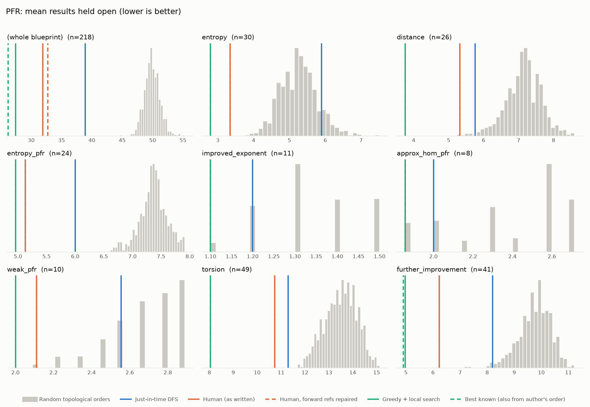
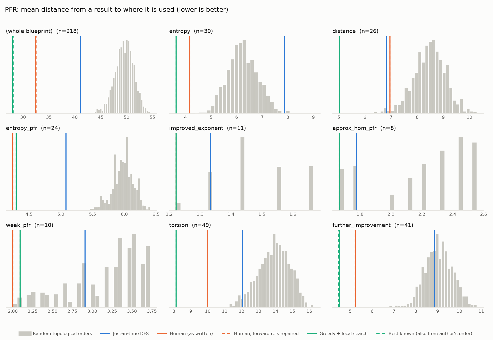

# Phase 0: PFR

*teorth/pfr @ ddd44f6ce82e (2026-09-20), blueprint/src*

218 nodes, 497 dependency edges. Null models per scope: 1000 randomised-Kahn topological orders (biased towards opening many results early) and 200 approximately uniform ones (Karzanov–Khachiyan MCMC). All metrics: lower is better.

**Share of random orders better than the order** (0% = the order beats every random one; 50% = typical):

| Scope | n | forward edges | Human: mean open (Kahn null) | Human: mean open (uniform null) | Human: mean edge length (Kahn) | Mean open: human / best known / uniform median | τ(human, optimised) | τ(human, random) |
|---|---:|---:|---:|---:|---:|---:|---:|---:|
| (whole blueprint) | 218 | 0% | 0% | 0% | 0% | 31.9 / 26.2 / 55.4 | +0.16 | +0.17 |
| entropy | 30 | 0% | 0% | 0% | 0% | 3.3 / 2.8 / 6.6 | +0.84 | +0.41 |
| distance | 26 | 0% | 0% | 0% | 1% | 5.3 / 3.8 / 7.7 | +0.73 | +0.39 |
| entropy_pfr | 24 | 0% | 0% | 0% | 0% | 5.1 / 5.0 / 7.0 | +0.91 | +0.51 |
| improved_exponent | 11 | 0% | 2% | 0% | 2% | 1.1 / 1.1 / 1.4 | +1.00 | +0.81 |
| approx_hom_pfr | 8 | 0% | 5% | 1% | 5% | 1.9 / 1.9 / 2.6 | +0.93 | +0.53 |
| weak_pfr | 10 | 0% | 1% | 0% | 0% | 2.1 / 2.0 / 2.6 | +0.69 | +0.56 |
| torsion | 49 | 0% | 0% | 0% | 0% | 10.7 / 8.0 / 13.5 | +0.50 | +0.46 |
| further_improvement | 41 | 0% | 0% | 0% | 0% | 6.2 / 4.9 / 9.8 | +0.81 | +0.44 |

## Whole blueprint: raw metrics

| Order | fwd refs | mean open | max open | mean cut | cutwidth | mean edge length | τ vs human | chapter runs |
|---|---:|---:|---:|---:|---:|---:|---:|---:|
| Human (as written) | 2 | 31.9 | 52 | 74.2 | 135 | 32.4 | +1.00 | 13 |
| Human, forward refs repaired | 0 | 32.7 | 52 | 74.4 | 135 | 32.5 | +0.97 | 16 |
| Just-in-time DFS (median run) | 0 | 38.9 | 60 | 94.1 | 137 | 41.1 | +0.49 | 59 |
| Greedy min-open (best run) | 0 | 39.5 | 68 | 96.2 | 180 | 42.0 | +0.14 | 109 |
| Greedy + local search on mean open (best run) | 0 | 27.4 | 49 | 64.1 | 139 | 28.0 | +0.16 | 80 |
| Best known (local search also from the author's order) | 0 | 26.2 | 48 | 64.3 | 132 | 28.1 | +0.81 | 49 |
| Random topological (median) | 0 | 49.9 | 79 | 113.8 | 181 | 49.7 | +0.17 | |
| Uniform topological (median) | 0 | 55.4 | 88 | 126.2 | 192 | 55.1 | | |

## Forward references in the human order (2)

- `hom-pfr` uses `pfr-9-aux'`, which is stated later
- `approx-hom-pfr` uses `pfr-9-aux'`, which is stated later

