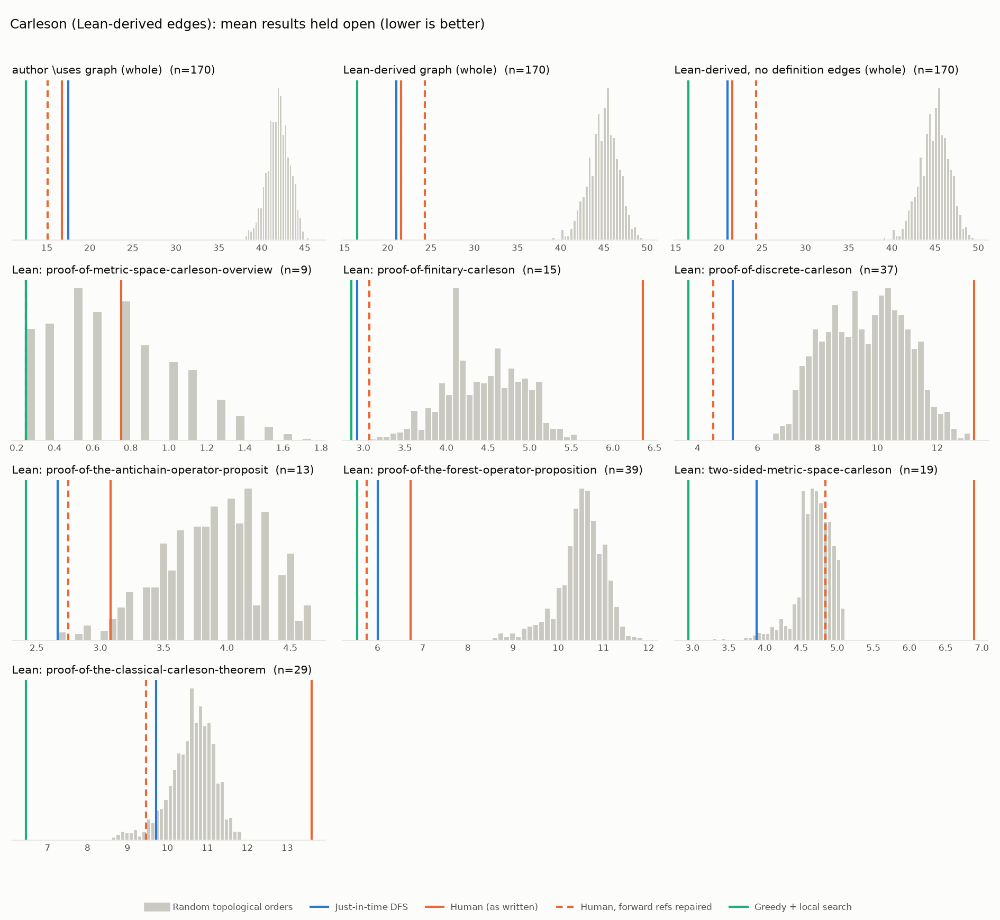

# Phase 1: Carleson

*fpvandoorn/carleson @ d966776f60fe (2026-09-23), chapters = \section*

## Formal graph

- Project declarations (after folding compiler auxiliaries): 3422 (def: 518, inductive: 27, theorem: 2877); 31692 project-internal dependency edges.
- Blueprint `\lean{}` names resolved to project declarations: 238 (95%); 170 of 180 blueprint nodes have at least one.
- Project theorems the blueprint never names: 2646.

## Author `\uses` edges vs Lean

Over the 170 formalised nodes. Lean edges are projected onto blueprint nodes through unlabelled helper declarations.

| | count |
|---|---:|
| Author edges | 212 |
| … also a direct Lean dependency | 199 |
| … implied by a chain of Lean dependencies | 1 |
| … not a Lean dependency at all | 12 |
| Lean edges | 353 |
| … not written by the author | 154 |
| … … of which from a definition node | 0 |

Most frequent sources of unreported edges: `kernel-summand` (21), `Hardy-Littlewood` (12), `wiggle-order-3` (10), `frequency-metric` (8), `basic-grid-structure` (7), `real-line-doubling` (7), `adjoint-tile-support` (6), `ball-covering` (5), `dyadic-partitions` (5), `equivalence-relation` (5).

## Ordering (Phase 0 metrics) on both graphs

Share of random orders better than the human order (0% = human beats all):

| Scope | n | edges | Kahn null | uniform null | mean open: human / optimised / uniform median | τ(human, optimised) |
|---|---:|---:|---:|---:|---:|---:|
| author \uses graph (whole) | 170 | 212 | 0% | 0% | 16.7 / 12.6 / 38.1 | +0.26 |
| Lean-derived graph (whole) | 170 | 353 | 0% | 0% | 21.6 / 16.5 / 44.5 | -0.11 |
| Lean-derived, no definition edges (whole) | 170 | 353 | 0% | 0% | 21.6 / 16.5 / 44.5 | -0.11 |
| Lean: proof-of-metric-space-carleson-overview | 9 | 2 | 59% | 44% | 0.8 / 0.2 / 0.8 | -0.06 |
| Lean: proof-of-finitary-carleson | 15 | 27 | 100% | 100% | 6.4 / 2.9 / 4.8 | +0.39 |
| Lean: proof-of-discrete-carleson | 37 | 56 | 100% | 100% | 13.2 / 3.7 / 10.8 | +0.40 |
| Lean: proof-of-the-antichain-operator-proposit | 13 | 15 | 3% | 0% | 3.1 / 2.4 / 4.2 | -0.21 |
| Lean: proof-of-the-forest-operator-proposition | 39 | 63 | 0% | 0% | 6.7 / 5.6 / 10.3 | +0.24 |
| Lean: two-sided-metric-space-carleson | 19 | 32 | 100% | 100% | 6.9 / 2.9 / 4.4 | -0.26 |
| Lean: proof-of-the-classical-carleson-theorem | 29 | 70 | 100% | 100% | 13.6 / 6.5 / 10.7 | +0.10 |

Forward references in the human order under Lean edges: 126

- `classical-carleson` depends on `smooth-approximation`, stated later
- `classical-carleson` depends on `convergence-for-smooth`, stated later
- `classical-carleson` depends on `real-Carleson`, stated later
- `classical-carleson` depends on `partial-Fourier-sum-bound`, stated later
- `classical-carleson` depends on `real-Carleson-operator-measurable`, stated later
- `metric-space-Carleson` depends on `linearised-metric-Carleson`, stated later
- `metric-space-Carleson` depends on `int-continuous`, stated later
- `linearised-metric-Carleson` depends on `int-continuous`, stated later
- `linearised-metric-Carleson` depends on `R-truncation`, stated later
- `finitary-Carleson` depends on `discrete-Carleson`, stated later
- `finitary-Carleson` depends on `grid-existence`, stated later
- `finitary-Carleson` depends on `tile-structure`, stated later
- `finitary-Carleson` depends on `tile-sum-operator`, stated later
- `discrete-Carleson` depends on `exceptional-set`, stated later
- `discrete-Carleson` depends on `forest-union`, stated later
- `discrete-Carleson` depends on `forest-complement`, stated later
- `antichain-operator` depends on `dens2-antichain`, stated later
- `antichain-operator` depends on `dens1-antichain`, stated later
- `forest-operator` depends on `kernel-summand`, stated later
- `forest-operator` depends on `forest-row-decomposition`, stated later
- `forest-operator` depends on `row-bound`, stated later
- `forest-operator` depends on `row-correlation`, stated later
- `forest-operator` depends on `disjoint-row-support`, stated later
- `Holder-van-der-Corput` depends on `Lipschitz-Holder-approximation`, stated later
- `R-truncation` depends on `S-truncation`, stated later
- `S-truncation` depends on `linearized-truncation`, stated later
- `grid-existence` depends on `counting-balls`, stated later
- `grid-existence` depends on `basic-grid-structure`, stated later
- `grid-existence` depends on `cover-by-cubes`, stated later
- `grid-existence` depends on `dyadic-property`, stated later
- `grid-existence` depends on `boundary-measure`, stated later
- `tile-structure` depends on `basic-grid-structure`, stated later
- `tile-structure` depends on `frequency-ball-cover`, stated later
- `tile-structure` depends on `disjoint-frequency-cubes`, stated later
- `tile-structure` depends on `frequency-cube-cover`, stated later
- `exceptional-set` depends on `first-exception`, stated later
- `exceptional-set` depends on `second-exception`, stated later
- `exceptional-set` depends on `third-exception`, stated later
- `forest-union` depends on `wiggle-order-1`, stated later
- `forest-union` depends on `C-dens1`, stated later

## `\lean{}` names not found in the project

- `covering-separable-space`: `Metric.dense_iff_iUnion_ball`, `TopologicalSpace.exists_countable_dense`
- `disjoint-family-countable`: `Pairwise.countable_of_isOpen_disjoint`
- `fourier-coeff-derivative`: `fourierCoeffOn_of_hasDerivAt`
- `convergence-of-coeffs-summable`: `hasSum_fourier_series_of_summable`
- `periodic-domain-shift`: `Function.Periodic.intervalIntegral_add_eq`, `intervalIntegral.integral_comp_sub_right`
- `real-line-metric`: `instProperSpaceReal`, `locallyCompact_of_proper`, `Real.instCompleteSpace`
- `real-line-ball`: `Real.ball_eq_Ioo`
- `real-line-measure`: `instIsAddHaarMeasureVolume`
- `real-line-ball-measure`: `Real.volume_ball`

