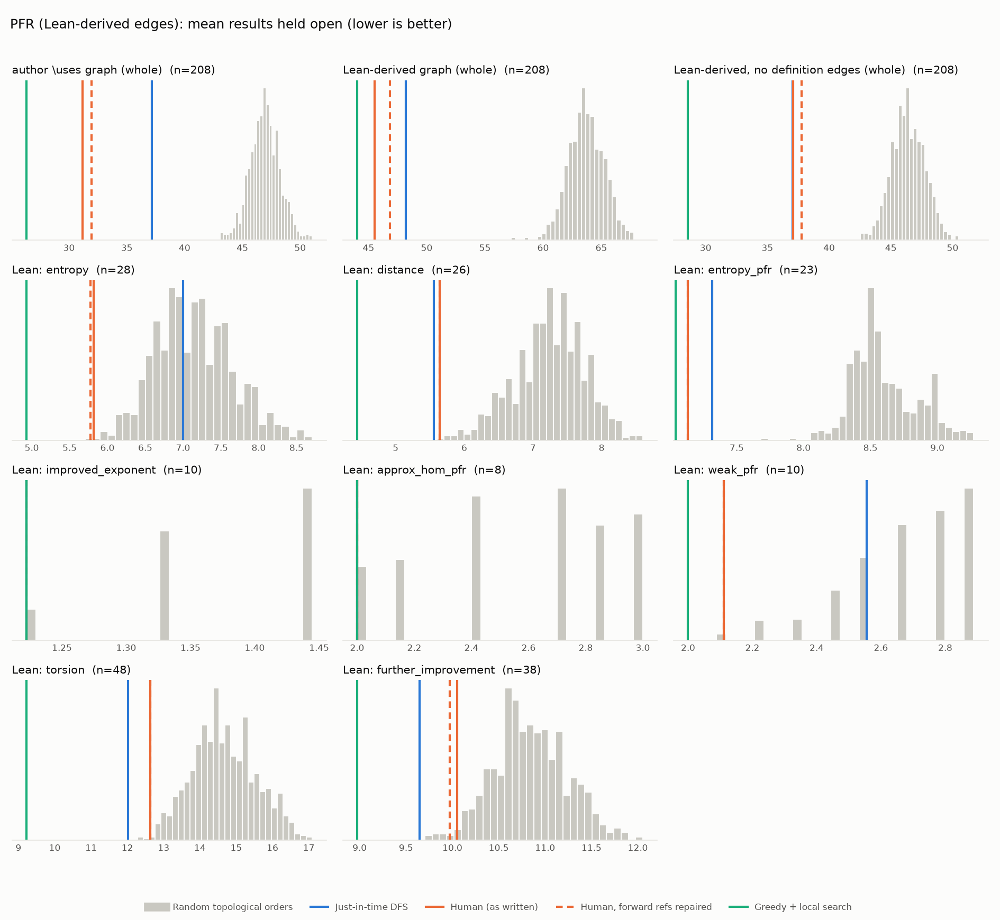

# Phase 1: PFR

*teorth/pfr @ ddd44f6ce82e, Lean leanprover/lean4:v4.35.0-rc2*

## Formal graph

- Project declarations (after folding compiler auxiliaries): 1395 (def: 139, inductive: 10, opaque: 2, theorem: 1244); 5768 project-internal dependency edges.
- Blueprint `\lean{}` names resolved to project declarations: 251 (98%); 208 of 218 blueprint nodes have at least one.
- Project theorems the blueprint never names: 1019.

## Author `\uses` edges vs Lean

Over the 208 formalised nodes. Lean edges are projected onto blueprint nodes through unlabelled helper declarations.

| | count |
|---|---:|
| Author edges | 469 |
| … also a direct Lean dependency | 407 |
| … implied by a chain of Lean dependencies | 20 |
| … not a Lean dependency at all | 42 |
| Lean edges | 1172 |
| … not written by the author | 765 |
| … … of which from a definition node | 439 |

Most frequent sources of unreported edges: `entropy-def` (143), `ruz-copy` (39), `copy-ent` (36), `conditional-entropy-def` (33), `cond-dist-def` (31), `information-def` (29), `conditional-mutual-def` (27), `ruzsa-symm` (22), `uniform-def` (20), `independent-exist` (19).

## Ordering (Phase 0 metrics) on both graphs

Share of random orders better than the human order (0% = human beats all):

| Scope | n | edges | Kahn null | uniform null | mean open: human / optimised / uniform median | τ(human, optimised) |
|---|---:|---:|---:|---:|---:|---:|
| author \uses graph (whole) | 208 | 469 | 0% | 0% | 31.2 / 26.3 / 52.6 | +0.15 |
| Lean-derived graph (whole) | 208 | 1172 | 0% | 0% | 45.5 / 44.0 / 65.7 | +0.35 |
| Lean-derived, no definition edges (whole) | 208 | 647 | 0% | 0% | 37.1 / 28.6 / 51.9 | +0.13 |
| Lean: entropy | 28 | 71 | 0% | 0% | 5.8 / 4.9 / 8.2 | +0.63 |
| Lean: distance | 26 | 45 | 0% | 0% | 5.6 / 4.4 / 7.6 | +0.05 |
| Lean: entropy_pfr | 23 | 54 | 0% | 0% | 7.1 / 7.0 / 8.5 | +0.80 |
| Lean: improved_exponent | 10 | 9 | 5% | 4% | 1.2 / 1.2 / 1.4 | +1.00 |
| Lean: approx_hom_pfr | 8 | 10 | 5% | 2% | 2.0 / 2.0 / 2.9 | +1.00 |
| Lean: weak_pfr | 10 | 11 | 1% | 0% | 2.1 / 2.0 / 2.6 | +0.73 |
| Lean: torsion | 48 | 147 | 0% | 0% | 12.6 / 9.2 / 15.3 | +0.65 |
| Lean: further_improvement | 38 | 147 | 2% | 2% | 10.1 / 9.0 / 10.9 | +0.84 |

Forward references in the human order under Lean edges: 8

- `relabeled-entropy` depends on `data-process-single`, stated later
- `relabeled-entropy-cond` depends on `chain-rule`, stated later
- `ruzsa-triangle-improved` depends on `data-process-single`, stated later
- `hom-pfr` depends on `pfr-9-aux'`, stated later
- `approx-hom-pfr` depends on `pfr-9-aux'`, stated later
- `pfr-projection'` depends on `data-process-single`, stated later
- `weak-pfr-asymm` depends on `data-process-single`, stated later
- `rho-invariant` depends on `rho-sums`, stated later

## `\lean{}` names not found in the project

- `concave`: `Real.strictConcaveOn_negMulLog`
- `condition-event-def`: `ProbabilityTheory.cond`
- `independent-def`: `ProbabilityTheory.IndepFun`
- `ruz-cov`: `Finset.ruzsa_covering_add`

